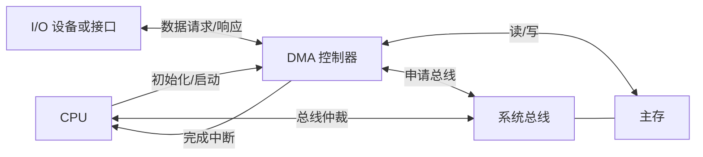

# DMA：直接存储器访问

DMA 是 `Direct Memory Access`，通常译作 **直接存储器访问** 或 **直接内存访问**。它是一种 I/O 数据传送方式：CPU 先设置传送任务，再由 DMA 控制器在外设和主存之间成批搬运数据；传送结束后，DMA 控制器再通知 CPU 做后处理。

!!! note "定义口径"
    DMA 的“直接”指数据不经过 CPU 通用寄存器，也不需要 CPU 逐字执行输入、输出或存取指令。CPU 仍然负责初始化、启动、完成中断处理和错误处理。

## DMA 的作用

外设和主存之间经常要交换成块数据，例如磁盘读写一个扇区、网卡接收一批数据包、声卡连续播放音频。如果每传送一个字都让 CPU 从外设接口读取，再写入主存，CPU 会被大量重复搬运占用。

几种 I/O 方式可以按 CPU 参与程度比较：

| 方式 | CPU 主要工作 | 适合场景 |
| --- | --- | --- |
| 程序查询方式 | CPU 反复查询设备状态，并亲自搬运数据 | 简单低速设备 |
| 中断方式 | 设备准备好后中断 CPU，CPU 再参与数据搬运 | 数据量不大、事件不连续 |
| DMA 方式 | CPU 设置参数，DMA 控制器成块搬运，完成后中断 CPU | 高速设备、大块数据传送 |

DMA 的价值在于减少 CPU 逐字参与 I/O 的开销，使 CPU 能和 I/O 设备并行工作。它特别适合磁盘、SSD、网卡、声卡、显卡、采集卡等高速或连续传输设备。

## 基本硬件结构

一次 DMA 传送至少涉及这些角色：

- **CPU**：设置主存起始地址、传送方向、传送长度和控制命令。
- **DMA 控制器**：接管数据传送，在需要时申请总线并访问主存。
- **I/O 设备或设备接口**：提供输入数据，或接收输出数据。
- **主存**：作为 I/O 数据块的来源或目的地。
- **系统总线**：CPU 和 DMA 控制器都要通过它访问主存，因此需要总线仲裁。

DMA 控制器内部通常包含这些寄存器：

| 寄存器 | 作用 |
| --- | --- |
| 主存地址寄存器 | 保存当前要访问的主存地址，传送后自动修改 |
| 字计数器 | 保存剩余传送字数或字节数，传送后递减 |
| 数据缓冲寄存器 | 暂存外设和主存之间传送的数据 |
| 控制/状态寄存器 | 保存传送方向、启动位、完成位、中断允许位和错误标志 |
| 设备地址或通道号寄存器 | 指明本次 DMA 对应的外设或 DMA 通道 |

## 一次 DMA 传送的三阶段

### 预处理

CPU 执行初始化程序，完成这些工作：

1. 检查设备是否可用。
2. 在主存中准备缓冲区。
3. 设置主存起始地址。
4. 设置传送长度。
5. 设置传送方向，例如外设到主存或主存到外设。
6. 设置 DMA 工作方式，并启动设备。

这一步仍由 CPU 完成，因为 DMA 控制器只会按给定参数搬运数据，它不会自己决定从哪里传、传多少、传给谁。

### 数据传送

传送开始后，DMA 控制器根据设备请求进行数据搬运。以外设到主存为例，过程通常是：

1. 外设准备好一个数据字，向 DMA 控制器发出请求。
2. DMA 控制器向 CPU 或总线仲裁器申请总线使用权。
3. 获得总线后，DMA 控制器把数据写入主存指定地址。
4. 主存地址寄存器自动更新，字计数器递减。
5. 若还没传完，继续等待下一次设备请求或继续突发传送。

!!! warning "DMA 会占用总线"
    DMA 降低了 CPU 执行搬运指令的开销，但它仍要访问主存、占用系统总线和消耗内存带宽。DMA 传送期间，CPU 访问主存可能被延迟。

### 后处理

当字计数器减到 0，或发生错误、超时等异常情况时，DMA 控制器结束本次传送，并通过中断或状态位通知 CPU。

CPU 随后进入后处理阶段：

- 读取 DMA 状态，判断传送是否成功。
- 处理校验、错误或重试。
- 唤醒等待 I/O 的进程。
- 准备下一次 DMA 传送。

DMA 并不取消中断。DMA 常常把“每传一个字都打扰 CPU”变成“整块数据传完后再通知 CPU”。

## DMA 的传送方向

| 方向 | 数据流向 | 例子 |
| --- | --- | --- |
| 外设到主存 | 外设产生数据，DMA 写入主存 | 磁盘读、网卡收包、音频采集 |
| 主存到外设 | DMA 从主存取数据，送到外设 | 磁盘写、网卡发包、音频播放 |
| 主存到主存 | DMA 在主存区域之间复制 | 图像缓冲区搬移、高速内存复制 |

考试里最常见的是外设和主存之间的传送。主存到主存 DMA 依赖具体硬件，并非所有系统都支持。

## DMA 传送方式

DMA 控制器和 CPU 都可能访问主存，所以核心矛盾是：DMA 什么时候占用总线？

### 停止 CPU 访问主存

DMA 控制器一次获得总线后，连续传送一整块数据。在这段时间里，CPU 暂停访问主存。

这种方式传送效率高，但 CPU 受影响明显，适合数据块较大且希望快速搬完的场景。

### 周期挪用

周期挪用也叫周期窃取。DMA 每传送一个数据字就占用一个或几个存储周期，传完这个字后释放总线，让 CPU 继续访问主存。

这种方式对 CPU 的影响比较分散，是考试中最常见、也最容易出计算题的方式。

!!! example "周期挪用计算"
    若一个扇区大小为 `512B`，DMA 数据缓冲寄存器宽度为 `64bit`，每次可传 `8B`，则传送一个扇区需要的 DMA 总线请求次数为：

    $$
    \frac{512\text{B}}{64\text{bit}/8}=\frac{512\text{B}}{8\text{B}}=64
    $$

### DMA 与 CPU 交替访问主存

如果 CPU 和 DMA 控制器使用不同的存储周期，或者主存访问时间允许交错安排，就可以让二者交替访问主存。这样 DMA 尽量利用 CPU 不访问主存的时隙，对 CPU 干扰较小。

这种方式对硬件配合要求更高，题目中通常会明确说明。

## DMA 和中断的区别

DMA 和中断经常一起出现，但二者解决的问题不同。

| 比较点 | 中断方式 | DMA 方式 |
| --- | --- | --- |
| 请求对象 | 请求 CPU 处理事件 | 请求总线或主存访问权 |
| 数据搬运者 | 通常仍由 CPU 执行输入/输出指令 | 由 DMA 控制器搬运 |
| CPU 参与频率 | 设备准备好时就可能中断 CPU | 一块数据传完后再中断 CPU |
| 适合数据量 | 小批量、事件型 I/O | 大批量、块式或流式 I/O |

!!! tip "常考判断"
    DMA 传送结束时通常会产生中断，但这个中断用于通知 CPU 收尾，并不是让 CPU 逐字搬运数据。

## DMA 的优先级

当 CPU 和 DMA 控制器同时请求访问主存时，DMA 的优先级通常更高。原因在于外设数据到达后，如果不能及时写入主存，可能造成数据丢失；而 CPU 被延迟几个存储周期，一般只是执行速度下降。

这也是 DMA 能提高 I/O 效率的同时，可能降低 CPU 访存速度的原因。

## 鼠标、键盘和外挂语境里的 DMA

网上讨论“鼠标 DMA”“键盘 DMA”时，常常混在几种不同概念里，需要先拆开看。

### 普通鼠标键盘通常不是 DMA 设备

常见 USB 鼠标和键盘属于 HID 设备。它们向主机报告按键、位移、滚轮等输入事件，数据量很小，传输方式通常是由主机按周期查询或调度输入报告。

从设备本身看，普通鼠标键盘并不能随意直接读写电脑主存，也不会像磁盘、网卡、显卡那样作为高吞吐设备进行大块 DMA 传送。

!!! note "USB 里的一个容易混淆点"
    USB 主机控制器为了把 USB 数据包放进内存，可能会使用 DMA 访问主存缓冲区。但这是主机控制器在操作系统和驱动管理下完成的传输，不等于鼠标或键盘这个外设获得了任意访问主存的能力。

### 游戏外挂语境里的 DMA 往往另有所指

游戏外挂圈里说的 DMA，很多时候不是在讲普通鼠标键盘的数据传输，而是在讲某类外部硬件通过 PCIe、Thunderbolt 或其他可直达系统总线的路径访问目标机器内存。攻击者可能把这类设备伪装成普通硬件，或搭配输入仿真设备，让目标机器看起来只是在接收键鼠输入。

这种语境下，“键鼠 DMA”可能只是市场话术或圈内简称。真正关键并不在鼠标、键盘本身，而在外部设备是否具备绕过正常软件进程边界、读取或修改内存的能力。

!!! warning "安全边界"
    这类 DMA 滥用会破坏操作系统、游戏反作弊和用户数据的安全边界。这里的讨论只用于区分概念，不涉及绕过检测、制作外挂或配置相关硬件。

### 外部 DMA 设备的检测难点

普通软件外挂通常运行在目标机器上，需要进程、驱动、句柄、内存读写 API 或可疑模块，因此更容易被系统审计和反作弊监控。外部 DMA 设备如果从系统总线侧访问内存，目标机器上的用户态进程未必能直接看到一个传统意义上的外挂进程。

防护思路也因此更偏硬件和系统边界：

- 使用 IOMMU 限制设备可访问的内存范围。
- 对外接高速总线设备做授权和隔离。
- 关闭不需要的外接 DMA 通道或热插拔能力。
- 结合系统完整性、驱动签名、反作弊策略和外设行为分析。

!!! tip "判断这类说法时先问两件事"
    第一，它说的是普通 HID 输入设备，还是能访问系统总线的外部硬件？第二，它说的是输入事件仿真，还是直接读取或修改主存？这两个问题分清后，“鼠标 DMA”“键盘 DMA”这类说法通常就不会混在一起。

## 容易混淆的点

!!! failure "误区 1：DMA 完全不需要 CPU"
    CPU 仍要负责初始化、启动、完成中断处理和异常处理。DMA 减少的是传送过程中的逐字搬运。

!!! failure "误区 2：DMA 数据通过 CPU 通用寄存器"
    DMA 数据在外设接口、DMA 控制器、主存和总线之间传送，不经过 CPU 通用寄存器。

!!! failure "误区 3：DMA 请求的是 CPU 执行时间"
    DMA 主要请求的是总线使用权或主存访问权；中断方式请求的是 CPU 响应并执行处理程序。

!!! failure "误区 4：DMA 一定让系统整体更快"
    对大块高速 I/O，DMA 通常很有效；对很小的数据，初始化、仲裁和中断成本可能抵消收益。

!!! failure "误区 5：鼠标键盘上的 DMA 就是普通输入更快"
    普通 HID 输入和外部 DMA 读写内存不是一回事。游戏外挂语境里的 DMA 重点通常在外部设备访问内存或配合输入仿真，而不是普通键鼠报告本身变成了大块 DMA 传输。

## 记忆框架

理解 DMA 可以抓三条线：

- **控制线**：CPU 设置地址、长度、方向和工作方式，传完后处理状态。
- **数据线**：DMA 控制器在外设和主存之间搬运数据。
- **总线线**：DMA 传送要申请总线，可能与 CPU 访问主存发生竞争。

如果题目问“DMA 为什么快”，答案重点不在于它让内存本身变快，而在于它减少 CPU 逐字参与 I/O 的开销，并允许 CPU 与外设传送并行推进。

!!! question "自测题：DMA 与中断"
    某磁盘把一个 `4KB` 数据块读入主存。若 DMA 每次可传送 `32bit`，采用周期挪用方式，则至少需要多少次 DMA 传送？传送结束后 CPU 如何得知本次 I/O 完成？

    ??? success "参考答案"
        `32bit = 4B`，所以传送次数为：

        $$
        \frac{4\text{KB}}{4\text{B}}=\frac{4096\text{B}}{4\text{B}}=1024
        $$

        数据块传送完成后，DMA 控制器通常设置完成状态，并向 CPU 发出中断。CPU 响应中断后读取 DMA 状态寄存器，确认传送结果，再进行后处理。
