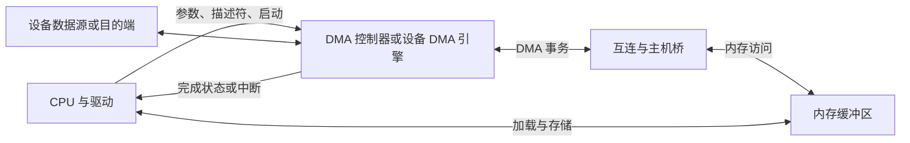

# DMA：直接存储器访问

DMA（Direct Memory Access）使设备或专用传送硬件能够访问内存缓冲区，减少 CPU 执行逐字搬运指令的开销。CPU 仍负责描述任务、准备映射和处理完成状态；数据传送仍消耗互连与内存带宽。

“直接”指主数据流无需经过 CPU 通用寄存器，不意味着设备拥有一根私有的主存连线，也不意味着设备可以访问任何内存地址。

## 数据搬运与完成通知

传统组成原理按程序查询、中断驱动搬运、DMA 三种方式比较 CPU 参与程度：

| 方式 | 谁搬运主数据 | CPU 怎样发现进展 |
| --- | --- | --- |
| 程序查询 | CPU 执行读写指令 | 轮询设备状态 |
| 中断驱动的程序搬运 | CPU 在服务程序中读写数据 | 设备中断 |
| DMA | 控制器或设备中的 DMA 引擎 | 中断、轮询完成队列或其他约定 |

搬运方式和通知方式是两个维度。高速网卡、NVMe 控制器可以通过 DMA 搬数据，同时由 CPU 轮询完成；现代中断也可能合并报告多个请求。不能从“使用轮询”推断没有 DMA，或从“使用 DMA”推断每块必然触发一次中断。

## 教学控制器与现代设备

教学结构通常有一个独立 DMA 控制器，设备先向它请求，再由它申请共享总线。现代 PCIe 设备常自带总线主控 DMA 引擎，通过主机桥与内存系统交互，未必存在独立的中央 DMA 芯片。

```mermaid
graph LR
  CPU[CPU 与驱动] -->|参数、描述符、启动| ENG[DMA 控制器或设备 DMA 引擎]
  DEV[设备数据源或目的端] <--> ENG
  ENG <-->|DMA 事务| BUS[互连与主机桥]
  BUS <-->|内存访问| MEM[内存缓冲区]
  CPU <-->|加载与存储| MEM
  ENG -->|完成状态或中断| CPU
```

| 教学寄存器 | 保存内容 |
| --- | --- |
| 主存地址寄存器 | 当前传送地址，随传送更新 |
| 字计数器 | 剩余字数或字节数，单位由控制器定义 |
| 数据缓冲寄存器 | 暂存数据，宽度影响一个传送单元 |
| 控制/状态寄存器 | 方向、启动、模式、完成与错误信息 |
| 设备地址或通道选择 | 本次任务对应的设备或通道 |

实际设备常把这些参数放在内存描述符中，DMA 引擎自行读取；scatter-gather（分散/聚集）列表允许一个逻辑请求由多个内存片段构成。设备支持的地址位宽、对齐、最大段长度和段数均会限制可用缓冲区。

常见方向为设备到主存（磁盘读、网卡收包）、主存到设备（磁盘写、网卡发包）。有些控制器也支持主存到主存复制，但这不是所有 DMA 硬件的必备能力。方向命名必须说明观察者，驱动的 `DMA_TO_DEVICE` 指内存到设备。

## 传送的生命周期

### 准备与启动

驱动先分配或取得缓冲区，确认设备能力与传送方向，建立 DMA 映射，再把设备可用的地址和长度写入描述符。描述符准备好后，通过设备寄存器或 doorbell 通知硬件开始。

初始化参数包括缓冲区地址、长度、方向、通道和工作方式，不需要给出一个用于逐字搬运的 CPU 通用寄存器编号。提交后，驱动必须保证缓冲区及映射在设备访问结束前保持有效。

### 数据传送

在传统共享总线模型中，DMA 请求总线或主存访问权，获得授权后传送一个字或一串数据，再更新地址和计数。CPU 可以执行不需要争用该资源的工作；是否停顿取决于它当时是否需要该资源，不能把一次周期挪用直接当作同样长的全 CPU 停机。

| 方式 | 资源分配 | 主要权衡 |
| --- | --- | --- |
| 停止 CPU 访存 | DMA 连续占用至一块传完 | 传送效率高，CPU 访存阻塞时间长 |
| 周期挪用 | 按请求占用一个或若干存储周期后释放 | 干扰分散，但授权开销可能重复 |
| 交替访问 | CPU 与 DMA 使用预留或约定时隙 | 需时序配合，空闲时隙可能浪费 |

教材常假设 DMA 在紧急设备请求下优先，以防设备缓冲溢出。现代仲裁也会考虑公平性、优先级和服务质量，“DMA 永远比 CPU 优先”不属于通用硬件保证。

### 完成、同步与释放

控制器更新完成或错误状态，主机通过约定方式发现完成。驱动检查结果，并按平台及映射类型执行缓存同步、解除映射、交还缓冲区所有权，最后唤醒等待方或提交后续任务。

看到完成中断只表示收到一种通知，仍应读取状态并遵守内存顺序。设备超时、取消请求或复位时，也须先确保硬件不再访问旧缓冲区，再释放内存。

## 传送次数与 CPU 开销

计算题先分别标出设备块大小、DMA 一个数据单元大小、一次总线授权可传多少单元，以及一次完成通知覆盖多少请求。这些数量一般不相等。

!!! question "例题：周期挪用与请求次数"
    某磁盘扇区为 $512\,\mathrm{B}$，DMA 每次传 $64$ 位，采用一次申请、传一单元后释放的周期挪用。传完整扇区需几次申请？若改成每次授权传 $8$ 个单元，申请次数如何变化？

    ??? success "参考答案"
        数据单元为 $8\,\mathrm{B}$，数据传送共 $512/8=64$ 次。逐单元申请时为 $64$ 次授权；每次授权传 $8$ 个单元时为 $64/8=8$ 次授权。数据量没有变化，仲裁频率发生变化。

!!! question "例题：块大小与完成通知"
    某设备把 $4\,\mathrm{KiB}$ 数据读入主存，每个 DMA 数据单元为 $32$ 位。一个描述符描述完整数据块，设置为块完成后中断一次。需要多少数据传送？CPU 怎样确认完成？

    ??? success "参考答案"
        $4\,\mathrm{KiB}=4096\,\mathrm{B}$，每单元 $4\,\mathrm{B}$，共 $1024$ 次传送。按题设完成中断一次；CPU 读取状态并完成所需同步后再使用数据。这个通知次数由题设决定，不能由数据传送次数直接推出。

!!! question "例题：带宽占用与处理器利用率"
    设备持续输入 $20\,\mathrm{MB/s}$，每个 DMA 单元为 $4\,\mathrm{B}$，占用一个 $50\,\mathrm{ns}$ 的存储周期；DMA 无额外开销，且单元不重叠。它占用多少比例的存储服务时间？能否据此断言 CPU 性能降低相同比例？

    ??? success "参考答案"
        每秒传 $20\times10^6/4=5\times10^6$ 个单元，忙时间为 $5\times10^6\times50\times10^{-9}=0.25\,\mathrm{s}$，占比 $25\%$。

        CPU 性能下降取决于程序的访存需求、Cache 命中以及可重叠执行的工作量，不能直接定为 $25\%$。若 CPU 始终等待同一存储器，其受影响才可能接近资源竞争所预测的程度。

对小数据，DMA 的映射、描述符、同步和通知开销可能超过 CPU 复制开销。评估收益应同时报告 CPU 占用、请求延迟和总吞吐，不能只比较介质传送速率。

## DMA 地址、IOMMU 与缓存一致性

CPU 虚拟地址、CPU 物理地址和设备看到的 DMA 地址属于不同地址空间。Linux DMA API 返回给设备使用的地址，可能通过 IOMMU 映射到物理页；不能把普通用户虚拟指针直接写进设备描述符。

IOMMU 提供地址转换和访问权限隔离，使设备只访问被授权的映射。它可以帮助连接物理上不连续的页，也限制错误设备或恶意设备影响范围。保护是否有效还取决于 IOMMU 启用、驱动映射范围、设备分组和平台配置，不能只凭硬件存在就认定隔离已完成。

缓存一致性另需处理：

- 在非一致性平台，CPU 写入的脏 Cache 数据可能尚未被设备看到；设备写内存后，CPU 也可能仍读到旧缓存副本。
- Linux 区分一致性 DMA 映射与流式 DMA 映射；流式映射需要按方向与所有权切换使用 DMA API 的同步操作。
- 一致性内存保证数据可见性的协调，仍不保证描述符字段按软件希望的先后顺序被观察；必要的内存屏障不能省略。

!!! question "例题：一致性与顺序"
    驱动在一致性 DMA 内存中准备描述符：先写缓冲区地址和长度，再写“有效”标志，设备见有效标志后立即取其他字段。是否可以因此省略所有顺序约束？

    ??? success "参考答案"
        不可以。一致性保证缓存副本协调，内存顺序仍需遵守平台与驱动 API。应保证地址和长度在有效标志之前对设备可见，使用所需写屏障及设备寄存器访问规范。否则设备可能观察到有效标志却读到旧参数。

## USB 输入设备与外接 DMA

普通 USB 鼠标、键盘报告的是 HID 输入事件，由主机控制器按 USB 协议调度传输。主机控制器可以用 DMA 把数据写入主存，但普通 HID 设备本身不因此获得任意访问主存的能力。

外接 PCIe 或携带 PCIe 事务的连接涉及设备 DMA 权限；输入事件仿真与直接内存访问属于不同能力。识别设备行为时，应看谁发起内存事务、使用什么地址映射和权限，不能仅凭“键鼠 DMA”等名称判断。没有目标进程中的传统应用程序，也不意味着设备不受操作系统枚举、驱动或 IOMMU 管理。

外部依据：[Linux DMA 映射指南](https://docs.kernel.org/core-api/dma-api-howto.html)详细区分 CPU 地址、总线地址、一致性映射、流式映射和屏障；[Linux USB 主机侧 API](https://docs.kernel.org/driver-api/usb/usb.html)说明主机控制器与 USB 请求。互连竞争见[总线](bus.md)，块设备队列见[外部存储器](external-storage.md)。
