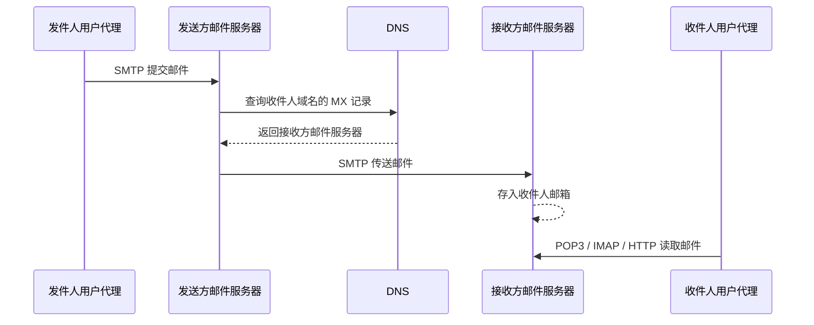

# 电子邮件

## 邮件收发链路

电子邮件不是两台用户主机直接互发文件，而是通过邮件服务器保存和转发。发件人把邮件提交给自己的邮件服务器，接收方邮件服务器把邮件放入收件人的邮箱，收件人之后再读取。

!!! note "异步通信"
    电子邮件不要求发件人和收件人同时在线。收件人离线时，邮件可以先保存在接收方邮件服务器的邮箱中，等收件人上线后再读取。

一个典型收发过程可以简化为：



这条链路里最容易混的是：`SMTP` 用于发送或传送邮件，`POP3` 和 `IMAP` 用于读取邮件。

!!! success "一句话主线"
    **发邮件靠 SMTP 推过去，收邮件靠 POP3/IMAP 拉回来；如果用浏览器登录邮箱，用户和 Web 邮箱之间通常走 HTTP/HTTPS。**

## 电子邮件系统的三个角色

### 用户代理

用户代理（User Agent，`UA`）是用户直接使用的邮件客户端，例如桌面邮件客户端、手机邮件应用或浏览器中的 Web 邮箱界面。它负责撰写、显示、回复、转发、删除邮件等用户操作。

用户代理本身不是“邮箱所在的地方”。真正长期保存邮件的通常是邮件服务器。

### 邮件服务器

邮件服务器负责接收、缓存、发送和保存邮件。它常常同时扮演两个角色：

- 接收别人投递来的邮件时，它是服务器。
- 向其他邮件服务器投递邮件时，它又是客户。

例如，发送方邮件服务器向接收方邮件服务器传送邮件时，发送方运行 `SMTP` 客户进程，接收方运行 `SMTP` 服务器进程。

!!! warning "服务器不是只做一件事"
    同一台邮件服务器可能既运行 `SMTP` 服务用于接收或转发邮件，也运行 `POP3` 或 `IMAP` 服务用于让用户读取邮箱。做题时要看当前这一步是在“发送”还是“读取”。

### 邮件协议

!!! note "常见缩写全称"
    | 缩写 | 英文全称 | 中文含义 |
    | --- | --- | --- |
    | `SMTP` | Simple Mail Transfer Protocol | 简单邮件传输协议 |
    | `POP3` | Post Office Protocol version 3 | 邮局协议第 3 版 |
    | `IMAP` | Internet Message Access Protocol | 互联网报文存取协议 |
    | `MIME` | Multipurpose Internet Mail Extensions | 多用途互联网邮件扩展 |
    | `HTTP` | Hypertext Transfer Protocol | 超文本传输协议 |
    | `HTTPS` | Hypertext Transfer Protocol Secure | 安全的超文本传输协议 |
    | `TCP` | Transmission Control Protocol | 传输控制协议 |
    | `DNS` | Domain Name System | 域名系统 |
    | `MX` | Mail Exchange | 邮件交换记录，不是协议 |

常见协议可以按功能分组：

| 功能 | 常见协议 | 传输层 | 常见服务器端口 |
| --- | --- | --- | --- |
| 用户提交邮件、服务器之间传送邮件 | `SMTP` | `TCP` | `25` |
| 用户从服务器下载邮件 | `POP3` | `TCP` | `110` |
| 用户在线管理服务器邮箱 | `IMAP` | `TCP` | `143` |
| 浏览器访问 Web 邮箱 | `HTTP/HTTPS` | `TCP` | `80/443` |

!!! tip "端口号口径"
    408 中常说 `SMTP` 使用 `25/tcp`、`POP3` 使用 `110/tcp`。这里的端口通常指服务器端熟知端口，客户端端口一般由操作系统临时分配。

## 邮件地址与 DNS

电子邮件地址的一般格式是：

```text
用户名@邮箱所在主机的域名
```

例如：

```text
alice@example.com
```

其中 `alice` 是邮箱名，`example.com` 是邮箱所在域名。发送方邮件服务器需要根据收件人地址中的域名找到负责接收该域邮件的邮件服务器，这通常依赖 DNS 的 `MX` 记录。

```text
example.com.  300  IN  MX  10 mail.example.com.
mail.example.com. 300 IN  A      203.0.113.20
```

!!! note "MX 记录"
    `MX` 记录说明“这个域名的邮件应该交给哪台邮件服务器”。邮件服务器拿到目标邮件服务器地址后，再通过 `SMTP` 建立 TCP 连接传送邮件。

## SMTP：发送和传送邮件

`SMTP`（Simple Mail Transfer Protocol，简单邮件传输协议）用于把邮件从发送方推到接收方。它属于应用层协议，基于 `TCP`，常见服务器端口号是 `25`。

`SMTP` 主要用在两段：

1. 发件人用户代理把邮件提交给发送方邮件服务器。
2. 发送方邮件服务器把邮件传送给接收方邮件服务器。

!!! warning "SMTP 不负责读取邮件"
    收件人从邮箱服务器取回邮件时，通常使用 `POP3`、`IMAP` 或 Web 邮箱的 `HTTP/HTTPS`，不是 `SMTP`。

一个简化的 `SMTP` 会话大致如下：

```text
S: 220 mail.example.net Service ready
C: HELO mail.example.com
S: 250 OK
C: MAIL FROM:<alice@example.com>
S: 250 OK
C: RCPT TO:<bob@example.net>
S: 250 OK
C: DATA
S: 354 End data with <CRLF>.<CRLF>
C: From: alice@example.com
C: To: bob@example.net
C: Subject: Hello
C:
C: Hi Bob.
C: .
S: 250 OK
C: QUIT
S: 221 Bye
```

常见命令含义：

| 命令 | 作用 |
| --- | --- |
| `HELO` / `EHLO` | 客户端向服务器表明身份 |
| `MAIL FROM` | 给出发件人地址 |
| `RCPT TO` | 给出收件人地址，可出现多次 |
| `DATA` | 开始传送邮件内容 |
| `QUIT` | 释放连接 |

!!! tip "为什么先 RCPT 再 DATA"
    `RCPT TO` 可以让服务器在传送正文前先检查收件人是否可接收。若地址无效，服务器可以较早拒绝，避免客户端传完长正文后才发现失败。

## POP3 与 IMAP：读取邮件

`POP3` 和 `IMAP` 都用于用户代理从接收方邮件服务器读取邮件，二者也都基于 `TCP`。

### POP3

`POP3`（Post Office Protocol version 3，邮局协议第 3 版）的特点是简单，常见端口是 `110/tcp`。它的典型思路是：用户代理连接服务器，认证后把邮件取到本地。

常见工作方式有两种：

- **下载并删除**：取回邮件后，服务器删除该邮件。
- **下载并保留**：取回邮件后，服务器仍保留副本。

!!! note "POP3 的定位"
    `POP3` 适合把邮箱看成“服务器上的收件箱”，用户上线后把邮件拉下来。它不负责用户向外发送邮件，也不负责邮件服务器之间传送邮件。

### IMAP

`IMAP`（Internet Message Access Protocol，互联网报文存取协议）的功能比 `POP3` 强，常见端口是 `143/tcp`。它更像“在线管理服务器邮箱”：邮件主要保留在服务器端，用户代理可以查看文件夹、移动邮件、搜索邮件，并按需下载邮件的一部分。

| 对比项 | POP3 | IMAP |
| --- | --- | --- |
| 基本定位 | 下载邮件 | 在线管理邮箱 |
| 服务器端状态 | 较少 | 较多 |
| 文件夹与搜索 | 能力有限 | 支持服务器端文件夹、搜索等操作 |
| 部分下载 | 不突出 | 支持只取首部或某个 MIME 部分 |

!!! tip "低带宽场景"
    如果邮件带有大附件，`IMAP` 可以先只取首部或某个 MIME 部分，用户确认需要后再下载完整内容。

## Web 邮箱与 HTTP/HTTPS

使用浏览器登录 Gmail、Outlook Web 或其他 Web 邮箱时，用户代理其实是浏览器。浏览器和 Web 邮箱服务器之间的交互通常是 `HTTP/HTTPS`，包括写信、查看收件箱、打开邮件等操作。

但这不表示整个邮件系统都不再使用 `SMTP`。当邮件需要从一个邮件服务商投递到另一个邮件服务商时，邮件服务器之间仍通常使用 `SMTP`。

```text
浏览器 -> Web 邮箱服务器：HTTP/HTTPS
Web 邮箱服务器 -> 对方邮件服务器：SMTP
对方用户读取邮件：POP3 / IMAP / HTTP/HTTPS
```

!!! warning "Web 邮箱易错点"
    题目若说“用浏览器在 Gmail 中发送邮件”，用户浏览器到 Gmail 服务器这一段通常选 `HTTP/HTTPS`；若问“Gmail 邮件服务器把邮件传给另一个域的邮件服务器”，则通常选 `SMTP`。

## 邮件内容格式与 MIME

一封邮件可以分成两层来理解：

- **信封**：邮件系统用于投递的控制信息，用户通常不直接填写。
- **内容**：用户看到的邮件本体，通常由首部和主体组成。

邮件内容中，首部由若干首部行组成，首部和主体之间用空行分隔：

```text
From: alice@example.com
To: bob@example.net
Subject: Hello

Hi Bob.
```

常见首部字段包括：

| 字段 | 含义 |
| --- | --- |
| `From` | 发件人 |
| `To` | 收件人 |
| `Subject` | 主题 |
| `Date` | 发送时间 |
| `Message-ID` | 邮件标识 |

早期 `SMTP` 主要面向 7 位 ASCII 文本，不能直接表达中文、图片、音频、视频、压缩包等内容。`MIME`（Multipurpose Internet Mail Extensions，多用途互联网邮件扩展）用来扩展邮件内容的表示方式，让多媒体内容可以被编码成适合邮件系统传输的形式。

`MIME` 常见新增信息包括：

| 字段 | 作用 |
| --- | --- |
| `MIME-Version` | 表明使用 MIME |
| `Content-Type` | 说明内容类型，如文本、图片、多部分邮件 |
| `Content-Transfer-Encoding` | 说明传送编码，如 `base64` |
| `Content-Disposition` | 说明内容是正文展示还是附件 |

!!! success "MIME 与 SMTP 的关系"
    `MIME` 不取代 `SMTP`，也不改变 `SMTP` 是邮件传输协议这一点。它主要解决“邮件内容如何表示和编码”的问题，使非 ASCII 文本和二进制附件能够通过既有邮件传输系统发送。

## 与网络分层的关系

电子邮件相关协议大多属于应用层。它们使用传输层提供的进程到进程通信服务，再由网络层和链路层完成实际转发。

以 `SMTP` 发送邮件为例：

```text
SMTP 邮件报文
-> TCP 报文段
-> IP 数据报
-> 数据链路层帧
-> 比特流
```

读取邮件时也类似：

```text
POP3 / IMAP 报文
-> TCP 报文段
-> IP 数据报
-> 数据链路层帧
-> 比特流
```

!!! warning "使用 TCP 不等于一定成功"
    `SMTP`、`POP3`、`IMAP` 基于 `TCP`，可以获得可靠、有序的字节流服务；但服务器宕机、地址错误、邮箱不存在、认证失败、网络严重拥塞等问题仍可能导致邮件发送或读取失败。

## 本机抓包实验

真实邮件服务通常会使用加密连接，直接抓包未必能看到邮件正文。学习 TCP 报文段和应用层文本分析时，建议先在本机回环接口上构造一个明文 TCP 会话，只分析自己产生的实验流量。

!!! warning "实验边界"
    不要截获他人的网络流量，也不要在真实邮箱账号上发送敏感内容做实验。本节只使用本机 `127.0.0.1` 和 `example.com` 示例地址，用来观察 TCP 端口、首部长度和 ASCII 载荷。

### 准备三个终端

终端 1 用 `tcpdump` 抓本机回环接口上的 TCP 流量，并同时显示十六进制和 ASCII：

```bash
sudo tcpdump -i lo -nn -s 0 -X 'tcp port 2525'
```

参数含义：

| 参数 | 含义 |
| --- | --- |
| `-i lo` | 抓本机回环接口 |
| `-nn` | 不把地址和端口反查成名字 |
| `-s 0` | 尽量抓完整报文 |
| `-X` | 同时显示十六进制和 ASCII |
| `tcp port 2525` | 只看 TCP 端口 `2525` 的流量 |

终端 2 启动一个本地 TCP 服务端，模拟邮件服务器监听：

```bash
nc -l 2525
```

终端 3 作为客户端，发送一段 SMTP 风格的明文内容：

```bash
printf 'Message-ID: <demo.20260510@example.com>\r\nDate: Sun, 10 May 2026 12:00:00 +0800\r\nFrom: alice@example.com\r\nTo: bob@example.net\r\nSubject: capture test\r\n\r\nhello\r\n' | nc 127.0.0.1 2525
```

如果 `tcpdump` 输出中能看到 `Message-ID`、`From: alice@example.com` 等文本，就说明已经抓到了承载应用层数据的 TCP 报文段。

!!! tip "为什么不用 25 端口"
    `25/tcp` 是 SMTP 的熟知服务器端口，普通用户进程通常不能直接监听低端口。本实验用 `2525` 作为替代端口，方便观察 TCP 报文段结构；考试题中若目的端口是 `25`，再据此判断为 `SMTP`。

### 保存后用 Wireshark 分析

如果想用 Wireshark 图形界面分析，可以先保存为 `pcap` 文件：

```bash
sudo tcpdump -i lo -nn -s 0 -w smtp-lab.pcap 'tcp port 2525'
```

再运行终端 2 和终端 3 的 `nc` 实验。打开 `smtp-lab.pcap` 后，可以重点观察：

- `Ethernet` / `Loopback` 层：本机抓包时链路层形式可能和普通以太网不同。
- `IP` 层：源地址和目的地址都是 `127.0.0.1`。
- `TCP` 层：源端口是客户端临时端口，目的端口是 `2525`。
- `TCP payload`：应用层文本内容。

!!! tip "Follow TCP Stream"
    在 Wireshark 中选中相关 TCP 报文后，可以使用 `Follow TCP Stream` 查看这一条 TCP 连接中的连续应用层数据。做考试题时，相当于从十六进制和 ASCII 区域中读出应用层字段。

## 抓包题分析方法

考试给出的通常不是完整抓包文件，而是一个 TCP 报文段前若干字节的十六进制数及 ASCII 内容。分析顺序固定为三步。

### 第一步：按 TCP 首部找端口

TCP 报文段开头 4 个字节就是源端口和目的端口：

```text
c0 e6 00 19 ...
|   | |   |
|   | +--- 目的端口 = 0x0019 = 25
+---+----- 源端口 = 0xc0e6 = 49382
```

端口转换：

```text
0xc0e6 = 12 * 16^3 + 0 * 16^2 + 14 * 16 + 6 = 49382
0x0019 = 25
```

若目的端口是 `25`，通常说明客户端正在连接 SMTP 服务器。因此应用层协议可以判断为 `SMTP`，用户代理使用的端口是源端口 `49382`。

!!! warning "端口方向"
    抓包题要先看报文方向。若报文是“客户端 -> 服务器”，服务器端口通常是目的端口；若报文是“服务器 -> 客户端”，服务器端口会出现在源端口。

### 第二步：用 TCP 首部长度定位载荷

TCP 首部中有“数据偏移”字段，表示 TCP 首部长度。题目如果直接说明“TCP 首部长度为 `20B`”，则前 `20B` 是 TCP 首部，后面才是应用层数据。

```text
TCP 报文段 = TCP 首部 + TCP 数据部分
          = 20B     + SMTP 文本
```

若题目没有直接给首部长度，可以看 TCP 首部第 13 个字节的高 4 位。比如 `0x50` 的高 4 位是 `5`，表示 TCP 首部长度为：

```text
5 * 4B = 20B
```

### 第三步：把载荷按 ASCII 读字段

超过 TCP 首部的部分就是应用层数据。SMTP 命令和邮件首部字段是文本形式，因此可以直接在 ASCII 区域找关键字段：

```text
4d 65 73 73 61 67 65 2d 49 44
 M  e  s  s  a  g  e  -  I  D
```

若看到：

```text
46 72 6f 6d 3a 20 61 6c 69 63 65 40 65 78 61 6d 70 6c 65 2e 63 6f 6d
 F  r  o  m  :     a  l  i  c  e  @  e  x  a  m  p  l  e  .  c  o  m
```

就能读出发件人邮箱：

```text
alice@example.com
```

!!! success "抓包题三步"
    **先看端口定协议，再看 TCP 首部长度切出载荷，最后从 ASCII 文本中找应用层字段。**

## 408 / 应试补充

### 协议选择

看到邮件题，先判断当前动作：

| 当前动作 | 优先判断 |
| --- | --- |
| 用户代理提交邮件给发送方邮件服务器 | `SMTP` |
| 发送方邮件服务器传给接收方邮件服务器 | `SMTP` |
| 用户代理从接收方邮件服务器读取邮件 | `POP3` 或 `IMAP` |
| 浏览器访问 Web 邮箱 | `HTTP/HTTPS` |
| 查询收件人域名对应的邮件服务器 | `DNS` 的 `MX` 记录 |

!!! tip "三段式速记"
    **用户 1 -> 邮件服务器 1：SMTP；邮件服务器 1 -> 邮件服务器 2：SMTP；邮件服务器 2 -> 用户 2：POP3 / IMAP / HTTP。**

### 端口与 TCP

常考端口：

| 协议 | 常见端口 | 记忆点 |
| --- | --- | --- |
| `SMTP` | `25/tcp` | 发送、传送邮件 |
| `POP3` | `110/tcp` | 读取邮件 |
| `IMAP` | `143/tcp` | 在线管理邮箱 |
| `HTTP` | `80/tcp` | Web 邮箱明文访问 |
| `HTTPS` | `443/tcp` | Web 邮箱加密访问 |

抓包题里，如果看到目标端口是 `25`，通常说明客户端正在连接 `SMTP` 服务器；源端口常是临时端口，不要误认为客户端也使用 `25`。

### 易混点速记

- 电子邮件地址格式是 `用户名@邮箱所在主机的域名`。
- `SMTP` 是推协议，用于发送和服务器间传送邮件。
- `POP3` 是拉协议，用于用户代理从服务器读取邮件。
- `IMAP` 也是读取邮件协议，但更强调服务器端邮箱管理。
- `SMTP` 不能用于收件人从服务器读取邮件。
- `POP3` 不能用于用户代理向服务器发送邮件，也不能用于服务器之间传送邮件。
- `POP3` 可以在一条 TCP 连接中收取多封邮件，不必每封邮件单独建立连接。
- `MIME` 不替代 `SMTP`，只是扩展邮件内容表示和编码。
- 无须转换即可由传统 `SMTP` 直接传输的是 ASCII 文本；中文和二进制附件通常要经过 MIME 编码。
- 用户“只能发送不能接收”时，优先怀疑读取邮件相关配置；“只能接收不能发送”时，优先怀疑发送邮件相关配置。

!!! success "一句话总结"
    电子邮件的核心不是一个协议包打天下，而是：`SMTP` 负责把邮件推到服务器和对方服务器，`POP3/IMAP/HTTP` 负责让用户读到邮箱里的邮件，`MIME` 负责让邮件内容能表示文本以外的复杂数据。
