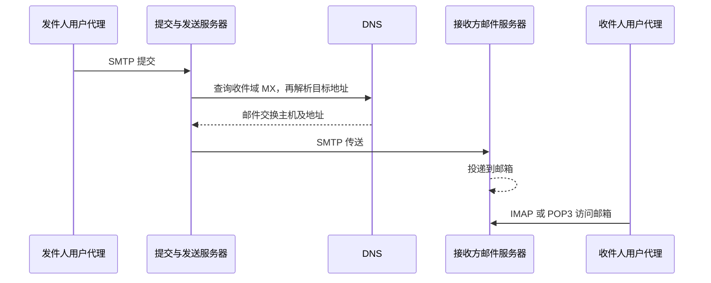

# 电子邮件

## 邮件提交、传送与读取

电子邮件通过服务器存储和转发，使通信双方不必同时在线。发送者的客户端负责撰写和提交，邮件传送系统负责把邮件交给收件域，收件人再从邮箱中读取。


```mermaid
sequenceDiagram
  participant A as 发件人用户代理
  participant SA as 提交与发送服务器
  participant D as DNS
  participant SB as 接收方邮件服务器
  participant B as 收件人用户代理
  A->>SA: SMTP 提交
  SA->>D: 查询收件域 MX，再解析目标地址
  D-->>SA: 邮件交换主机及地址
  SA->>SB: SMTP 传送
  SB-->>SB: 投递到邮箱
  B->>SB: IMAP 或 POP3 访问邮箱
```

用户代理（UA）是用户操作邮件的程序；邮件服务器可以同时承担接收、转发和邮箱存储。判断客户与服务器要依据当前连接：发送方邮件服务器向接收方投递时，发送方运行 SMTP 客户端。

教材常将客户端提交与服务器中继统一表述为“SMTP 使用 TCP 端口 25”。实际部署区分这两个角色，避免把终端用户提交邮件与服务器之间的传送混在一起。

| 环节 | 协议与常见端口 | 说明 |
| --- | --- | --- |
| 邮件服务器之间传送 | SMTP，`25/tcp` | 可协商 STARTTLS；是否强制加密取决于策略 |
| 用户提交邮件 | SMTP submission，`587/tcp` | 常要求认证，并通过 STARTTLS 使用 TLS |
| 隐式 TLS 提交 | SMTP submission，`465/tcp` | 建连后立即进行 TLS 握手 |
| 下载邮箱邮件 | POP3，`110/tcp`；隐式 TLS 为 `995/tcp` | 传统端口可支持升级 TLS |
| 管理服务器邮箱 | IMAP，`143/tcp`；隐式 TLS 为 `993/tcp` | 维护文件夹、标记和同步状态 |
| 浏览器访问邮箱 | HTTPS，通常 `443` | 浏览器这一段使用 Web 协议 |

端口表中的 TCP 限定适用于邮件协议；HTTPS 使用 HTTP/3 时可以走 QUIC/UDP。考试若采用经典协议模型，按题干的 SMTP、POP3、HTTP 端口答题；排查真实客户端时则核对服务商给出的提交端口和 TLS 模式。

Web 邮箱的浏览器通过 HTTPS 提交和读取邮件，后台再使用 SMTP 等机制完成传送。一次“发邮件”动作可能跨越不同协议，问题必须限定到具体的一段链路。

## 邮箱地址与 MX 查询

通常的邮箱地址写成 `local-part@domain`，例如 `alice@example.com`。域名标识收件域，不必是实际运行邮箱进程的那台主机名；本地部分的解释由该域负责，不能简单假设它就是操作系统用户名。

发送服务器通常先查收件域的 MX 记录：

```text
example.com.       300 IN MX 10 mail1.example.com.
example.com.       300 IN MX 20 mail2.example.com.
mail1.example.com. 300 IN A     203.0.113.20
mail2.example.com. 300 IN AAAA  2001:db8::20
```

MX 数值较小者优先，目标字段是主机名，再通过 A 或 AAAA 取得 IP 地址。MX 的优先级用于邮件交换主机选择，不是 TCP 端口或 IP 路由代价。主机暂时不可用时，发送端可以尝试其他目标并排队重试。

标准还规定了特殊情况：没有 MX 时可按“隐式 MX”规则尝试域名自身的地址记录；显式的 Null MX 表示该域不接收邮件，不能把它当成无 MX 后继续尝试。

## SMTP 事务与接收责任

SMTP 建立在 TCP 之上，通过命令与数字响应交换状态。一个连接可以承载多个邮件事务，一个事务也可以指定多个收件人。下面省略 TLS 和认证，仅展示成功事务的主要步骤：

```text
S: 220 mail.example.net Service ready
C: EHLO sender.example.com
S: 250 mail.example.net
C: MAIL FROM:<alice@example.com>
S: 250 OK
C: RCPT TO:<bob@example.net>
S: 250 OK
C: DATA
S: 354 End data with <CRLF>.<CRLF>
C: Date: Thu, 1 Oct 2026 10:00:00 +0000
C: From: Alice <alice@example.com>
C: To: Bob <bob@example.net>
C: Subject: Meeting notes
C:
C: The notes are ready.
C: .
S: 250 Message accepted
C: QUIT
S: 221 Bye
```

`EHLO` 声明客户身份并查询扩展能力；它本身不构成身份认证。`MAIL FROM` 给出信封反向路径，常用于投递失败通知；`RCPT TO` 给出一个信封收件人，可重复出现。`DATA` 之后传输邮件内容，用空行分开首部与主体，以单独一行的句点结束；正文行首的句点需要按协议转义。

响应首位体现大类：`2xx` 成功，`3xx` 需要继续输入，`4xx` 通常是临时失败，`5xx` 通常是永久失败。应结合具体命令和增强状态码决定是否重试，不能对所有失败都无限重发。

最终 `DATA` 后的 `250` 表示接收 SMTP 节点已经承担邮件的后续处理责任，不证明收件人已经阅读。TCP ACK 的保证更早一层，只表明字节已被对端 TCP 接收。若服务器接收邮件后连接断开，发送端未见最终响应，重试仍可能造成重复邮件；SMTP 不提供端到端“恰好一次阅读”的保证。

标准 SMTP 允许中继和网关，真实邮件可以经过多个传送节点。教材中的两台服务器直连是简化拓扑，每条 SMTP 连接通常只对应其中一跳。

## 信封、首部与 MIME

### 投递地址与显示地址

SMTP 信封决定投递对象；邮件首部用于表达作者、显示收件人、主题等内容。它们可以不同。

| 字段 | 所在位置 | 作用 |
| --- | --- | --- |
| `MAIL FROM` | SMTP 信封 | 反向路径；退信等通知使用 |
| `RCPT TO` | SMTP 信封 | 当前事务的实际投递收件人 |
| `From:` | 邮件首部 | 作者身份的声明 |
| `To:`、`Cc:` | 邮件首部 | 显示收件人信息 |
| `Subject:` | 邮件首部 | 主题 |
| `Message-ID:` | 邮件首部 | 用于标识和关联消息；本身不防伪 |

密送地址可以出现在 SMTP 信封中，却不出现在其他收件人看到的 `To:` 或 `Cc:` 中。因此，不能仅凭可见首部还原全部投递对象，也不能仅凭 `From:` 认定邮件已通过身份认证。按互联网消息格式标准，`To:` 并非所有邮件都必须存在。

### 内容类型与传送编码

MIME 扩展邮件内容的表示方式，支持不同字符集、多部分正文和附件。SMTP 决定怎样传送邮件，MIME 决定内容怎样解释。

| 字段 | 作用 | 示例 |
| --- | --- | --- |
| `MIME-Version` | 声明 MIME 版本 | `1.0` |
| `Content-Type` | 媒体类型、字符集或多部分边界 | `text/plain; charset=utf-8` |
| `Content-Transfer-Encoding` | 传送编码 | `base64`、`quoted-printable` |
| `Content-Disposition` | 展示方式与附件信息 | `attachment; filename="notes.pdf"` |

传统 SMTP 以七位传输为基础，非 ASCII 内容通常要通过 MIME 编码。现代扩展还包括 `8BITMIME` 和 `SMTPUTF8`，在双方支持并成功协商时，可以传送相应的八位内容或国际化邮件地址；不能把传统限制解释成所有现代邮件链路都只允许 ASCII。

Base64 是编码，不提供保密性。若二进制附件长为 $n$ 字节，不计换行和 MIME 首部，Base64 长度为：

$$
4\left\lceil\frac{n}{3}\right\rceil\ \mathrm{B}.
$$

附件较大时约增加三分之一体积；实际邮件还包含换行、边界和首部，因此“允许发送的附件大小”与“允许接收的邮件总大小”需要区分。

## POP3 与 IMAP 的状态模型

POP3 主要面向邮箱内容下载，可在一条 TCP 连接中读取多封邮件。`RETR` 读取邮件不会自行等同于删除；通常由 `DELE` 标记删除，再在正常 `QUIT` 进入更新阶段后执行。客户端中的“下载并删除”是这一过程的使用策略。

IMAP 把邮箱视为服务器端的可管理状态，支持文件夹、消息标记、搜索和部分获取，适合多个设备同步。例如先取邮件首部，再按需取某个 MIME 附件，可以减少无用下载。IMAP 不承担跨邮件服务器投递，客户端发送邮件仍需提交服务或 Web API。

“能够发送但不能读取”通常指向读取链路、认证或邮箱权限；“能够读取但不能发送”则需要检查提交服务器、端口、TLS 和发信策略。这是排查方向，不能单凭症状确定唯一原因。

## TLS 与发件域认证

传输加密和发件域认证解决不同问题。SMTP STARTTLS 通常保护当前两台 SMTP 节点之间的链路；中间邮件服务仍可能读取内容。需要邮件内容的端到端保护时，另用 S/MIME、OpenPGP 等机制。

| 机制 | 校验对象 | 能提供的证据 | 限制 |
| --- | --- | --- | --- |
| SPF | 发信 IP 与信封发件域等 SMTP 身份 | 该域是否授权此 IP 发信 | 转发可能改变发信 IP；不直接验证可见 `From:` |
| DKIM | 指定首部、正文及签名域 | 签名域承担的签名可验证，覆盖内容未被破坏 | 签名域不必等于可见作者域；不保证内容善意 |
| DMARC | 可见 `From:` 域与 SPF/DKIM 身份的一致性 | 至少一项通过且满足域对齐要求 | 不验证显示名称对应的自然人，也不阻止相似域名欺骗 |

DMARC 可以发布处理建议与报告策略，接收方仍会结合本地策略决定处理。SPF 通过但域不对齐，不能独立使 DMARC 通过；一个与 `From:` 对齐的 DKIM 签名通过，则可能在 SPF 失败时仍使 DMARC 通过。

!!! question "例题：信封、显示作者与认证"
    邮件信封的 `MAIL FROM` 是 `bounce@mailer.example.net`，可见 `From:` 是 `news@example.com`。SPF 对 `mailer.example.net` 验证通过；DKIM 的 `d=example.com` 签名也通过。假定均使用严格域对齐，DMARC 能否通过？仅凭这两个结果能否证明显示名称对应的个人确实发信？

    ??? success "参考答案"
        SPF 的验证域与可见作者域不同，SPF 这一路不满足对齐。DKIM 签名域与 `From:` 域精确一致，且签名有效，因此满足 DMARC 的一条通过路径。

        这些机制提供域与邮件完整性方面的证据，不直接认证显示名称中的自然人，也不保证邮件内容安全或真实。

## 抓包分析与本地实验

### 首部与应用载荷定位

抓包题首先要确认十六进制数据从哪一层开始。只有已定位 TCP 首部，开头四个字节才是源端口和目的端口，按网络字节序读取。例如 `c0 e6 00 19` 对应源端口 $49382$、目的端口 $25$。

TCP 首部第十三个字节的高四位是数据偏移，单位为 $4\,\mathrm{B}$。若该字段为 $5$，TCP 首部长为 $20\,\mathrm{B}$；不能总按固定长度跳过选项。若还未定位 TCP，则需先读取 IPv4 IHL，或逐个处理 IPv6 扩展首部。

!!! question "例题：TCP 载荷与邮件字段"
    已知抓包从 TCP 首部开始，前四字节为 `c0 e6 00 19`，第十三字节为 `80`（十六进制）。载荷重组后可读到 `From: alice@example.com`。求双方端口、TCP 首部长，并说明能否据此确定 SMTP 信封发件人。

    ??? success "参考答案"
        源端口为 $\mathtt{0xc0e6}=49382$，目的端口为 $\mathtt{0x0019}=25$；TCP 首部长为 $8\times4=32\,\mathrm{B}$。

        在标准端口使用的题设下，可以判断为发往 SMTP 服务的流量。`From:` 是邮件内容首部，不能据此确定 `MAIL FROM`。还要读取对应 SMTP 命令；若已经进入 TLS，普通抓包无法直接读取这些文本。

实际分析中，端口只是一条线索，流量可能使用非标准端口。TCP 是字节流，字段也可能跨越多个报文段，必要时使用 Wireshark 的 **Follow TCP Stream** 重组后查看。

### 回环接口实验

下面只发送自制示例文本，观察 TCP 字节流，不实现完整 SMTP 状态机，也不需要真实邮箱账号。在 Linux 的三个终端依次准备抓包、监听和发送。

```bash title="终端 1：抓取回环接口"
sudo tcpdump -i lo -nn -s 0 -X 'tcp port 2525'
```

```bash title="终端 2：仅在回环地址监听（OpenBSD nc）"
nc -l 127.0.0.1 2525
```

```bash title="终端 3：发送示例首部和正文"
printf 'From: alice@example.com\r\nTo: bob@example.net\r\nSubject: capture test\r\n\r\nhello\r\n' | nc 127.0.0.1 2525
```

不同 `nc` 实现的监听参数和 EOF 行为可能不同，先用 `nc -h` 核对，观察完后可手动停止。使用 `2525` 是为了避开常见系统对低端口的绑定权限限制，不会让这段原始 TCP 流自动成为完整 SMTP 服务。

需要保存分析时，把抓包命令改为：

```bash
sudo tcpdump -i lo -nn -s 0 -w smtp-lab.pcap 'tcp port 2525'
```

检查 IP 地址、客户端临时端口、TCP 数据偏移和应用文本。回环抓包的链路表示、校验和及聚合行为可能与真实以太网不同，相关边界见[各层典型数据单位](network-data-units.md)。

## 参考资料

- [RFC 5321：SMTP](https://www.rfc-editor.org/rfc/rfc5321)、[RFC 5322：互联网消息格式](https://www.rfc-editor.org/rfc/rfc5322)、[RFC 7505：Null MX](https://www.rfc-editor.org/rfc/rfc7505)。
- [RFC 2045：MIME](https://www.rfc-editor.org/rfc/rfc2045)、[RFC 6531：SMTPUTF8](https://www.rfc-editor.org/rfc/rfc6531)。
- [RFC 1939：POP3](https://www.rfc-editor.org/rfc/rfc1939)、[RFC 9051：IMAP4rev2](https://www.rfc-editor.org/rfc/rfc9051)、[RFC 8314：邮件提交与访问的 TLS 使用](https://www.rfc-editor.org/rfc/rfc8314)。
- [RFC 7208：SPF](https://www.rfc-editor.org/rfc/rfc7208)、[RFC 6376：DKIM](https://www.rfc-editor.org/rfc/rfc6376)、[RFC 7489：DMARC](https://www.rfc-editor.org/rfc/rfc7489)。
