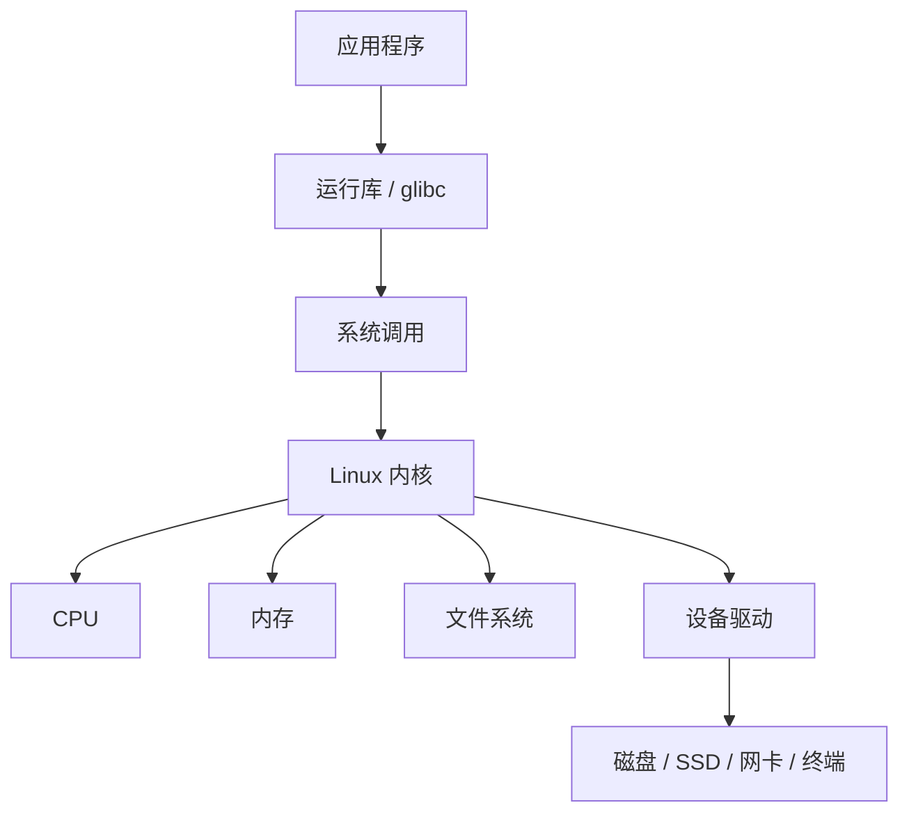
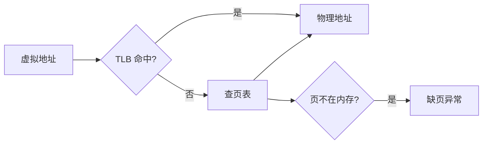

# 操作系统主题总览

## 为什么用 Linux 来理解操作系统

操作系统课里的很多概念都比较抽象：进程控制块、虚拟地址、页表、文件控制块、设备独立性、调度算法等。如果只背定义，很容易知道名词，却不知道它们在真实系统里对应什么。

Linux 很适合作为观察对象，因为它把许多内核状态暴露在 `/proc`、`/sys`、日志和命令行工具里。Ubuntu 则是一个常见发行版，可以把 Linux 内核、GNU 工具、systemd 服务管理、软件包管理和图形环境组合成一个可直接使用的系统。

从学习角度看，建议始终追问三件事：

1. 这个主题管理的资源是什么？
2. 应用程序看到的抽象是什么？
3. Linux 内核大致用什么机制把抽象落到硬件上？

## 总体模型

可以把一台运行 Ubuntu 的机器粗略看成下面这条链：



应用程序不能直接随意操作硬件。它们通常先调用标准库函数，再进入系统调用，由内核代为完成受保护的操作。

!!! tip "一个贯穿全篇的观察方法"
    Linux 下很多问题都可以先问：这是用户态能自己完成的事，还是必须通过系统调用进入内核？如果必须进入内核，就继续看它涉及的是进程、内存、文件、设备还是网络资源。

## 内核态、用户态与系统调用

现代操作系统通常把 CPU 运行状态分成不同特权级。普通应用运行在用户态，内核运行在内核态。

- 用户态：权限受限，不能直接执行特权指令，不能随意访问内核内存和硬件寄存器。
- 内核态：权限高，可以管理页表、中断、进程调度、设备驱动等核心资源。
- 系统调用：用户态程序主动请求内核服务的入口。

例如，程序执行：

```c title="read-example.c"
read(fd, buffer, 4096);
```

表面上是在调用 C 库函数，实际会通过 `read` 系统调用进入内核。内核检查文件描述符、权限、缓冲区地址，再从文件系统或设备中读取数据。

在 Ubuntu 上可以用 `strace` 观察一个程序发出的系统调用：

```bash
strace -e openat,read,write cat /etc/hostname
```

这类观察很有用，因为它能把“应用调用库函数”与“内核执行系统调用”对应起来。

!!! warning "常见误区"
    系统调用不是普通函数调用。普通函数调用仍在当前进程的用户态代码里执行；系统调用会触发受控的特权级切换，让 CPU 进入内核态执行内核代码。

## 中断与异常

中断和异常都是让 CPU 暂停当前执行流、转去执行处理程序的机制。

- 外中断：来自 CPU 外部，典型例子是时钟中断、I/O 设备中断。
- 异常：来自 CPU 正在执行的指令，典型例子是缺页、除零、非法指令。
- 软中断或陷入：由指令主动触发，系统调用可理解为一种受控进入内核的机制。

Linux 依赖时钟中断进行调度计时，也依赖设备中断响应键盘、网卡、磁盘等硬件事件。缺页异常则是虚拟内存能按需调页的基础。

!!! note "把中断看成入口"
    中断和异常不是某个孤立章节。它们连接了 CPU、进程调度、系统调用、虚拟内存和 I/O 设备，是用户态与内核态、同步执行与异步事件之间的重要入口。

## 进程

进程是操作系统进行资源分配和保护的基本单位。一个进程通常拥有：

- 独立的虚拟地址空间。
- 打开的文件描述符表。
- 当前工作目录、环境变量、用户身份等上下文。
- 至少一个执行线程。
- 内核中的进程控制信息。

在 Linux 中，每个进程都有一个 `PID`。可以用下面的命令观察：

```bash
ps -ef
ps -o pid,ppid,state,comm
cat /proc/1/status
```

`/proc/<pid>/` 下保存了内核暴露出的进程状态。例如：

- `/proc/<pid>/cmdline`：启动命令。
- `/proc/<pid>/status`：状态、内存、线程数量等摘要。
- `/proc/<pid>/maps`：虚拟地址空间映射。
- `/proc/<pid>/fd/`：打开的文件描述符。

### 进程状态

教材中常见状态包括运行、就绪、阻塞、创建、终止。Linux 的 `ps` 输出会用更具体的状态字符表示，例如：

- `R`：正在运行或可运行。
- `S`：可中断睡眠，常见于等待 I/O 或事件。
- `D`：不可中断睡眠，常见于某些内核 I/O 等待。
- `T`：停止。
- `Z`：僵尸进程。

!!! warning "僵尸进程不是还在运行"
    僵尸进程已经结束执行，只是父进程还没有回收它的退出状态。它保留的是少量进程表信息，不是一个仍在消耗 CPU 的正常运行进程。

### 创建与退出

Linux 中经典进程创建路径是 `fork` 加 `exec`：

- `fork`：复制当前进程，得到子进程。
- `exec`：在当前进程上下文中装入新程序。
- `wait`：父进程回收子进程退出状态。

Shell 执行 `ls` 时，大致会创建子进程，再让子进程 `exec` 成 `ls` 程序。

!!! tip "理解 fork 的关键"
    `fork` 后父子进程的虚拟地址空间看起来相似，但 Linux 通常用写时复制优化：没有写入时不急着复制物理页，真正发生写入时再复制对应页。

## 线程

线程是 CPU 调度的基本执行单位。多个线程可以属于同一个进程，共享同一进程的地址空间和打开文件等资源，但各自拥有自己的栈、寄存器上下文和调度状态。

可以用下面命令观察线程：

```bash
ps -eLf
top -H -p <pid>
ls /proc/<pid>/task
```

进程和线程的关键差别是：

| 对比项 | 进程 | 线程 |
| --- | --- | --- |
| 资源拥有 | 拥有独立地址空间等资源 | 共享所属进程的大部分资源 |
| 调度 | 可被调度 | 可被调度 |
| 切换开销 | 通常更大 | 通常更小 |
| 通信 | 需要 IPC 或共享内存等机制 | 可直接访问共享变量，但需要同步 |

!!! warning "共享不是自动安全"
    线程共享地址空间，所以通信方便；但也正因为共享，多个线程同时读写同一数据时需要锁、信号量、条件变量等同步机制。

## CPU 调度

单个 CPU 核心同一时刻只能运行一个执行流。多个进程或线程同时想运行时，内核必须决定谁先获得 CPU，这就是 CPU 调度。

调度要平衡不同目标：

- CPU 利用率：尽量不要让 CPU 空闲。
- 响应时间：交互程序要尽快有反馈。
- 周转时间：批处理任务希望尽快完成。
- 公平性：不能让某些任务长期得不到 CPU。
- 实时性：实时任务需要在期限内响应。

在 Linux 上可以观察调度相关信息：

```bash
top
htop
ps -o pid,ni,pri,stat,comm
chrt -p <pid>
```

其中 `nice` 值会影响普通进程的调度权重。数值越高，越“谦让”；数值越低，越倾向于获得 CPU。

### 上下文切换

当 CPU 从一个进程或线程切到另一个时，内核需要保存当前执行流的寄存器、程序计数器、栈指针等上下文，并恢复下一个执行流的上下文。

上下文切换让并发成为可能，但它本身有成本。因此大量短任务、频繁锁竞争、频繁系统调用都可能导致性能下降。

!!! tip "调度题的核心"
    考试里遇到 FCFS、SJF、优先级、时间片轮转、多级反馈队列时，不要只记名字。先判断系统目标：批处理更关心吞吐和周转，分时系统更关心响应与公平，实时系统更关心及时性和可预测性。

## 同步、互斥与死锁

只要多个执行流共享资源，就会出现并发控制问题。

- 临界资源：一次只允许一个执行流访问的资源。
- 临界区：访问临界资源的代码段。
- 互斥：避免多个执行流同时进入同一临界区。
- 同步：让多个执行流按某种先后关系协作。

Linux 用户态程序常见同步工具包括：

- mutex：互斥锁。
- semaphore：信号量。
- condition variable：条件变量。
- rwlock：读写锁。
- futex：Linux 中支撑许多用户态同步原语的底层机制。

### 死锁

死锁是多个进程或线程互相等待对方持有的资源，导致都无法继续推进。

死锁产生的四个必要条件是：

1. 互斥。
2. 不可剥夺。
3. 请求并保持。
4. 循环等待。

处理死锁通常有几类思路：

- 预防：破坏必要条件之一。
- 避免：分配前判断是否会进入不安全状态。
- 检测与解除：允许发生，之后检测并恢复。
- 忽略：很多通用系统对部分应用级死锁采用由应用自行处理的策略。

!!! warning "死锁与饥饿不同"
    死锁强调一组执行流互相等待，整体无法推进；饥饿强调某个执行流长期得不到资源，但系统中其他执行流可能仍在推进。

## 内存管理

内存管理的核心目标是：让多个进程安全、高效地共享主存，并让每个进程看到一个相对独立、连续、可保护的地址空间。

Linux 中每个进程看到的是虚拟地址。虚拟地址经过页表和 MMU 翻译后，才对应到物理内存。

可以用这些命令观察：

```bash
free -h
cat /proc/meminfo
cat /proc/<pid>/maps
pmap <pid>
vmstat 1
```

### 虚拟地址与物理地址

虚拟内存提供了几个关键能力：

- 地址隔离：进程不能随意访问其他进程或内核内存。
- 按需分配：申请虚拟空间不等于立刻占用同等物理内存。
- 内存保护：页表项可标记可读、可写、可执行等权限。
- 共享映射：多个进程可以映射同一份共享库或共享内存。
- 换入换出：内存压力大时，部分页可被换出到外存。

!!! note "虚拟内存不是简单的“硬盘当内存”"
    虚拟内存首先是一套地址抽象和保护机制；换页只是它的能力之一。把虚拟内存只理解成交换空间，会遗漏地址隔离、按需调页、共享库映射等关键作用。

### 分页、页表与 TLB

Linux 常用分页机制管理内存。虚拟地址被拆成页号和页内偏移，页表把虚拟页映射到物理页框。

如果每次访存都查页表，速度会很慢，所以 CPU 使用 `TLB` 缓存近期页表翻译结果。地址翻译可粗略理解为：



!!! warning "页表题常见混淆"
    逻辑地址结构、页表项结构、地址变换过程是三件事。逻辑地址结构说明地址怎么拆；页表项说明表里存什么；地址变换过程说明 CPU 和内核怎样一步步找到物理地址。

### 缺页与页面置换

当进程访问的虚拟页还没有装入物理内存时，会触发缺页异常。内核可能从文件、交换空间或零页机制中准备页面，再恢复进程执行。

页面置换算法用于决定内存不够时淘汰哪一页。教材常见算法包括：

- `OPT`：理论最优，用于比较，不可实际预知未来。
- `FIFO`：先进先出，简单但可能出现 Belady 异常。
- `LRU`：淘汰最近最久未使用页，符合局部性思想，但精确实现成本高。
- `CLOCK`：用访问位近似 LRU，是常见折中思路。

## 用户、权限与系统边界

操作系统不只是“帮你运行程序”，还要防止一个普通程序把整个系统弄坏。Linux 的用户、权限、`sudo` 和 `Permission denied`，其实就是保护机制最日常的入口。

普通用户不能随便改 `/etc` 下的文件，是因为这些文件通常影响系统级配置，例如用户账户、服务配置、网络配置等。应用程序在用户态运行，它的文件读写请求必须通过系统调用进入内核；内核会检查当前进程的身份、文件权限和目录权限，只有通过检查才真正执行读写。

可以先观察当前身份：

```bash
id
whoami
ls -l /etc/passwd /etc/shadow
```

通常 `/etc/passwd` 可读，而 `/etc/shadow` 只有高权限用户或特定组能读。这不是文件“害羞”，而是内核在文件系统层面拦住了普通进程。

!!! note "保护的真正对象是进程"
    用户名只是人类可读的标签。内核真正检查的是进程携带的用户 ID、组 ID、有效用户 ID 等凭据。文件权限检查发生在进程发起 `open`、`read`、`write` 等系统调用时。

### `sudo` 的本质

`sudo` 不是魔法咒语，而是以受控方式启动一个具有更高有效权限的进程。简单说，当前用户通过认证和策略检查后，`sudo` 让被执行命令临时获得执行特权操作的资格。

例如：

```bash
sudo systemctl restart ssh
sudoedit /etc/hosts
```

这类命令背后不是“Shell 突然变成内核态”，而是新进程仍然在用户态运行，只是它携带的有效身份允许它请求内核执行更多受保护操作。

!!! warning "不要把 sudo 理解成进入内核态"
    `sudo` 提升的是进程的权限身份，不是让程序代码直接跑进内核态。真正修改文件、管理服务、加载配置时，仍然要通过系统调用请求内核执行。

### inode、rwx 与 `chmod 777`

Linux 文件权限通常可以从 `ls -l` 里读出来：

```bash
ls -l /usr/bin/python3
ls -ld /etc /home
stat /usr/bin/python3
```

典型输出开头类似：

```text
-rwxr-xr-x 1 root root ... /usr/bin/python3
```

可以拆成三组权限：

| 位置 | 含义 | 例子 |
| --- | --- | --- |
| Owner | 文件所有者权限 | `rwx` |
| Group | 文件所属组权限 | `r-x` |
| Others | 其他用户权限 | `r-x` |

其中：

- `r`：读文件内容或列出目录项。
- `w`：写文件内容或修改目录项。
- `x`：执行文件，或进入目录、穿过目录路径。

权限信息是文件元数据的一部分，通常与 inode 相关。目录项负责把名字映射到 inode；内核再根据 inode 中的权限、所有者等元数据判断能不能访问。

!!! danger "为什么 chmod 777 危险"
    `chmod 777` 表示所有用户都可读、可写、可执行。对系统配置、脚本、服务目录乱用它，等于把“谁能改系统行为”的边界直接拆掉。短期看是消灭了 `Permission denied`，长期看是给误操作和恶意程序开门。

!!! tip "遇到 Permission denied 的排查顺序"
    先用 `ls -l` 看文件权限，再用 `ls -ld` 看路径上每一级目录权限，最后确认当前进程身份 `id`。不要上来就 `chmod 777`，那是在用大锤修手表。

## 文件系统

文件系统把磁盘、SSD 等外存组织成用户能理解的文件和目录。对应用来说，文件是连续字节流或记录集合；对存储设备来说，数据最终落在一个个块上。

在 Linux 中可以用：

```bash
ls -l
ls -li
stat <file>
df -h
du -sh <path>
mount
findmnt
```

### 文件、目录与 inode

Linux 文件系统常用 `inode` 保存文件元数据，例如权限、所有者、大小、时间戳、数据块位置等。目录本质上维护“文件名到 inode”的映射。

这解释了几个现象：

- 同一 inode 可以有多个硬链接名称。
- 删除文件名只是删除目录项；如果仍有进程打开该文件，数据可能暂时还不释放。
- 权限检查既涉及文件权限，也涉及路径上目录的执行权限。

!!! tip "理解目录"
    目录不是普通意义上的“文件夹容器”，而是一类特殊文件，核心作用是把名字映射到文件对象。文件名通常属于目录项，文件元数据更多属于 inode。

### 文件描述符

进程打开文件后，内核返回一个小整数，即文件描述符。标准输入、标准输出、标准错误通常是：

- `0`：stdin
- `1`：stdout
- `2`：stderr

可以观察某个进程打开了哪些文件：

```bash
ls -l /proc/<pid>/fd
lsof -p <pid>
```

Shell 的重定向、管道都建立在文件描述符抽象之上：

```bash
cat input.txt > output.txt
grep error app.log | less
```

### VFS

Linux 支持 ext4、xfs、btrfs、tmpfs、procfs、sysfs 等多种文件系统。应用程序不需要分别学习每种文件系统的读写接口，因为内核提供了虚拟文件系统 `VFS`。

`VFS` 的作用是给上层提供统一的文件操作接口，再把具体请求分派给底层文件系统实现。

!!! note "设备也常被文件化"
    Linux 里很多设备以 `/dev` 下的文件形式出现，例如磁盘、终端、随机数设备。这里的“文件”更多是一种统一接口，不代表它们都是真正存放在普通磁盘文件里的数据。

## 软件是怎么装到系统里的？以 apt 为例

执行：

```bash
sudo apt install python3
```

从用户角度看，是“装了一个软件”。从操作系统角度看，它至少牵涉文件分发、权限、包数据库、环境变量、动态链接和进程启动。

### 文件被放到哪里

软件包安装时会把不同类型的文件放到约定位置：

- 可执行文件常放在 `/usr/bin`、`/usr/sbin`。
- 系统配置常放在 `/etc`。
- 共享库常放在 `/usr/lib` 或架构相关目录。
- 文档、图标、服务单元、缓存等也会进入各自目录。

可以用下面命令观察：

```bash
which python3
dpkg -L python3 | sed -n '1,20p'
```

典型结果会告诉你：`python3` 这个命令名最终指向某个目录树中的可执行文件。VFS 负责把这些路径统一组织起来，应用程序不需要关心这些文件分别来自哪个分区或哪块磁盘。

!!! note "apt 不是把软件塞进一个神秘仓库"
    软件包安装后的结果仍然是一批普通文件、目录、符号链接和元数据。包管理器负责下载、校验、解包、登记依赖和执行维护脚本；内核负责提供文件系统、权限和进程执行能力。

### 为什么装完能直接敲命令

Shell 能直接运行 `python3`，通常是因为可执行文件所在目录在 `$PATH` 环境变量中。

```bash
echo "$PATH"
command -v python3
```

当你输入 `python3` 时，Shell 会按 `$PATH` 中的目录顺序查找可执行文件。找到后，Shell 创建子进程，再通过 `exec` 把子进程替换成 Python 程序。

!!! tip "PATH 是进程上下文的一部分"
    环境变量属于进程的运行上下文。子进程通常继承父进程的环境变量，所以你在 Shell 里看到的 `$PATH` 会影响它启动命令时的查找行为。

### 共享库与动态链接

很多程序并不是把所有代码都打包进一个可执行文件。它们会依赖 `.so` 动态链接库，例如 C 标准库 `libc`。

可以用：

```bash
ldd "$(command -v python3)"
```

观察一个程序运行时需要哪些共享库。

多个程序可以同时映射同一个共享库文件。每个进程看到的是自己的虚拟地址空间；内核可以把同一份只读库代码页映射到多个进程中，从而节省物理内存。进程各自的全局状态、堆、栈仍然隔离，不会因为共用 `libc` 代码页就互相踩内存。

!!! note "共享库的核心收益"
    动态链接库把“代码复用”和“内存共享”结合起来：磁盘上只需维护一份库文件，内存中常用只读代码页也可被多个进程共享映射。

## 网络、进程与万物皆文件

前面讲了文件描述符，容易让人以为它只和磁盘文件有关。实际上，在 Linux 中，网络连接也可以表现为文件描述符。应用程序通过 Socket 抽象使用网络，内核负责把读写请求交给 TCP/IP 协议栈和网卡驱动。

一个简化模型如下：


Socket 是进程和网络协议栈之间的接口。服务器程序创建 socket、绑定地址和端口、监听连接；客户端程序创建 socket、连接远端地址。连接建立后，应用可以像处理文件一样对 socket 做 `read`、`write`，或者使用更专门的 `send`、`recv`。

!!! note "万物皆文件不是万物都在磁盘上"
    Socket、管道、终端、设备文件都可以通过文件描述符统一管理，但它们背后的内核对象不同。文件描述符统一的是访问接口，不是物理存储形态。

可以用下面命令观察网络资源：

```bash
ss -tuln
lsof -i
ls -l /proc/<pid>/fd
```

`ss -tuln` 能查看正在监听的 TCP/UDP 端口，`lsof -i` 能把网络连接和进程对应起来，`/proc/<pid>/fd` 则能看到进程打开的文件描述符，其中可能包含 `socket:[...]` 这类条目。

!!! tip "排查端口占用"
    看到 `Address already in use` 时，先用 `ss -tulnp` 找监听端口和进程，再判断是停止旧服务、换端口，还是修正配置。不要只盯着应用代码，端口也是内核管理的系统资源。

## I/O 与设备管理

I/O 管理解决的是 CPU、内存和外部设备之间速度差异巨大、接口各异的问题。

典型 I/O 路径可以粗略看成：


### I/O 控制方式

教材中常见 I/O 控制方式包括：

- 程序直接控制：CPU 不断查询设备状态，简单但浪费 CPU。
- 中断驱动：设备准备好后发中断通知 CPU。
- DMA：设备和内存之间直接搬运数据，CPU 只负责设置和收尾。

Linux 中磁盘、网卡等高速设备通常离不开中断、DMA、驱动和缓冲机制的配合。

### 缓冲与缓存

缓冲和缓存都能提升 I/O 效率，但侧重点不同：

- 缓冲：协调生产者与消费者速度差异，例如内核缓冲区、管道缓冲区。
- 缓存：保存近期可能再次使用的数据，例如页缓存、目录项缓存。

可以用下面命令观察块设备和 I/O：

```bash
lsblk
cat /proc/diskstats
iostat -xz 1
```

其中 `iostat` 通常来自 `sysstat` 软件包，不一定默认安装。

!!! warning "不要把 cache 都当成浪费内存"
    Linux 会积极使用空闲内存做页缓存，这能显著提升文件访问性能。当应用需要内存时，许多缓存页可以被回收。

## 磁盘、SSD 与外存调度

传统机械磁盘的访问时间主要包括：

$$
T_{\text{access}} = T_{\text{seek}} + T_{\text{rotation}} + T_{\text{transfer}}
$$

因此，磁盘调度算法会考虑磁头移动，例如：

- `FCFS`：按请求到达顺序服务。
- `SSTF`：优先服务离当前磁头最近的请求。
- `SCAN`：像电梯一样沿一个方向扫描。
- `C-SCAN`：单向循环扫描，响应时间更均匀。

SSD 没有机械磁头和旋转延迟，但有擦写次数、块擦除、写放大和磨损均衡等问题。理解 SSD 时，重点应从“减少寻道”转向“闪存页、擦除块、控制器和寿命管理”。

!!! tip "考试和真实系统的区别"
    408 中磁盘调度常按柱面号计算磁头移动距离；真实 Linux I/O 调度还会考虑队列合并、设备并行度、SSD 特性、控制组和文件系统写回策略。

## 实战插曲：从安装 Ubuntu 深刻理解外存与挂载

安装 Ubuntu 时看到的分区界面，其实是一张操作系统概念地图。`EFI`、`Swap`、`/`、`/home` 不是安装向导随便摆出来的选项，而是分别对应启动、虚拟内存、文件系统层次和用户数据隔离。

可以用下面命令观察安装后的磁盘与挂载关系：

```bash
lsblk -f
findmnt
cat /etc/fstab
```

`lsblk -f` 看块设备、分区、文件系统类型和挂载点；`findmnt` 看当前挂载树；`/etc/fstab` 则记录系统启动时应该自动挂载哪些文件系统。

### UEFI/EFI 分区

在 UEFI 启动方式下，磁盘上通常会有一个 EFI System Partition，常见挂载点是 `/boot/efi`。这个分区一般使用 FAT32 文件系统，里面存放 UEFI 固件能识别的引导程序。

启动流程可以更具体地补成：


UEFI 固件先找到 EFI 分区中的引导程序，引导程序再加载 Linux 内核和 initramfs。内核起来后，才有后面的驱动初始化、根文件系统挂载、`systemd` 启动服务等步骤。

!!! note "EFI 分区不是 /boot 的同义词"
    `/boot/efi` 常用于挂载 EFI System Partition，里面放 UEFI 固件要找的启动文件；`/boot` 通常放内核、initramfs、GRUB 配置等启动相关文件。具体布局会因发行版和安装方式而不同。

可以观察启动相关日志：

```bash
dmesg | grep -i efi
bootctl status
```

其中 `bootctl` 不一定在所有安装方式下都有完整输出，但它能帮助理解当前系统的 UEFI 启动状态。

### Swap 分区或 Swap 文件

安装系统时让你分配 Swap，本质上是在给虚拟内存机制准备一个后备空间。内存压力大时，Linux 可以把一些暂时不活跃的匿名页换出到 Swap，把宝贵的物理内存留给更需要的页缓存或活跃进程。

可以观察 Swap：

```bash
swapon --show
free -h
cat /proc/swaps
```

这和前面提到的缺页异常、页面置换有关：当一个被换出的页再次被访问时，会触发缺页异常，内核再把它从 Swap 读回内存。

!!! warning "Swap 不是免费的内存扩容"
    Swap 在磁盘或 SSD 上，速度远慢于 RAM。它能让系统在内存紧张时多撑一会儿，但频繁换入换出会导致系统明显变慢。内存真的长期不够，正确答案通常是减少负载或增加内存。

当内存和可用 Swap 都顶不住时，Linux 不能凭空变出内存。内核可能触发 `OOM Killer`，选择某个进程杀掉以释放内存。可以用下面命令查看相关痕迹：

```bash
dmesg | grep -i "out of memory\\|killed process"
journalctl -k | grep -i "out of memory\\|killed process"
```

!!! danger "OOM Killer 是最后手段"
    OOM Killer 不是调度算法里的温柔排队，而是系统为了活下去做的强制回收。被选中的进程会直接被杀掉，所以服务端程序要关注内存上限、监控和降级策略。

### `/` 与 `/home` 分离

Linux 没有 Windows 那种 `C:`、`D:` 盘符模型，而是把所有文件系统挂到一棵统一目录树上。根目录 `/` 是树根，其他分区、磁盘、网络文件系统都可以挂到某个目录节点上。

例如安装时把 `/` 和 `/home` 分开：

- `/`：放系统程序、库、配置、服务文件等。
- `/home`：放普通用户的数据、配置和项目文件。

这样做的一个现实好处是：重装系统或更换根分区时，理论上可以保留 `/home` 分区，用户数据不必跟着系统文件一起清空。

!!! tip "挂载点就是目录树的接入口"
    挂载前，`/home` 只是根文件系统里的一个目录；挂载后，访问 `/home` 会进入另一个文件系统。VFS 把这种跨设备、跨文件系统的跳转包装成统一路径，所以用户看到的仍是一棵树。

可以用 `findmnt /home` 看 `/home` 是否是独立挂载点：

```bash
findmnt /
findmnt /home
df -hT / /home
```

如果 `/home` 没有独立分区，它也可以只是 `/` 文件系统下的普通目录。抽象不变：路径统一，挂载关系由内核和 VFS 维护。

## 启动、服务与系统结构

Ubuntu 启动过程可以粗略理解为：

1. 固件初始化硬件，例如 UEFI。
2. 引导加载程序加载 Linux 内核和 initramfs。
3. 内核初始化内存、调度器、驱动等核心机制。
4. 内核启动第一个用户态进程。
5. systemd 拉起系统服务、挂载文件系统、进入目标运行状态。

在多数现代 Ubuntu 系统中，`PID 1` 是 `systemd`：

```bash
ps -p 1 -o pid,comm,args
systemctl status
systemctl list-units --type=service
journalctl -b
```

!!! note "PID 1 的特殊性"
    `PID 1` 是用户态进程树的根，负责启动和管理大量系统服务，并会接收孤儿进程。它不是内核本身，但它在系统启动和服务管理中非常关键。

## 虚拟化与容器

虚拟化让一台物理机上可以运行多个隔离环境。

- 虚拟机：通过虚拟化层模拟或直通硬件，让客户机运行自己的内核。
- 容器：共享宿主机内核，通过 namespace、cgroup、文件系统隔离等机制隔离进程视图和资源。

Docker 容器里运行的 Ubuntu 用户态，不等于它拥有一个独立 Ubuntu 内核。容器内的进程仍由宿主机 Linux 内核调度，只是看到的进程、网络、挂载点等命名空间被隔离了。

可以观察容器和普通进程共享的一些基础机制：

```bash
cat /proc/self/cgroup
lsns
systemd-cgls
```

!!! warning "容器不是轻量虚拟机的完整等价物"
    容器隔离的是进程能看到的资源视图和资源使用边界；虚拟机通常拥有自己的客户机内核。两者在安全边界、启动成本、内核能力和运维方式上都不同。

## 一个 Linux 命令串联例子

假设执行：

```bash
grep "error" app.log | sort > result.txt
```

这条命令背后涉及多个 OS 主题：

1. Shell 创建 `grep` 和 `sort` 进程。
2. Shell 建立管道，把 `grep` 的标准输出接到 `sort` 的标准输入。
3. `grep` 通过系统调用读取 `app.log`。
4. 文件系统把文件名解析到 inode，再找到数据块。
5. 内核可能从页缓存返回数据，也可能触发磁盘 I/O。
6. `grep` 和 `sort` 被调度器轮流放到 CPU 上运行。
7. 管道缓冲区满或空时，进程可能阻塞和唤醒。
8. `sort` 写入 `result.txt`，内核维护文件描述符、页缓存和后续写回。
9. 进程结束后，父进程回收退出状态。

!!! success "一个整体结论"
    操作系统不是一堆孤立名词，而是在同一条执行路径上同时管理 CPU、内存、文件、设备和权限。能把一条命令拆到这些层次，基本就建立了 OS 的主干模型。

## 408 / 应试补充

### 建议学习顺序

1. 系统概述：先理解 OS 的目标、特征、内核态/用户态、中断、系统调用。
2. 进程与线程：掌握进程状态、PCB、线程、调度、同步互斥、死锁。
3. 内存管理：掌握连续分配、分页、分段、段页式、虚拟内存、页面置换。
4. 文件管理：掌握文件逻辑结构、目录、inode/FCB、文件共享与保护、空闲空间管理。
5. I/O 管理：掌握 I/O 控制方式、缓冲、设备独立性、磁盘调度、SSD 特性。

### 常见考点速记

| 主题 | 常问问题 | 抓手 |
| --- | --- | --- |
| 系统调用 | 为什么需要进入内核态 | 用户态不能直接执行特权操作 |
| 中断/异常 | 来源和处理时机 | 外部事件、当前指令、主动陷入 |
| 进程状态 | 状态转换是否合法 | 就绪、运行、阻塞之间的触发原因 |
| 调度算法 | 平均周转时间、响应时间 | 画时间轴，不要凭感觉排序 |
| 信号量 | `P` / `V` 放在哪里 | 先互斥，再同步，注意初值 |
| 死锁 | 是否满足四个必要条件 | 互斥、不可剥夺、请求并保持、循环等待 |
| 页式管理 | 地址翻译与页表大小 | 页号、页内偏移、页表项数 |
| 页面置换 | 缺页次数 | 按访问串逐步模拟 |
| 文件系统 | 逻辑结构和物理结构 | 用户视角与磁盘存放方式分开 |
| 磁盘调度 | 移动磁道数 | 明确初始磁头、请求序列、移动方向 |

### 易混点

!!! warning "并发与并行"
    并发强调多个任务在同一时间段内交替推进；并行强调多个任务在同一时刻真的同时执行。单核 CPU 可以并发，多核 CPU 才能让多个执行流物理并行。

!!! warning "调度与切换"
    调度是选择下一个运行对象的决策过程；切换是保存和恢复上下文的执行过程。考试题里常把两者放在一起问，但概念上不要混成一个动作。

!!! warning "逻辑地址与物理地址"
    程序产生的是逻辑地址或虚拟地址；真正访问内存芯片需要物理地址。分页、分段、段页式的差异，核心都体现在地址结构和地址变换过程上。

!!! warning "文件逻辑结构与物理结构"
    逻辑结构是用户看到的记录或字节组织方式；物理结构是文件在外存块上的存放方式。二者有关联，但不是同一个维度。

!!! tip "做综合题的顺序"
    先画资源和状态，再套算法。进程调度题画时间轴，页面置换题画页框表，磁盘调度题画磁头移动方向，死锁题画资源分配图或检查安全序列。

## 小结

操作系统的主线可以压缩成一句话：**内核用受保护的机制，把 CPU、内存、文件和设备包装成应用程序可用的抽象，并在多个进程之间做隔离、共享和调度。**

Ubuntu/Linux 给了我们很好的观察窗口：

- 用 `ps`、`top`、`/proc` 看进程与线程。
- 用 `strace` 看系统调用。
- 用 `free`、`vmstat`、`/proc/<pid>/maps` 看虚拟内存。
- 用 `ls -li`、`stat`、`mount` 看文件系统。
- 用 `lsblk`、`iostat`、`dmesg` 看设备与 I/O。
- 用 `systemctl`、`journalctl` 看启动和服务管理。

把这些命令背后的机制与教材概念一一对应起来，OS 就会从“定义集合”变成一套可以观察、可以解释、也可以用于排查问题的系统模型。
