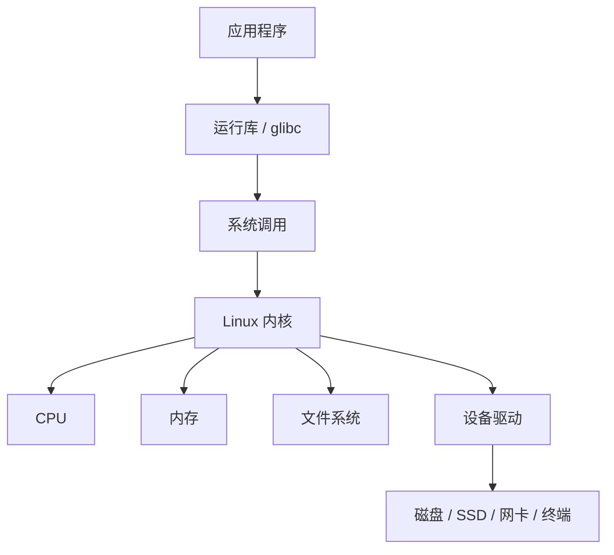
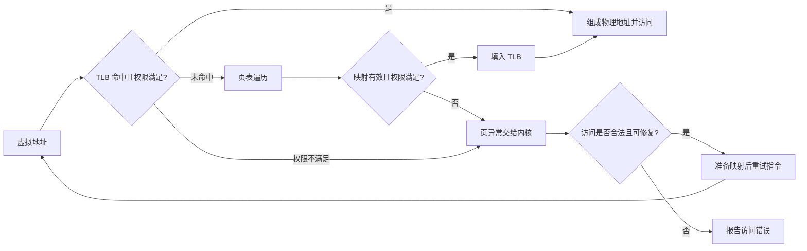

# 操作系统主题总览

## Linux 视角下的操作系统

操作系统管理处理机、内存、文件和设备，并向程序提供进程、虚拟地址空间、文件描述符等抽象。复习时需要区分三层问题：抽象对程序保证什么，内核用什么机制实现，具体算法在什么条件下成立。

本文沿“系统运行环境—进程与线程—内存—文件—I/O”组织概念，用 Linux 命令给出观察入口。Linux 的实现用于解释机制；调度、页面置换和磁盘调度题仍应按题目给定的模型计算。Ubuntu 是由 Linux 内核、用户态工具、服务管理和软件包系统组成的发行版，不能把发行版工具的行为直接当成所有操作系统的定义。

## 总体模型

可以把一台运行 Ubuntu 的机器粗略看成下面这条链：


```mermaid
graph TD
  App[应用程序] --> Lib[运行库 / glibc]
  Lib --> Syscall[系统调用]
  Syscall --> Kernel[Linux 内核]
  Kernel --> CPU[CPU]
  Kernel --> Mem[内存]
  Kernel --> FS[文件系统]
  Kernel --> Dev[设备驱动]
  Dev --> Disk[磁盘 / SSD / 网卡 / 终端]
```

应用程序不能直接随意操作硬件。它们通常先调用标准库函数，再进入系统调用，由内核代为完成受保护的操作。

标准库函数与系统调用并非一一对应：`strlen` 通常只在用户态计算，`printf` 可能先写用户态缓冲区，`malloc` 可能复用已有内存。只有需要内核服务时，相关路径才会进入系统调用。

## 内核态、用户态与系统调用

现代操作系统通常把 CPU 运行状态分成不同特权级。普通应用运行在用户态，内核运行在内核态。

- 用户态：权限受限，不能直接执行特权指令，不能随意访问内核内存和硬件寄存器。
- 内核态：权限高，可以管理页表、中断、进程调度、设备驱动等核心资源。
- 系统调用：用户态程序主动请求内核服务的入口。

例如，程序执行：

```c title="read-example.c"
read(fd, buffer, 4096);
```

这里的 `read` 库接口通常进入同名系统调用。内核检查文件描述符是否有效、是否允许读取以及用户缓冲区是否合法，再从对应内核对象读取数据；普通文件的路径与访问权限主要在打开时检查。读到页缓存即可返回时，无须发起磁盘 I/O。

在 Ubuntu 上可以用 `strace` 观察一个程序发出的系统调用：

```bash
strace -e openat,read,write cat /etc/hostname
```

这类观察很有用，因为它能把“应用调用库函数”与“内核执行系统调用”对应起来。

系统调用会发生受控的特权级切换，但当前任务可以一直保持运行。因此，**进入内核态不必然发生进程切换**；只有阻塞、抢占等条件导致调度器选择另一任务时，才需要切换执行上下文。

## 中断与异常

中断和异常都是让 CPU 暂停当前执行流、转去执行处理程序的机制。

- 外中断：来自 CPU 外部，典型例子是时钟中断、I/O 设备中断。
- 异常：来自 CPU 正在执行的指令，典型例子是缺页、除零、非法指令。
- 陷入：程序主动请求处理的同步事件；教材常用陷入指令说明系统调用入口，实际指令随体系结构而异。

Linux 的 `softirq` 是内核延后处理中断相关工作的机制，与教材把陷入称作“软中断”的用法不同。缺页在体系结构上属于同步异常，教材中的“缺页中断”沿用的是较宽泛的名称。

Linux 依赖时钟中断进行调度计时，也依赖设备中断响应键盘、网卡、磁盘等硬件事件。缺页异常则是虚拟内存能按需调页的基础。

外中断到来时，CPU 可能本来就在内核态；中断返回后也可能继续运行原任务。判断题应分别检查事件来源、是否切换特权级、是否切换任务，不能由其中一项直接推出其余两项。

## 进程

进程是操作系统进行资源分配和保护的基本单位。一个进程通常拥有：

- 独立的虚拟地址空间。
- 打开的文件描述符表。
- 当前工作目录、环境变量、用户身份等上下文。
- 至少一个执行线程。
- 内核中的进程控制信息。

在 Linux 中，每个进程都有一个 `PID`。可以用下面的命令观察：

```bash
ps -ef
ps -o pid,ppid,state,comm
cat /proc/1/status
```

`/proc/<pid>/` 下保存了内核暴露出的进程状态。例如：

- `/proc/<pid>/cmdline`：启动命令。
- `/proc/<pid>/status`：状态、内存、线程数量等摘要。
- `/proc/<pid>/maps`：虚拟地址空间映射。
- `/proc/<pid>/fd/`：打开的文件描述符。

### 进程状态

教材中常见状态包括运行、就绪、阻塞、创建、终止。Linux 的 `ps` 输出会用更具体的状态字符表示，例如：

- `R`：正在运行或可运行。
- `S`：可中断睡眠，常见于等待 I/O 或事件。
- `D`：不可中断睡眠，常见于某些内核 I/O 等待。
- `T`：停止。
- `Z`：僵尸进程。

僵尸进程已经结束执行，只保留供父进程回收的退出状态等信息，不再执行用户代码。教材中的阻塞进程被唤醒后先进入就绪态；在通常的三态模型中，阻塞不能直接变为运行，就绪也不会因“等待 CPU”变成阻塞。`ps` 的 `R` 合并了就绪和运行，不能仅凭这个字符断言该任务此刻占有 CPU。

### 创建与退出

Linux 中经典进程创建路径是 `fork` 加 `exec`：

- `fork`：复制当前进程，得到子进程。
- `exec`：在当前进程上下文中装入新程序。
- `wait`：父进程回收子进程退出状态。

Shell 执行 `ls` 时，大致会创建子进程，再让子进程 `exec` 成 `ls` 程序。

`fork` 后父子进程的私有可写映射通常采用写时复制：未写入时可共享物理页，首次写入再按需复制。父子进程的文件描述符表分别存在，但对应表项可以指向同一打开文件描述，因此可能共享文件偏移。`exec` 替换程序映像并保留进程身份，成功后不返回原程序；它本身不创建新进程。

## 线程

线程是 CPU 调度的基本执行单位。多个线程可以属于同一个进程，共享同一进程的地址空间和打开文件等资源，但各自拥有自己的栈、寄存器上下文和调度状态。

可以用下面命令观察线程：

```bash
ps -eLf
top -H -p <pid>
ls /proc/<pid>/task
```

进程和线程的关键差别是：

| 对比项 | 进程 | 线程 |
| --- | --- | --- |
| 资源拥有 | 拥有独立地址空间等资源 | 共享所属进程的大部分资源 |
| 调度 | 单线程进程由其执行线程参与调度 | 内核线程直接参与调度；用户级线程取决于运行时映射 |
| 切换开销 | 跨地址空间切换可能增加翻译与缓存成本 | 同地址空间切换可省去部分成本，实际开销仍取决于工作负载 |
| 通信 | 需要 IPC 或共享内存等机制 | 可直接访问共享变量，但需要同步 |

Linux 通常以任务结构描述内核可调度实体，常见 POSIX 线程实现采用一对一映射。用户级协程、绿色线程还需要运行时调度；把许多用户任务映射到少量内核线程时，用户任务切换不一定进入内核。线程拥有各自的栈，但这些栈仍在共享地址空间内，不形成内存保护边界。

## CPU 调度

在教材的单处理机模型中，同一时刻只有一个任务运行。实际调度应按逻辑 CPU 计数：支持同时多线程的物理核心可提供多个逻辑 CPU，但它们共享部分硬件资源，不能把吞吐量当成相同数量独立物理核心的吞吐量。

调度要平衡不同目标：

- CPU 利用率：尽量不要让 CPU 空闲。
- 响应时间：交互程序要尽快有反馈。
- 周转时间：批处理任务希望尽快完成。
- 公平性：不能让某些任务长期得不到 CPU。
- 实时性：实时任务需要在期限内响应。

在 Linux 上可以观察调度相关信息：

```bash
top
htop
ps -o pid,ni,pri,stat,comm
chrt -p <pid>
```

`nice` 影响普通调度类中任务的相对权重，较低的数值通常获得较高权重；它不保证固定 CPU 百分比，也不等价于实时调度优先级。CPU 亲和性、控制组配额、竞争任务及调度类都会影响实际结果。

### 上下文切换

当 CPU 从一个进程或线程切到另一个时，内核需要保存当前执行流的寄存器、程序计数器、栈指针等上下文，并恢复下一个执行流的上下文。

任务切换除了保存寄存器，还可能影响缓存和地址翻译的局部性。频繁系统调用有用户态与内核态切换成本，但只有其中发生阻塞或抢占时才增加任务切换；两类开销应分别观察。

FCFS、SJF、HRRN、时间片轮转和多级反馈队列分别体现不同取舍。计算前应明确到达时间、抢占条件、同时到达时的次序以及切换开销是否计入；HRRN 的响应比随等待时间增长，不能只按运行时间排序。

Linux 的普通调度实现也在演进。内核文档以 EEVDF 说明对任务应得服务量和虚拟截止时间的处理；它仍服务于公平调度目标，不应与实时调度类 `SCHED_DEADLINE` 混同。教材算法适合在可控假设下推导性质，现实实现还需处理多核、CPU 亲和性和调度组。

### 调度指标与题目条件

对任务 $i$，到达时刻为 $a_i$，完成时刻为 $c_i$，实际服务时间为 $s_i$，则周转时间为 $T_i=c_i-a_i$，带权周转时间为 $W_i=T_i/s_i$。响应时间统计从到达到首次得到服务的等待，与完成时刻无关；等待时间也不能在存在 I/O 阻塞时一律写成周转时间减 CPU 时间。

!!! question "例题：FCFS 与非抢占 SJF"
    三个任务 $A,B,C$ 同时于时刻 $0$ 到达，服务时间分别为 $6,2,1$，无 I/O，忽略切换开销。FCFS 的同到达次序为 $A,B,C$。比较 FCFS 与非抢占 SJF 的平均周转时间。

    ??? success "参考答案"
        FCFS 完成时刻依次为 $6,8,9$，平均周转时间为 $(6+8+9)/3=23/3$。

        SJF 次序为 $C,B,A$，完成时刻依次为 $1,3,9$，平均周转时间为 $(1+3+9)/3=13/3$。该比较使用了“所有任务同时就绪且服务时间已知”的条件；不能据此认定 SJF 在任意到达过程、响应目标和抢占约束下都最优。

## 同步、互斥与死锁

只要多个执行流共享资源，就会出现并发控制问题。

- 临界资源：一次只允许一个执行流访问的资源。
- 临界区：访问临界资源的代码段。
- 互斥：避免多个执行流同时进入同一临界区。
- 同步：让多个执行流按某种先后关系协作。

Linux 用户态程序常见同步工具包括：

- mutex：互斥锁。
- semaphore：信号量。
- condition variable：条件变量。
- rwlock：读写锁。
- futex：Linux 中支持用户态等待与唤醒的机制；常见锁在无竞争时可用原子操作完成，竞争时再请求内核阻塞。

原子性与可见性需要分别保证。在 C/C++ 中，用 `volatile` 不能代替互斥锁或语言内存模型中的原子操作。条件变量的唤醒只意味着应重新检查条件，因此等待通常写在检查共享谓词的循环中。

### 死锁

死锁是多个进程或线程互相等待对方持有的资源，导致都无法继续推进。

死锁产生的四个必要条件是：

1. 互斥。
2. 不可剥夺。
3. 请求并保持。
4. 循环等待。

处理死锁通常有几类思路：

- 预防：破坏必要条件之一。
- 避免：分配前判断是否会进入不安全状态。
- 检测与解除：允许发生，之后检测并恢复。
- 忽略：很多通用系统对部分应用级死锁采用由应用自行处理的策略。

死锁强调一组执行流无法推进；饥饿表示某个执行流长期得不到资源，其他执行流仍可能推进。银行家算法中的“不安全”表示无法保证所有进程都能完成，不能直接判为已经死锁；存在安全序列则可保证按该次序完成。资源分配图中，若每类资源只有一个实例，环可作为死锁的充分必要条件；多实例情形下，有环仅是必要条件。

!!! question "例题：生产者与消费者的等待次序"
    容量为 $N$ 的缓冲区使用互斥信号量 `mutex`，空位信号量 `empty` 和产品信号量 `full`。三者初值应如何设置？生产者先执行 `P(mutex)` 再执行 `P(empty)` 有什么问题？

    ??? success "参考答案"
        初值分别为 $1$、$N$、$0$。生产者应先等待空位，再进入互斥区：`P(empty)`、`P(mutex)`、放入产品、`V(mutex)`、`V(full)`；消费者对称地先等待产品。

        缓冲区满时，若生产者持有 `mutex` 再等待 `empty`，消费者无法进入缓冲区取走产品，也就不能释放空位，形成死锁。同步等待放在互斥锁外，是由这一资源依赖关系决定的。

## 内存管理

内存管理的核心目标是：让多个进程安全、高效地共享主存，并向每个进程提供可保护的虚拟地址空间；其中有效映射可以不连续。

Linux 中每个进程看到的是虚拟地址。虚拟地址经过页表和 MMU 翻译后，才对应到物理内存。

可以用这些命令观察：

```bash
free -h
cat /proc/meminfo
cat /proc/<pid>/maps
pmap <pid>
vmstat 1
```

### 虚拟地址与物理地址

虚拟内存提供了几个关键能力：

- 地址隔离：进程不能随意访问其他进程或内核内存。
- 按需分配：申请虚拟空间不等于立刻占用同等物理内存。
- 内存保护：页表项可标记可读、可写、可执行等权限。
- 共享映射：多个进程可以映射同一份共享库或共享内存。
- 换入换出：内存压力大时，部分页可被换出到外存。

虚拟内存首先是一套地址抽象和保护机制；换页只是它的能力之一。把虚拟内存只理解成交换空间，会遗漏地址隔离、按需调页、共享库映射等关键作用。

### 分页、页表与 TLB

Linux 常用分页机制管理内存。虚拟地址被拆成页号和页内偏移，页表把虚拟页映射到物理页框。

如果每次访存都查页表，速度会很慢，所以 CPU 使用 `TLB` 缓存近期页表翻译结果。地址翻译可粗略理解为：


```mermaid
graph LR
  VA[虚拟地址] --> TLB{TLB 命中且权限满足?}
  TLB -->|是| PA[组成物理地址并访问]
  TLB -->|未命中| PT[页表遍历]
  PT --> Check{映射有效且权限满足?}
  Check -->|是| Fill[填入 TLB] --> PA
  Check -->|否| PF[页异常交给内核]
  TLB -->|权限不满足| PF
  PF --> Fix{访问是否合法且可修复?}
  Fix -->|是| Retry[准备映射后重试指令] --> VA
  Fix -->|否| Signal[报告访问错误]
```

逻辑地址结构、页表项结构、地址变换过程是三件事。逻辑地址结构说明地址怎么拆；页表项说明表里存什么；地址变换过程说明 CPU 和内核怎样一步步找到物理地址。

### 缺页与页面置换

在常见硬件页表实现中，TLB 未命中可由页表遍历解决，并不等于缺页。页异常可能来自未驻留页、写时复制所需的写保护，也可能来自非法地址或权限错误。内核先判断是否合法，再决定补齐映射并重试，或向进程报告错误。

Linux 将无需读入后备存储的缺页计为 minor fault，将需要相应 I/O 的缺页计为 major fault。首次使用零页、共享页或页缓存中的文件数据，都可能无需磁盘读取；不能用缺页总数直接估算磁盘读次数。

页面置换算法用于决定内存不够时淘汰哪一页。教材常见算法包括：

- `OPT`：理论最优，用于比较，不可实际预知未来。
- `FIFO`：先进先出，简单但可能出现 Belady 异常。
- `LRU`：淘汰最近最久未使用页，符合局部性思想，但精确实现成本高。
- `CLOCK`：用访问位近似 LRU，是常见折中思路。

教材通常给定页框数并逐次模拟访问串。实际 Linux 回收还要区分匿名页、文件页、脏页、可回写性和控制组。多代 LRU（MGLRU）按访问新旧组织页面，是减少扫描成本、改善回收决策的一种实现；是否启用取决于内核配置和运行时设置，不能假定所有系统都在运行精确 LRU。

```bash
ps -o pid,min_flt,maj_flt,rss,vsz,comm -p <pid>
cat /proc/pressure/memory
```

`RSS` 表示驻留量，`VSZ` 表示虚拟地址空间规模，两者都不能直接代表进程独占的物理内存。共享库页会出现在多个进程的 RSS 中；分析共享成本可进一步查看 `/proc/<pid>/smaps_rollup` 的 `Pss`。PSI 的内存压力记录任务因资源不足而停滞的时间，需结合采样区间判断，不能仅凭“剩余内存少”认定异常。

## 用户、权限与系统边界

资源保护落实为内核对进程凭据和对象权限的检查。用户、组、访问位、ACL 和安全模块共同约束可执行操作；`Permission denied` 只说明请求被拒绝，还需要定位具体检查环节。

普通用户不能随便改 `/etc` 下的文件，是因为这些文件通常影响系统级配置，例如用户账户、服务配置、网络配置等。应用程序在用户态运行，它的文件读写请求必须通过系统调用进入内核；内核会检查当前进程的身份、文件权限和目录权限，只有通过检查才真正执行读写。

可以先观察当前身份：

```bash
id
whoami
ls -l /etc/passwd /etc/shadow
```

通常 `/etc/passwd` 可读，而 `/etc/shadow` 只允许特权用户或指定组读取。二者保存的信息敏感程度不同，因此访问策略不同。

内核根据进程凭据进行检查。普通文件的路径访问与传统权限检查主要发生在 `open` 等操作中；后续 `read`、`write` 根据已打开对象的访问模式等条件处理。因此，改变路径权限通常不会自动撤销其他进程已经打开的文件描述符。

### `sudo` 与进程凭据

`sudo` 在认证和策略检查通过后，以指定用户身份执行命令；默认目标通常是 `root`。它改变的是进程凭据，程序仍按用户态代码运行。

例如：

```bash
sudo systemctl restart ssh
sudoedit /etc/hosts
```

修改文件、控制服务仍需系统调用。特权身份与 CPU 特权级属于两个不同维度，普通用户的系统调用同样会进入内核态。

### inode、rwx 与 `chmod 777`

Linux 文件权限通常可以从 `ls -l` 里读出来：

```bash
ls -l /usr/bin/python3
ls -ld /etc /home
stat /usr/bin/python3
```

典型输出开头类似：

```text
-rwxr-xr-x 1 root root ... /usr/bin/python3
```

可以拆成三组权限：

| 位置 | 含义 | 例子 |
| --- | --- | --- |
| Owner | 文件所有者权限 | `rwx` |
| Group | 文件所属组权限 | `r-x` |
| Others | 其他用户权限 | `r-x` |

其中：

- `r`：读文件内容或列出目录项。
- `w`：写文件内容或修改目录项。
- `x`：执行文件，或进入目录、穿过目录路径。

权限信息是文件元数据的一部分，通常与 inode 相关。目录项负责把名字映射到 inode；内核再根据 inode 中的权限、所有者等元数据判断能不能访问。

`chmod 777` 给所有用户读、写、执行权限，会扩大配置和程序被修改的范围。排错应修正所需的最小权限，避免用全开放模式掩盖所有者、组或目录权限错误。

先用 `id` 确认身份，用 `namei -l <path>` 检查路径各级目录，再检查目标文件；传统权限无误时，继续检查 ACL、只读挂载、AppArmor 或 SELinux。删除文件主要受父目录的写和搜索权限约束，还需考虑 sticky bit；文件本身只读并不自动禁止删除其目录项。

## 文件系统

文件系统把磁盘、SSD 等外存组织成用户能理解的文件和目录。对应用来说，文件是连续字节流或记录集合；对存储设备来说，数据最终落在一个个块上。

在 Linux 中可以用：

```bash
ls -l
ls -li
stat <file>
df -h
du -sh <path>
mount
findmnt
```

### 文件、目录与 inode

Linux 文件系统常用 `inode` 保存文件元数据，例如权限、所有者、大小、时间戳、数据块位置等。目录本质上维护“文件名到 inode”的映射。

这解释了几个现象：

- 同一 inode 可以有多个硬链接名称。
- 删除文件名只是删除目录项；如果仍有进程打开该文件，数据可能暂时还不释放。
- 权限检查既涉及文件权限，也涉及路径上目录的执行权限。

文件名保存在目录项中，权限、长度等元数据通常保存在 inode 中。硬链接共享同一文件系统内的 inode；符号链接保存目标路径，可以跨文件系统，也可能因目标移动而失效。

### 文件描述符

进程打开文件后，内核返回一个小整数，即文件描述符。标准输入、标准输出、标准错误通常是：

- `0`：stdin
- `1`：stdout
- `2`：stderr

可以观察某个进程打开了哪些文件：

```bash
ls -l /proc/<pid>/fd
lsof -p <pid>
```

Shell 的重定向、管道都建立在文件描述符抽象之上：

```bash
cat input.txt > output.txt
grep error app.log | less
```

### VFS

Linux 支持 ext4、xfs、btrfs、tmpfs、procfs、sysfs 等多种文件系统。应用程序不需要分别学习每种文件系统的读写接口，因为内核提供了虚拟文件系统 `VFS`。

`VFS` 的作用是给上层提供统一的文件操作接口，再把具体请求分派给底层文件系统实现。

一次打开操作关联三层对象：进程中的文件描述符、内核的打开文件描述、文件系统中的 inode。文件偏移和状态标志属于打开文件描述；`dup` 和 `fork` 后的描述符可共享它，独立执行两次 `open` 通常得到不同的打开文件描述。

### 页缓存与持久化

普通缓冲写入的 `write` 成功，通常表示数据进入内核管理的缓存。脏页随后写回设备，进程退出也不等价于数据已安全持久化。应用需要按协议调用 `fsync` 等接口并检查错误；创建、替换文件时，文件内容和目录项的持久化还需分别考虑。

排查“删除日志后磁盘空间未释放”时，可比较 `df -h` 与 `du`，再用 `lsof +L1` 查找已取消链接但仍被打开的文件。只有硬链接计数归零且相关打开引用释放后，相应空间才具备回收条件。

Linux 里很多设备以 `/dev` 下的文件形式出现，例如磁盘、终端、随机数设备。这里的“文件”更多是一种统一接口，不代表它们都是真正存放在普通磁盘文件里的数据。

## `apt` 安装软件

执行：

```bash
sudo apt install python3
```

从用户角度看，是“装了一个软件”。从操作系统角度看，它至少牵涉文件分发、权限、包数据库、环境变量、动态链接和进程启动。

### 文件被放到哪里

软件包安装时会把不同类型的文件放到约定位置：

- 可执行文件常放在 `/usr/bin`、`/usr/sbin`。
- 系统配置常放在 `/etc`。
- 共享库常放在 `/usr/lib` 或架构相关目录。
- 文档、图标、服务单元、缓存等也会进入各自目录。

可以用下面命令观察：

```bash
command -v python3
dpkg -L python3 | sed -n '1,20p'
```

典型结果会告诉你：`python3` 这个命令名最终指向某个目录树中的可执行文件。VFS 负责把这些路径统一组织起来，应用程序不需要关心这些文件分别来自哪个分区或哪块磁盘。

软件包安装后的结果是一批普通文件、目录、符号链接和元数据。包管理器负责下载、校验、解包、登记依赖和执行维护脚本；内核负责文件操作、保护和进程执行。

### `PATH` 与命令解析

Shell 能直接运行 `python3`，通常是因为可执行文件所在目录在 `$PATH` 环境变量中。

```bash
echo "$PATH"
command -v python3
```

当你输入 `python3` 时，Shell 会按 `$PATH` 中的目录顺序查找可执行文件。找到后，Shell 创建子进程，再通过 `exec` 把子进程替换成 Python 程序。

环境变量属于进程的运行上下文。子进程通常继承父进程的环境变量，所以你在 Shell 里看到的 `$PATH` 会影响它启动命令时的查找行为。

### 共享库与动态链接

很多程序并不是把所有代码都打包进一个可执行文件。它们会依赖 `.so` 动态链接库，例如 C 标准库 `libc`。

可以用：

```bash
ldd "$(command -v python3)"
```

观察可信程序需要的共享库。不对未知来源的可执行文件直接运行 `ldd`；只需检查 ELF 依赖声明时，可使用 `readelf -d <file>` 查看 `NEEDED` 项。

多个程序可以同时映射同一个共享库文件。每个进程看到的是自己的虚拟地址空间；内核可以把同一份只读库代码页映射到多个进程中，从而节省物理内存。进程各自的全局状态、堆、栈仍然隔离，不会因为共用 `libc` 代码页就互相踩内存。

动态链接库把“代码复用”和“内存共享”结合起来：磁盘上只需维护一份库文件，内存中常用只读代码页也可被多个进程共享映射。

## 网络、进程与万物皆文件

前面讲了文件描述符，容易让人以为它只和磁盘文件有关。实际上，在 Linux 中，网络连接也可以表现为文件描述符。应用程序通过 Socket 抽象使用网络，内核负责把读写请求交给 TCP/IP 协议栈和网卡驱动。

一个简化模型如下：


```mermaid
graph LR
  App[应用程序] --> FD[Socket 文件描述符]
  FD --> Stack[TCP/IP 协议栈]
  Stack --> Driver[网卡驱动]
  Driver --> NIC[网卡]
```

Socket 是进程和网络协议栈之间的接口。服务器程序创建 socket、绑定地址和端口、监听连接；客户端程序创建 socket、连接远端地址。连接建立后，应用可以像处理文件一样对 socket 做 `read`、`write`，或者使用更专门的 `send`、`recv`。

Socket、管道、终端、设备文件都可以通过文件描述符管理，但支持的操作不同。例如普通文件通常可定位偏移，管道和 TCP socket 通常不支持 `lseek`。

可以用下面命令观察网络资源：

```bash
ss -tuln
lsof -i
ls -l /proc/<pid>/fd
```

`ss -tuln` 能查看正在监听的 TCP/UDP 端口，`lsof -i` 能把网络连接和进程对应起来，`/proc/<pid>/fd` 则能看到进程打开的文件描述符，其中可能包含 `socket:[...]` 这类条目。

看到 `Address already in use` 时，先用 `ss -tulnp` 找监听端口和进程，再判断是停止旧服务、换端口，还是修正配置。不要只盯着应用代码，端口也是内核管理的系统资源。

## I/O 与设备管理

I/O 管理解决的是 CPU、内存和外部设备之间速度差异巨大、接口各异的问题。

典型 I/O 路径可以粗略看成：


```mermaid
graph LR
  App[应用程序] --> Sys[read/write/ioctl]
  Sys --> VFS[VFS / 设备接口]
  VFS --> Driver[设备驱动]
  Driver --> Ctrl[设备控制器]
  Ctrl --> Device[具体设备]
```

### I/O 控制方式

教材中常见 I/O 控制方式包括：

- 程序直接控制：CPU 不断查询设备状态，简单但浪费 CPU。
- 中断驱动：设备准备好后发中断通知 CPU。
- DMA：设备和内存之间直接搬运数据，CPU 只负责设置和收尾。

Linux 中磁盘、网卡等高速设备通常离不开中断、DMA、驱动和缓冲机制的配合。

### 缓冲与缓存

缓冲和缓存都能提升 I/O 效率，但侧重点不同：

- 缓冲：协调生产者与消费者速度差异，例如内核缓冲区、管道缓冲区。
- 缓存：保存近期可能再次使用的数据，例如页缓存、目录项缓存。

可以用下面命令观察块设备和 I/O：

```bash
lsblk
cat /proc/diskstats
iostat -xz 1
```

其中 `iostat` 通常来自 `sysstat` 软件包，不一定默认安装。

Linux 会利用内存保存页缓存。干净文件页常可直接回收，脏页回收可能需要先写回；评估余量时可参考 `MemAvailable`，再结合回收、换页和 PSI，避免把全部缓存都当成立即可用。

## 磁盘、SSD 与外存调度

传统机械磁盘的访问时间主要包括：

$$
T_{\text{access}} = T_{\text{seek}} + T_{\text{rotation}} + T_{\text{transfer}}
$$

因此，磁盘调度算法会考虑磁头移动，例如：

- `FCFS`：按请求到达顺序服务。
- `SSTF`：优先服务离当前磁头最近的请求。
- `SCAN`：像电梯一样沿一个方向扫描。
- `C-SCAN`：单向循环扫描，响应时间更均匀。

SSD 没有机械磁头和旋转延迟，但有擦写次数、块擦除、写放大和磨损均衡等问题。理解 SSD 时，重点应从“减少寻道”转向“闪存页、擦除块、控制器和寿命管理”。

408 中磁盘调度常按柱面号计算磁头移动距离；真实 Linux I/O 调度还会考虑队列合并、设备并行度、SSD 特性、控制组和文件系统写回策略。

## 分区、启动与挂载

Ubuntu 安装中的 EFI 分区、Swap、`/` 和 `/home` 分别涉及引导、匿名页后备存储和文件系统挂载。分区是块设备上的区域，文件系统组织数据，挂载把文件系统接入路径树；这三个概念应分别判断。

可以用下面命令观察安装后的磁盘与挂载关系：

```bash
lsblk -f
findmnt
cat /etc/fstab
```

`lsblk -f` 看块设备、分区、文件系统类型和挂载点；`findmnt` 看当前挂载树；`/etc/fstab` 则记录系统启动时应该自动挂载哪些文件系统。

### UEFI/EFI 分区

在 UEFI 启动方式下，磁盘上通常会有一个 EFI System Partition，常见挂载点是 `/boot/efi`。这个分区一般使用 FAT32 文件系统，里面存放 UEFI 固件能识别的引导程序。

启动流程可以更具体地补成：


```mermaid
graph LR
  UEFI[UEFI 固件] --> ESP[EFI 分区]
  ESP --> GRUB[引导加载程序]
  GRUB --> Kernel[Linux 内核 + initramfs]
  Kernel --> Systemd[PID 1 / systemd]
```

UEFI 固件先找到 EFI 分区中的引导程序，引导程序再加载 Linux 内核和 initramfs。内核起来后，才有后面的驱动初始化、根文件系统挂载、`systemd` 启动服务等步骤。

`/boot/efi` 常用于挂载 EFI System Partition，里面放 UEFI 固件要找的启动文件；`/boot` 通常放内核、initramfs、GRUB 配置等启动相关文件。具体布局会因发行版和安装方式而不同。

可以观察启动相关日志：

```bash
dmesg | grep -i efi
bootctl status
```

其中 `bootctl` 不一定在所有安装方式下都有完整输出，但它能帮助理解当前系统的 UEFI 启动状态。

### Swap 分区或 Swap 文件

Swap 为匿名页等内容提供后备存储。内存压力增大时，Linux 可以将部分不活跃页换出，腾出物理页框供其他用途。

可以观察 Swap：

```bash
swapon --show
free -h
cat /proc/swaps
```

这和前面提到的缺页异常、页面置换有关：当一个被换出的页再次被访问时，会触发缺页异常，内核再把它从 Swap 读回内存。

磁盘或 SSD 上的 Swap 访问慢于 RAM，持续大量换入换出会显著增加等待。现代 Linux 还可能使用 zram 等压缩内存设备作为 Swap，因此应先看 `swapon --show` 的实际后端，再判断瓶颈。

当相应分配约束下无法满足内存请求时，内核可能触发 OOM 处理。控制组内存限额也可能使容器内任务被杀，即使宿主机还有可用内存。可以查看相关痕迹：

```bash
dmesg | grep -i "out of memory\\|killed process"
journalctl -k | grep -i "out of memory\\|killed process"
```

排查 OOM 需同时检查内核日志、服务内存限额和cgroup v2 控制组的 `memory.events`。退出码只提供线索；例如被 `SIGKILL` 终止还可能来自管理员操作，不能仅凭退出码认定 OOM。

### `/` 与 `/home` 分离

Linux 通过挂载把各文件系统接入统一的目录树。根目录 `/` 是树根，其他分区、磁盘、网络文件系统都可以挂到某个目录节点上。

例如安装时把 `/` 和 `/home` 分开：

- `/`：放系统程序、库、配置、服务文件等。
- `/home`：放普通用户的数据、配置和项目文件。

这样做的一个现实好处是：重装系统或更换根分区时，理论上可以保留 `/home` 分区，用户数据不必跟着系统文件一起清空。

挂载前，`/home` 只是根文件系统里的一个目录；挂载后，访问 `/home` 会进入另一个文件系统。VFS 把这种跨设备、跨文件系统的跳转包装成统一路径，所以用户看到的仍是一棵树。

可以用 `findmnt /home` 看 `/home` 是否是独立挂载点：

```bash
findmnt /
findmnt /home
df -hT / /home
```

如果 `/home` 没有独立分区，它也可以只是 `/` 文件系统下的普通目录。抽象不变：路径统一，挂载关系由内核和 VFS 维护。

## 启动、服务与系统结构

Ubuntu 启动过程可以粗略理解为：

1. 固件初始化硬件，例如 UEFI。
2. 引导加载程序加载 Linux 内核和 initramfs。
3. 内核初始化内存、调度器、驱动等核心机制。
4. 内核启动第一个用户态进程。
5. systemd 拉起系统服务、挂载文件系统、进入目标运行状态。

在多数现代 Ubuntu 系统中，`PID 1` 是 `systemd`：

```bash
ps -p 1 -o pid,comm,args
systemctl status
systemctl list-units --type=service
journalctl -b
```

宿主机 PID 命名空间的 `PID 1` 通常承担初始化与回收任务。孤儿进程可能先由最近的 subreaper 接管，否则再由相应命名空间的 init 接管。容器中的 `PID 1` 可以是普通应用，因此还需考虑信号处理和子进程回收。

## 虚拟化与容器

虚拟化让一台物理机上可以运行多个隔离环境。

- 虚拟机：通过虚拟化层模拟或直通硬件，让客户机运行自己的内核。
- 容器：共享宿主机内核，通过 namespace、cgroup、文件系统隔离等机制隔离进程视图和资源。

Docker 容器里运行的 Ubuntu 用户态，不等于它拥有一个独立 Ubuntu 内核。容器内的进程仍由宿主机 Linux 内核调度，只是看到的进程、网络、挂载点等命名空间被隔离了。

可以观察容器和普通进程共享的一些基础机制：

```bash
cat /proc/self/cgroup
lsns
systemd-cgls
```

namespace 控制进程看到的资源视图，cgroup 用于资源计量与控制，两者解决的问题不同。权限能力、seccomp 和安全模块共同补充隔离；容器内的 `root` 不意味着自动获得全部宿主机权限，也不意味着容器边界能抵御所有内核漏洞。Docker Desktop 通常把 Linux 容器运行在虚拟机内，此时共享的是该虚拟机的 Linux 内核。

## 管道命令的执行路径

假设执行：

```bash
grep "error" app.log | sort > result.txt
```

这条命令背后涉及多个 OS 主题：

1. Shell 创建 `grep` 和 `sort` 进程。
2. Shell 建立管道，把 `grep` 的标准输出接到 `sort` 的标准输入。
3. `grep` 打开 `app.log`，文件系统把路径解析到对应文件对象。
4. `grep` 通过系统调用读取内容，内核根据打开对象处理请求。
5. 内核可能从页缓存返回数据，也可能触发磁盘 I/O。
6. 调度器安排两者执行；多核条件下，它们也可在不同逻辑 CPU 上并行运行。
7. 管道缓冲区满或空时，进程可能阻塞和唤醒。
8. `sort` 写入 `result.txt`，内核维护文件描述符、页缓存和后续写回。
9. 进程结束后，父进程回收退出状态。

管道把进程调度、同步、文件和 I/O 连接到同一执行路径。分析性能时应判断各阶段是在计算、等待数据，还是等待下游消费，避免把“程序慢”统一归因于 CPU 不够快。

## 复习任务与诊断证据

| 章节主线 | 应能独立完成的题型 | Linux 观察及其局限 |
| --- | --- | --- |
| 系统运行环境 | 区分中断、异常、系统调用与特权指令 | `strace` 可见系统调用，不能表示全部用户态计算 |
| 进程与线程 | 状态转换、调度时间轴、信号量次序、安全序列 | `ps`、`/proc` 是采样快照，Linux 状态不能机械映射教材各状态 |
| 内存 | 连续分配与碎片、分页/分段地址变换、页表大小、置换与工作集 | `maps` 展示映射，RSS/PSS 与缺页计数提供不同证据 |
| 文件 | 逻辑/物理结构、索引块寻址、位图空闲管理、硬/软链接 | `stat`、`findmnt`、`lsof` 分别观察对象、挂载和打开引用 |
| I/O | 缓冲与 SPOOLing、阻塞/非阻塞、控制方式、磁盘调度 | `iostat`、压力指标与日志需按相同采样区间关联 |

连续分配、分段、索引块容量等题目所采用的简化模型，未必直接等同于当前 Linux 的实现。例如页表占用题需明确页大小、地址位数、页表级数和表项长度；磁盘调度题需明确初始方向、边界与是否计入回程。写出假设后再计算，结果才具有可比较性。

!!! question "例题：内核态与进程切换"
    进程读取一个已经位于页缓存中的普通文件，调用很快返回；另一次读取需要等待存储设备。两次调用都发生了什么？哪些动作只可能出现在第二条路径中？

    ??? success "参考答案"
        两次都可经 `read` 进入内核态，再返回用户态。第一次不因文件数据缺失而等待磁盘，可以由同一任务连续完成。第二次若采用阻塞 I/O 且数据未就绪，当前任务可能进入等待状态，调度器选择其他可运行任务；完成事件使等待任务重新就绪，但不保证它立即运行。

        即使第一次也可能因抢占而切换任务，因此差别在于是否因该 I/O 请求阻塞，而不能将两条路径分别绝对化为“无切换”和“必切换”。

## 参考

- [Linux man-pages：系统调用](https://man7.org/linux/man-pages/man2/syscalls.2.html)、[打开文件描述](https://man7.org/linux/man-pages/man2/open.2.html)、[文件持久化](https://man7.org/linux/man-pages/man2/fsync.2.html)
- [Linux 内核文档：EEVDF 调度](https://docs.kernel.org/scheduler/sched-eevdf.html)
- [Linux 内核文档：Multi-Gen LRU](https://docs.kernel.org/admin-guide/mm/multigen_lru.html)
- [Linux 内核文档：Pressure Stall Information](https://docs.kernel.org/accounting/psi.html)
- [Linux man-pages：namespaces](https://man7.org/linux/man-pages/man7/namespaces.7.html)、[cgroups](https://man7.org/linux/man-pages/man7/cgroups.7.html)
