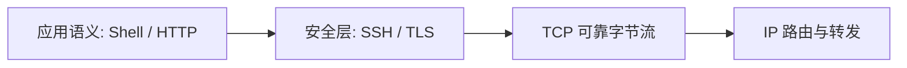
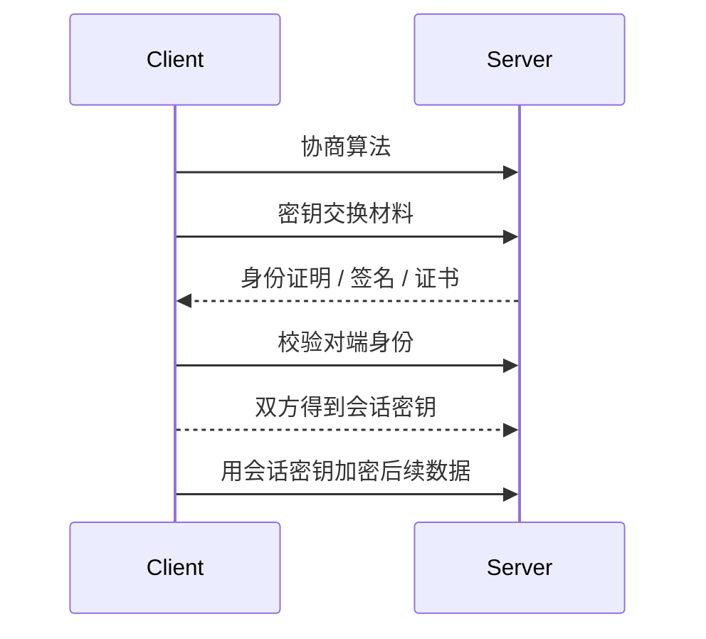
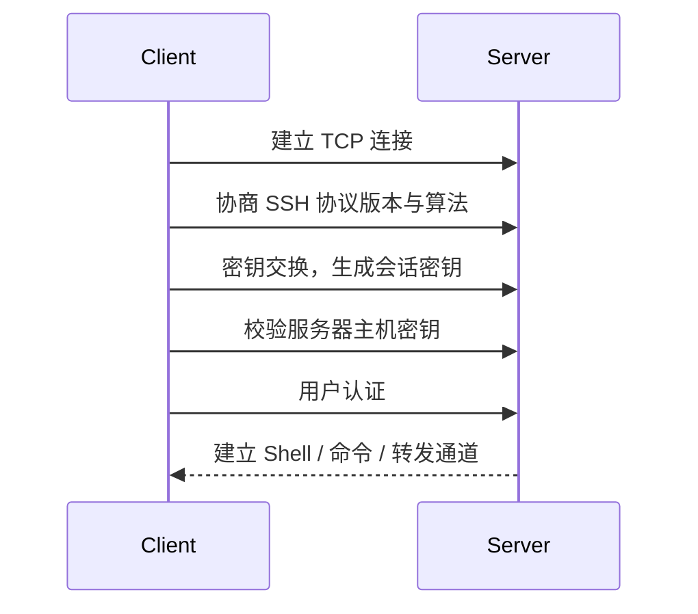
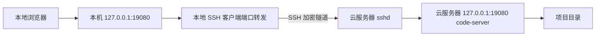
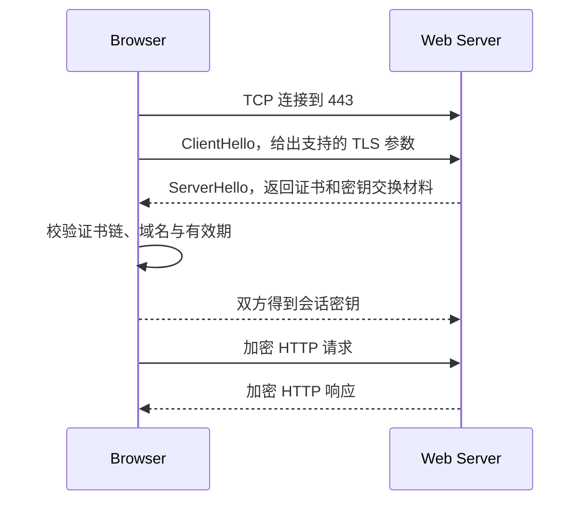

# SSH、HTTPS 与加密连接

!!! abstract "本文要点"
    本文把 SSH 远程登录、SSH 隧道、HTTPS 加密访问放到同一条主线中理解：

    - 对称加密适合加密大量数据，非对称加密适合身份认证、密钥交换和数字签名。
    - SSH 和 HTTPS 都会先建立底层连接，再协商密钥，最后用会话密钥保护后续数据。
    - SSH 适合远程登录、文件传输和端口转发；HTTPS 适合浏览器到网站之间的安全访问。
    - 实践中要分清主机密钥、用户密钥、HTTPS 证书、Web 登录密码和系统权限。

## 先建立整体模型

SSH 和 HTTPS 面向的场景不同，但安全目标很接近：

| 场景 | 常见协议 | 默认端口 | 主要用途 |
| --- | --- | --- | --- |
| 远程登录服务器 | SSH | `22/tcp` | Shell、命令执行、SFTP、端口转发 |
| 浏览器访问网站 | HTTPS | `443/tcp` | 加密 Web 请求与响应 |

两者都不是“只要换个端口就安全”。真正起作用的是加密、完整性校验和身份认证机制。

!!! note "安全连接解决的三个问题"
    - **保密性**：中间人截获数据，也不应看懂内容。
    - **完整性**：中间人不应悄悄修改数据。
    - **身份认证**：客户端要知道自己连接的对端是谁，对端也可能要确认客户端是谁。

可以把一次安全连接理解成两层：

1. 先用 TCP、DNS、IP 路由等网络机制把两台机器连起来。
2. 再由 SSH 或 TLS 在这条连接上完成加密、认证和会话管理。



## 对称加密与非对称加密

### 对称加密

对称加密使用同一把密钥完成加密和解密。客户端和服务器只要拥有同一个会话密钥，就可以用它保护后续数据。

```text
明文 + 会话密钥 -> 密文
密文 + 同一会话密钥 -> 明文
```

它的优点是速度快，适合加密大量数据；缺点是双方必须先安全地拥有同一把密钥。如果密钥在网络中明文传输，中间人截获后就能解密后续通信。

!!! tip "实践理解"
    SSH 登录后的终端输入、命令输出，HTTPS 中的 HTTP 请求和响应，通常都靠对称会话密钥持续加密。非对称加密一般不直接拿来加密整段会话数据。

### 非对称加密

非对称加密使用一对密钥：

- **公钥**：可以公开，用于验证签名或加密给私钥持有者的数据。
- **私钥**：必须保密，用于生成签名或解开对应公钥加密的数据。

它的优势是可以解决“不先共享秘密，如何确认身份或协商秘密”的问题；缺点是计算成本高，不适合直接加密大量流量。

!!! danger "私钥不能上传到服务器"
    用户私钥是登录凭据，应只保存在可信客户端上。服务器需要保存的是公钥，不是私钥。更稳妥的做法是给私钥设置 passphrase，并用 `ssh-agent` 缓存解锁后的密钥。

### 为什么安全协议会混合使用两者

实际协议通常采用混合方案：

1. 用非对称机制或密钥交换算法解决身份确认和会话密钥协商。
2. 得到只在本次连接中使用的会话密钥。
3. 后续大量数据改用对称加密保护。



!!! note "会话密钥"
    会话密钥通常只服务于当前连接。连接结束后，即使以后再次访问同一台服务器，也会重新协商新的会话密钥。

## SSH 的连接过程

**SSH** 是 **Secure Shell** 的缩写，常用于远程登录服务器、执行命令、传输文件和建立加密隧道。

```bash
ssh user@example.com
```

这条命令表示：本机 SSH 客户端连接到 `example.com` 上的 SSH 服务端，并尝试以 `user` 这个系统用户身份登录。

一次典型 SSH 登录可以粗略分成下面几步：



### TCP 只负责可靠传输

SSH 通常运行在 TCP 之上。客户端如果写的是域名，需要先通过 DNS 得到服务器 IP 地址，再连接服务器的 `22/tcp` 或指定端口。

```bash
ssh ubuntu@server.example.com
```

!!! note "TCP 与 SSH 的分工"
    TCP 负责提供可靠、有序的字节流；SSH 在这个字节流之上完成加密、完整性校验、身份认证和多路复用通道。不要把“SSH 安全”理解成 TCP 本身安全。

### 主机密钥确认服务器身份

第一次连接一台新服务器时，客户端常会提示确认服务器指纹。确认后，客户端会把服务器主机密钥记录到本机的 `~/.ssh/known_hosts`。

以后再次连接同一服务器时，如果服务器主机密钥突然变化，客户端会报警。这可能只是服务器重装或更换了密钥，也可能意味着连接被劫持。

!!! warning "不要机械删除 known_hosts"
    遇到 `REMOTE HOST IDENTIFICATION HAS CHANGED` 时，不要直接把 `known_hosts` 里的记录删掉了事。应先确认服务器是否确实重装、迁移或更换过主机密钥。

### 用户密钥认证登录者

服务器确认“你是谁”常见有两种方式：

- 口令登录：输入远程系统账户的密码。
- 公钥登录：客户端持有私钥，服务器保存对应公钥。

公钥登录不是把私钥发给服务器。更准确地说，服务器发出挑战，客户端用私钥证明“我确实持有对应私钥”，服务器用 `authorized_keys` 里的公钥验证这个证明。

!!! note "主机密钥和用户密钥不是一回事"
    服务器主机密钥用于让客户端确认“我连到的是哪台服务器”；用户密钥用于让服务器确认“谁正在尝试登录”。前者记录在客户端的 `known_hosts`，后者的公钥通常放在服务器用户目录的 `~/.ssh/authorized_keys`。

## SSH 实践：密钥登录

密钥登录的核心是：**私钥留在客户端，公钥放到服务器**。

可以在客户端生成一对 Ed25519 密钥：

```bash
ssh-keygen -t ed25519 -C "your-name"
```

常见文件位置如下：

```text
~/.ssh/id_ed25519      # 私钥，只能自己保管
~/.ssh/id_ed25519.pub  # 公钥，可以放到服务器
```

把公钥安装到服务器账户中：

```bash
ssh-copy-id user@example.com
```

之后即可尝试密钥登录：

```bash
ssh user@example.com
```

OpenSSH 对密钥文件权限比较严格。常见权限可以整理为：

```bash
chmod 700 ~/.ssh
chmod 600 ~/.ssh/authorized_keys
chmod 600 ~/.ssh/id_ed25519
```

如果权限过宽，服务端可能会拒绝使用 `authorized_keys`，客户端也可能拒绝使用私钥。

!!! tip "排查 publickey 登录失败"
    先确认用户名是否正确，再检查服务器上的 `~/.ssh/authorized_keys` 是否包含对应公钥，最后看目录和文件权限。客户端可用 `ssh -vvv user@host` 观察认证过程。

## SSH 实践：客户端配置与跳板机

频繁登录同一台服务器时，可以把参数写入 `~/.ssh/config`。

```sshconfig title="~/.ssh/config"
Host notebook
    HostName 203.0.113.10
    User ubuntu
    Port 22
    IdentityFile ~/.ssh/id_ed25519
    ServerAliveInterval 30
    ServerAliveCountMax 3
```

之后就可以直接写：

```bash
ssh notebook
```

常见配置项含义如下：

| 配置项 | 含义 |
| --- | --- |
| `Host` | 本地别名 |
| `HostName` | 真实主机名或 IP 地址 |
| `User` | 默认登录用户 |
| `Port` | SSH 服务端口 |
| `IdentityFile` | 指定私钥文件 |
| `ServerAliveInterval` | 客户端定期发送保活消息的间隔 |
| `ProxyJump` | 通过跳板机连接目标主机 |

例如通过跳板机登录内网主机：

```sshconfig title="~/.ssh/config"
Host inner
    HostName 10.0.0.5
    User ubuntu
    ProxyJump bastion
```

也可以直接使用命令行：

```bash
ssh -J bastion ubuntu@10.0.0.5
```

## SSH 实践：服务端安全边界

服务端配置通常位于：

```text
/etc/ssh/sshd_config
```

常见安全策略包括：

- 确认密钥登录可用后，再考虑关闭密码登录。
- 禁止直接以 `root` 远程登录，改用普通用户加 `sudo`。
- 只在防火墙中放行必要来源访问 SSH 端口。
- 修改服务端配置前，保留一个已登录会话作为回退通道。

配置示例：

```text title="/etc/ssh/sshd_config"
PubkeyAuthentication yes
PasswordAuthentication no
PermitRootLogin no
```

Ubuntu 上常见服务名是 `ssh`。修改配置后可先检查配置，再重载服务：

```bash
sudo sshd -t
sudo systemctl reload ssh
```

!!! danger "远程改 SSH 配置要留退路"
    调整端口、关闭密码登录或收紧防火墙前，应先确认密钥登录可用，并保留当前 SSH 会话。否则配置写错或防火墙规则过窄时，很容易把自己锁在服务器外面。

## SSH 实践：文件传输与端口转发

SSH 不只用于交互式 Shell，也常被其他工具复用。

### SFTP 与 scp

SFTP 是基于 SSH 的文件传输协议，不是传统 FTP 的简单加密版。常见用法：

```bash
sftp user@example.com
```

`scp` 也常用于复制文件：

```bash
scp ./local.txt user@example.com:/tmp/local.txt
scp user@example.com:/var/log/syslog ./syslog
```

### 本地端口转发

本地端口转发把本机端口映射到远端网络中的某个地址和端口。

例如远程服务器上有一个只监听本机的 PostgreSQL：

```bash
ssh -L 127.0.0.1:15432:127.0.0.1:5432 user@example.com
```

此时访问本机 `127.0.0.1:15432`，流量会通过 SSH 隧道转到远程服务器视角下的 `127.0.0.1:5432`。

!!! note "两个 127.0.0.1"
    浏览器地址栏或本地程序连接的 `127.0.0.1` 是本地电脑自己；`-L` 参数中间的 `127.0.0.1` 是从云服务器视角看服务器自己。它们写法一样，但所在机器不同。

### 远程端口转发

远程端口转发把远程服务器上的端口映射回本机。

```bash
ssh -R 18080:127.0.0.1:8000 user@example.com
```

这表示远程服务器的 `18080` 端口会通过 SSH 隧道转回本机的 `127.0.0.1:8000`。

### 动态端口转发

动态端口转发会在本机开一个 SOCKS 代理：

```bash
ssh -D 127.0.0.1:1080 user@example.com
```

!!! warning "端口转发不是权限豁免"
    SSH 隧道只是把流量放进加密通道里转发。远端服务的认证、数据库权限、Web 应用权限和操作系统权限仍然照常生效。

## 实例：用 SSH 隧道访问 Web VS Code

桌面 VS Code Remote-SSH 和浏览器版 `code-server` 容易混淆：

| 场景 | 运行在服务器上的组件 | 典型入口 | 用途 |
| --- | --- | --- | --- |
| 桌面 VS Code Remote-SSH | VS Code 自动安装的 `~/.vscode-server` | 本地 VS Code 桌面端 | 让本地 VS Code 操作远程文件、终端和扩展 |
| 浏览器版 Web VS Code | 独立安装的 `code-server` 或 OpenVSCode Server | 浏览器页面 | 在浏览器中使用类似 VS Code 的开发环境 |

!!! warning "名字相近但用途不同"
    Remote-SSH 自动启动的 `~/.vscode-server` 通常服务于桌面 VS Code；它不等于可以直接用浏览器打开的 `code-server` Web 服务。

比较稳妥的个人使用方式是：`code-server` 只监听云服务器自己的 `127.0.0.1:19080`，公网不直接暴露 Web VS Code；本地电脑通过 SSH 隧道访问。



服务器上 `code-server` 的推荐监听配置：

```yaml title="~/.config/code-server/config.yaml"
bind-addr: 127.0.0.1:19080
auth: password
password: change-me-to-a-strong-password
cert: false
```

启动或重启服务：

```bash
sudo systemctl enable --now code-server@$USER
sudo systemctl restart code-server@$USER
```

在服务器上检查它是否只监听本机地址：

```bash
CODE_SERVER_PORT=19080

sudo systemctl status code-server@$USER --no-pager
ss -lntp | grep ":${CODE_SERVER_PORT}"
curl -I "http://127.0.0.1:${CODE_SERVER_PORT}"
```

如果 `curl` 返回 `302` 并跳转到 `/login`，说明 `code-server` Web 服务已经在服务器本机可访问。

在本地电脑建立隧道：

```bash
LOCAL_PORT=19080
CODE_SERVER_PORT=19080

ssh -N -L "${LOCAL_PORT}:127.0.0.1:${CODE_SERVER_PORT}" ubuntu@server.example.com
```

然后本地浏览器打开：

```text
http://127.0.0.1:19080
```

!!! success "安全边界"
    这种架构下，公网只需要能访问 SSH 服务。`code-server` 不直接暴露在公网，只有能 SSH 登录服务器的人，才能通过隧道访问浏览器版 VS Code。

如果希望手机、平板或任意电脑都能直接访问 Web VS Code，可以把它放到 Nginx、Caddy 或 Cloudflare Zero Trust 后面，通过 HTTPS、强认证和访问控制暴露到公网。

!!! danger "公网暴露要更谨慎"
    Web VS Code 能直接读写服务器文件、运行终端命令和访问项目凭据。只要暴露到公网，就应按高权限管理入口处理，不能只依赖一个弱密码。

## HTTPS 的加密过程

HTTPS 可以理解为：

```text
HTTPS = HTTP 语义 + TLS 安全层 + TCP 可靠传输
```

其中 HTTP 仍然负责“请求哪个路径、提交哪些头和正文、服务器返回什么状态码和内容”；TLS 负责在 HTTP 数据进入网络之前，把它封装进一条经过认证和加密保护的安全通道。

浏览器访问：

```text
https://notes.example.com/
```

大致会经历：

1. DNS 解析 `notes.example.com`，得到服务器 IP。
2. 与服务器 `443/tcp` 建立 TCP 连接。
3. TLS 握手，协商协议版本、算法和会话密钥。
4. 浏览器校验证书链、域名、有效期和吊销状态。
5. 握手完成后，用对称会话密钥加密 HTTP 请求和响应。



### TLS 握手在做什么

TLS 握手的目标不是直接传网页内容，而是先回答三个问题：

| 问题 | TLS 握手中的处理 |
| --- | --- |
| 双方用什么协议版本和算法 | `ClientHello` 与 `ServerHello` 协商 |
| 服务器是不是目标域名对应的服务器 | 服务器返回证书，浏览器校验证书链和域名 |
| 后续数据用哪把密钥加密 | 双方通过密钥交换材料计算会话密钥 |

握手完成后，浏览器才会把 HTTP 请求放进 TLS 加密通道中发送。也就是说，用户看到的是访问 `https://notes.example.com/articles/a.html`，但网络中间人只能看到连接目标 IP、端口、部分握手元数据和加密后的字节流，不能直接读取 HTTP 路径、Cookie 或正文内容。

!!! warning "HTTPS 不隐藏所有信息"
    HTTPS 能保护 HTTP 内容本身，但通常不会隐藏连接到哪个 IP、使用哪个端口、传输了大约多少数据。域名在现代 TLS 中也可能通过 SNI 暴露给网络路径上的设备；是否加密 SNI 取决于客户端、服务端和网络环境支持。

### 证书链如何建立信任

证书通常由受信任的 CA 签发。浏览器校验证书时，会检查：

- 证书链是否能追溯到受信任根证书。
- 证书中的域名是否覆盖当前访问域名。
- 证书是否在有效期内。
- 证书是否被吊销。

!!! warning "证书绑定的是域名身份"
    证书能证明“这个连接对端拥有某个域名的有效证书”，但不能证明网站业务本身一定可信。HTTPS 解决传输安全，不替代应用权限、登录鉴权和内容安全。

可以把证书链理解为：

```text
浏览器信任的根 CA
  -> 中间 CA
  -> notes.example.com 的服务器证书
  -> 服务器证明自己持有对应私钥
```

服务器证书里包含域名、公钥、有效期、签发者、用途等信息。浏览器信任的不是“这个网站自称自己可信”，而是“这张证书能沿着签名链追溯到浏览器或系统信任的根证书”。

!!! note "证书和私钥的关系"
    证书可以公开发给浏览器，私钥必须留在服务器上。TLS 握手中，服务器需要证明自己持有证书公钥对应的私钥；如果私钥泄露，攻击者就可能伪装成该域名的服务器。

### 会话加密保护了什么

TLS 握手完成后，后续 HTTP 数据会被对称会话密钥保护。典型受保护内容包括：

- HTTP 请求方法和路径，例如 `GET /profile`。
- 请求头中的 Cookie、Authorization 等敏感字段。
- 表单提交、JSON 请求体和上传内容。
- 服务器返回的 HTML、JSON、图片等响应内容。
- 响应头中的 Set-Cookie 等字段。

!!! tip "为什么登录页面必须用 HTTPS"
    如果登录页面或登录提交接口使用 HTTP，用户名、密码、Cookie 或 Token 可能被中间人截获。实际部署时应让登录、后台、支付、接口请求和静态资源都走 HTTPS，而不是只给首页加 HTTPS。

### HTTPS 部署中的常见形态

很多 Web 服务不会由应用进程自己直接处理 HTTPS，而是让反向代理统一终止 TLS：

```text
浏览器
  -> https://notes.example.com:443
  -> Nginx / Caddy / 云负载均衡处理 TLS 和证书
  -> http://127.0.0.1:3000
  -> 应用进程
```

这里的“终止 TLS”是指 HTTPS 连接到达反向代理后，反向代理完成证书校验、密钥协商、解密请求，再把请求转发给后端应用。后端应用通常只监听内网地址或 `127.0.0.1`。

!!! note "反向代理后的 HTTP 不等于公网明文"
    如果反向代理和应用在同一台机器上，代理到 `127.0.0.1` 的 HTTP 通常只在本机内部传递，不会暴露到公网。若反向代理和应用跨机器通信，则应根据网络边界考虑内网 TLS、专线、服务网格或其他访问控制。

### 实践检查命令

排查 HTTPS 时，可以先分层确认：

```bash
curl -I https://notes.example.com/
```

如果需要看证书链和 TLS 握手信息，可以用：

```bash
openssl s_client -connect notes.example.com:443 -servername notes.example.com
```

常见观察点：

| 现象 | 优先检查 |
| --- | --- |
| 证书域名不匹配 | 当前域名是否在证书的 SAN 中 |
| 证书过期 | 证书续期任务是否正常 |
| 证书链不完整 | 服务器是否发送了中间证书 |
| HTTP 能访问，HTTPS 不能访问 | `443/tcp` 是否放行，反向代理是否监听 |
| HTTPS 可访问但资源报错 | 页面中的图片、脚本、接口是否仍使用 `http://` |

!!! warning "混合内容"
    HTTPS 页面里继续加载 HTTP 脚本、图片或接口，称为混合内容。浏览器通常会阻止高风险的 HTTP 脚本和接口请求；即使图片能加载，也会削弱页面的安全状态。

### HTTPS 与 SSH 的信任方式差异

| 对比项 | SSH | HTTPS |
| --- | --- | --- |
| 常见用途 | 远程运维、隧道、文件传输 | 浏览器访问网站 |
| 对端身份 | 主机密钥，通常记录在 `known_hosts` | CA 签发的域名证书 |
| 用户身份 | 口令、公钥、MFA 等 | Cookie、Token、表单登录、客户端证书等 |
| 后续数据 | SSH 会话密钥加密 | TLS 会话密钥加密 |
| 常见风险 | 私钥泄露、主机密钥变化未核实、防火墙过宽 | 证书配置错误、弱登录、应用漏洞 |

!!! tip "类比但不要混同"
    SSH 的 `known_hosts` 更像“我以前确认过这台服务器的主机密钥”；HTTPS 的证书链更像“浏览器信任的 CA 证明这个公钥属于这个域名”。两者都用于确认对端身份，但信任来源不同。

## SSH 与 HTTPS 的实践选择

同一台服务器上，常见部署边界可以这样安排：

```text
公网 443/tcp -> Nginx / Caddy / 负载均衡 -> 127.0.0.1:应用端口
公网 22/tcp  -> sshd，尽量限制来源并使用密钥登录
```

公开 Web 服务通常需要开放 `443/tcp`，并让反向代理或负载均衡持有证书和私钥；应用进程则尽量只监听本机或内网地址。这样可以把证书、压缩、访问日志、HTTP 到 HTTPS 跳转等入口行为集中管理。

如果只是自己访问一个高权限管理工具，例如 Web VS Code、数据库管理后台、内部监控页面，优先考虑：

1. 应用只监听 `127.0.0.1`。
2. 通过 SSH 本地端口转发访问。
3. 需要多人或多设备访问时，再放到 HTTPS、强认证和访问控制之后。

!!! note "127.0.0.1 与 0.0.0.0"
    `127.0.0.1` 表示只接受本机访问；`0.0.0.0` 表示监听本机所有 IPv4 网络接口。把管理入口从 `127.0.0.1` 改成 `0.0.0.0` 前，应先确认认证、HTTPS、防火墙和访问控制都已经配置好。

!!! tip "HTTPS 上线清单"
    一个公开站点至少要确认：DNS 指向正确，`443/tcp` 已放行，反向代理监听对应域名，证书覆盖该域名，HTTP 自动跳转 HTTPS，应用不要生成 `http://` 的绝对链接。

## 常见故障判断

### `Connection timed out`

通常表示客户端无法连到目标地址和端口。优先检查：

- 服务器 IP 或域名是否正确。
- 云安全组和 Linux 防火墙是否放行对应端口。
- SSH 服务端是否监听在预期端口。
- 本机网络是否能到达服务器。

### `Connection refused`

通常表示目标主机可达，但对应端口没有服务在监听，或服务主动拒绝连接。可在服务器上检查：

```bash
sudo systemctl status ssh
ss -tlnp | grep ':22'
```

### `Permission denied (publickey)`

通常表示网络已经连通，但用户认证失败。排查顺序：

- 登录用户名是否正确。
- 客户端是否使用了正确私钥。
- 公钥是否已放入服务器对应用户的 `authorized_keys`。
- `~/.ssh` 和 `authorized_keys` 权限是否过宽。

### `Host key verification failed`

表示客户端无法确认服务器主机密钥。应先确认服务器身份，再决定是否更新本机 `known_hosts`。

### HTTPS 证书错误

浏览器提示 HTTPS 证书错误时，优先检查：

- 访问域名是否和证书域名匹配。
- 证书是否过期。
- 服务器是否提供完整证书链。
- 反向代理是否把错误站点的证书用于当前域名。

!!! danger "不要让用户绕过证书警告"
    证书错误意味着浏览器无法可靠确认当前连接对端身份。临时测试可以定位配置问题，但正式访问不应要求用户手动忽略 HTTPS 警告。

## 408 / 应试补充

### 层次与端口

SSH 属于应用层协议，通常使用传输层的 TCP，默认熟知端口号为 `22`。HTTPS 也是应用层访问方式的一部分，通常表现为 HTTP over TLS over TCP，默认熟知端口号为 `443`。

!!! tip "常考判断"
    远程登录和 Web 页面传输都要求数据可靠、有序，因此 SSH、HTTP/1.1、HTTP/2 常建立在 TCP 之上。HTTP/3 基于 QUIC/UDP，但 QUIC 自己补上了可靠传输、加密和拥塞控制等机制。

### 安全性边界

考试或面试中容易把几件事混在一起：

| 问题 | 主要由谁提供 |
| --- | --- |
| 字节流可靠、有序到达 | TCP |
| 路由与跨网段转发 | IP |
| 域名到 IP 的映射 | DNS |
| SSH 数据加密与完整性保护 | SSH |
| HTTPS 数据加密与完整性保护 | TLS |
| 服务器身份确认 | SSH 主机密钥 / HTTPS 证书 |
| 用户登录后能否读写某文件 | 操作系统权限 |
| 网站业务是否可信 | 应用设计、权限控制、运营主体 |

### 对称与非对称的速记

| 类型 | 密钥特点 | 优点 | 常见用途 |
| --- | --- | --- | --- |
| 对称加密 | 加密和解密使用同一把密钥 | 快，适合大量数据 | 会话数据加密 |
| 非对称加密 | 公钥和私钥成对出现 | 便于身份认证、签名和密钥交换 | SSH 公钥登录、证书体系、签名验证 |

!!! warning "易错点"
    “HTTPS 使用了非对称加密”不等于“所有网页数据都用非对称加密传输”。更准确的说法是：TLS 握手阶段会使用非对称机制或密钥交换机制来认证身份、协商密钥；真正承载大量 HTTP 数据的是对称会话密钥。

### 与 Telnet、HTTP 对比

| 协议 | 默认端口 | 传输特点 |
| --- | --- | --- |
| Telnet | `23/tcp` | 明文远程登录，不适合不可信网络 |
| SSH | `22/tcp` | 加密、完整性校验、身份认证 |
| HTTP | `80/tcp` | 明文 Web 访问 |
| HTTPS | `443/tcp` | HTTP 加 TLS，提供传输安全 |

!!! success "一句话总结"
    SSH 和 HTTPS 都是在普通网络连接之上建立安全会话：先确认对端身份并协商会话密钥，再用对称加密保护后续数据；差别在于 SSH 面向远程运维，HTTPS 面向 Web 访问，二者的信任模型和实践边界不同。
