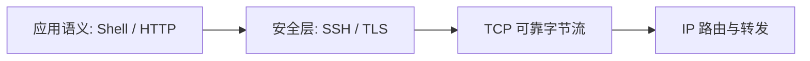
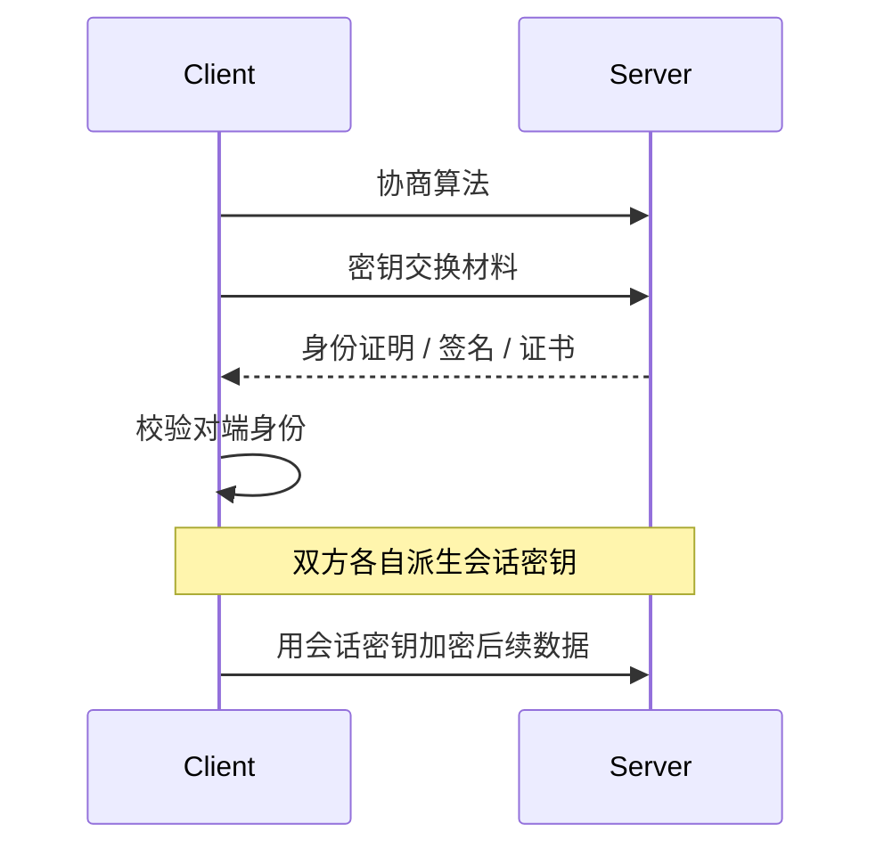
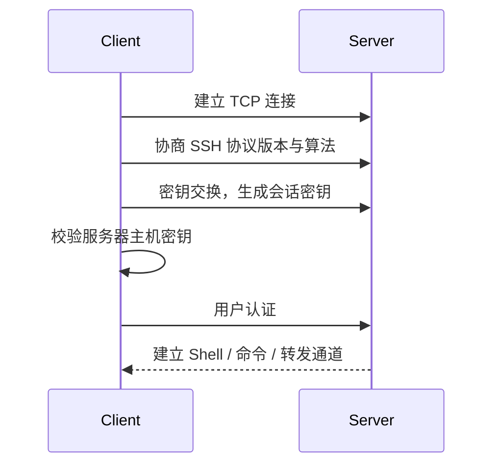
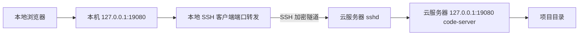
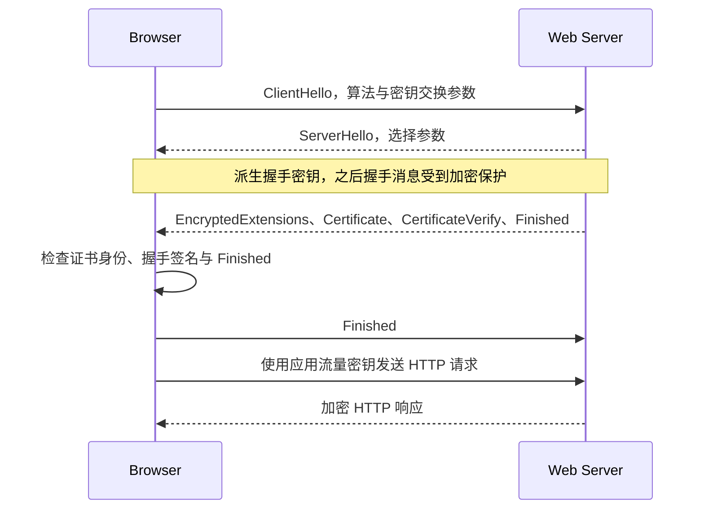

# SSH、HTTPS 与加密连接

## 整体模型

SSH 和 HTTPS 面向的场景不同，但安全目标很接近：

| 场景 | 常见协议 | 默认端口 | 主要用途 |
| --- | --- | --- | --- |
| 远程登录服务器 | SSH | `22/tcp` | Shell、命令执行、SFTP、端口转发 |
| 浏览器访问网站 | HTTPS | `443/tcp`，HTTP/3 常用 `443/udp` | 加密 Web 请求与响应 |

连接安全依赖加密、完整性保护与身份认证。改变监听端口可能减少常规扫描噪声，不改变协议的认证强度。

- **保密性**：中间人截获数据，也不应看懂内容。
- **完整性**：中间人不应悄悄修改数据。
- **身份认证**：客户端要知道自己连接的对端是谁，对端也可能要确认客户端是谁。

对 SSH 以及 HTTP/1.1、HTTP/2 上的 HTTPS，可分成两层：

1. 先用 TCP、DNS、IP 路由等网络机制把两台机器连起来。
2. 再由 SSH 或 TLS 在这条连接上完成加密、认证和会话管理。


```mermaid
graph LR
  App[应用语义: Shell / HTTP] --> Secure[安全层: SSH / TLS]
  Secure --> TCP[TCP 可靠字节流]
  TCP --> IP[IP 路由与转发]
```

## 对称加密与公钥密码

### 对称加密

对称加密使用同一把密钥完成加密和解密。客户端和服务器只要拥有同一个会话密钥，就可以用它保护后续数据。

```text
明文 + 会话密钥 -> 密文
密文 + 同一会话密钥 -> 明文
```

它的优点是速度快，适合加密大量数据；缺点是双方必须先安全地拥有同一把密钥。如果密钥在网络中明文传输，中间人截获后就能解密后续通信。

SSH 登录后的终端输入、命令输出，HTTPS 中的 HTTP 请求和响应，通常都靠对称会话密钥持续加密。非对称加密一般不直接拿来加密整段会话数据。

### 公钥密码

公钥密码使用成对关联的公钥与私钥，但不同算法承担不同工作：签名用于证明私钥持有者参与了特定消息的生成，密钥交换用于建立共享秘密，加密用于保护消息内容。Ed25519 是签名算法，X25519 是密钥交换算法，不能把所有密钥都理解成“公钥加密、私钥解密”。

SSH 公钥登录使用签名证明身份；现代 TLS 的常见完整握手用临时密钥交换建立共享秘密，再由证书对应的签名密钥认证握手。后续数据使用对称算法处理。

!!! danger "用户认证私钥的存放"
    用户认证私钥应保存在可信客户端或硬件密钥中，登录目标只需对应公钥。服务器另有用于证明自身身份的主机私钥，两者不可混同。文件型用户私钥可设置 passphrase，并用 `ssh-agent` 管理解锁后的签名能力。

### 混合加密与密钥协商

实际协议通常采用混合方案：

1. 用非对称机制或密钥交换算法解决身份确认和会话密钥协商。
2. 得到只在本次连接中使用的会话密钥。
3. 后续大量数据改用对称加密保护。


```mermaid
sequenceDiagram
  participant C as Client
  participant S as Server
  C->>S: 协商算法
  C->>S: 密钥交换材料
  S-->>C: 身份证明 / 签名 / 证书
  C->>C: 校验对端身份
  Note over C,S: 双方各自派生会话密钥
  C->>S: 用会话密钥加密后续数据
```

连接通常派生各方向的加密与完整性保护密钥，长连接还可重新换钥。使用临时密钥交换并妥善销毁临时秘密时，可提供前向保密：以后长期认证私钥泄露，不会仅凭历史流量记录就解出既往会话。具体保证仍取决于协商算法和会话恢复方式。

## SSH 的连接过程

**SSH** 是 **Secure Shell** 的缩写，常用于远程登录服务器、执行命令、传输文件和建立加密隧道。

```bash
ssh user@example.com
```

这条命令表示：本机 SSH 客户端连接到 `example.com` 上的 SSH 服务端，并尝试以 `user` 这个系统用户身份登录。

一次典型 SSH 登录可以粗略分成下面几步：


```mermaid
sequenceDiagram
  participant C as Client
  participant S as Server
  C->>S: 建立 TCP 连接
  C->>S: 协商 SSH 协议版本与算法
  C->>S: 密钥交换，生成会话密钥
  C->>C: 校验服务器主机密钥
  C->>S: 用户认证
  S-->>C: 建立 Shell / 命令 / 转发通道
```

### TCP 只负责可靠传输

SSH 通常运行在 TCP 之上。客户端如果写的是域名，需要先通过 DNS 得到服务器 IP 地址，再连接服务器的 `22/tcp` 或指定端口。

```bash
ssh ubuntu@server.example.com
```

TCP 负责提供可靠、有序的字节流；SSH 在这个字节流之上完成加密、完整性校验、身份认证和多路复用通道。不要把“SSH 安全”理解成 TCP 本身安全。

### 主机密钥确认服务器身份

第一次连接时，OpenSSH 常提示确认主机密钥指纹。应通过云控制台、管理员公布信息或其他可信渠道核对；确认后记录到 `~/.ssh/known_hosts`。首次看到提示直接接受属于首次使用信任（TOFU），无法独立排除第一次连接就被冒充的情况。

以后再次连接同一服务器时，如果服务器主机密钥突然变化，客户端会报警。这可能只是服务器重装或更换了密钥，也可能意味着连接被劫持。

遇到 `REMOTE HOST IDENTIFICATION HAS CHANGED` 时，不要直接把 `known_hosts` 里的记录删掉了事。应先确认服务器是否确实重装、迁移或更换过主机密钥。

### 用户密钥认证登录者

服务器确认“你是谁”常见有两种方式：

- 口令登录：输入远程系统账户的密码。
- 公钥登录：客户端持有私钥，服务器保存对应公钥。

公钥认证时，客户端对包含会话标识和认证请求字段的数据签名，服务器用允许的公钥验证。签名把认证绑定到当前 SSH 会话；私钥不随请求发送。将过程理解为持有证明即可，不必假定服务器先发送一段独立随机挑战。

服务器主机密钥用于让客户端确认“我连到的是哪台服务器”；用户密钥用于让服务器确认“谁正在尝试登录”。前者记录在客户端的 `known_hosts`，后者的公钥通常放在服务器用户目录的 `~/.ssh/authorized_keys`。

## SSH 实践：密钥登录

密钥登录的核心是：**私钥留在客户端，公钥放到服务器**。

可以在客户端生成一对 Ed25519 密钥：

```bash
ssh-keygen -t ed25519 -C "your-name"
```

常见文件位置如下：

```text
~/.ssh/id_ed25519      # 私钥，只能自己保管
~/.ssh/id_ed25519.pub  # 公钥，可以放到服务器
```

把公钥安装到服务器账户中：

```bash
ssh-copy-id user@example.com
```

之后即可尝试密钥登录：

```bash
ssh user@example.com
```

OpenSSH 会检查敏感文件及其目录的所有权和权限。客户端私钥可设置为：

```bash
chmod 700 ~/.ssh
chmod 600 ~/.ssh/id_ed25519
```

服务器对应账户的授权文件可设置为：

```bash
chmod 700 ~/.ssh
chmod 600 ~/.ssh/authorized_keys
```

两组命令分别在相应机器执行，不能把客户端私钥复制到目标账户目录来“修复”认证。

如果权限过宽，服务端可能会拒绝使用 `authorized_keys`，客户端也可能拒绝使用私钥。

先确认用户名是否正确，再检查服务器上的 `~/.ssh/authorized_keys` 是否包含对应公钥，最后看目录和文件权限。客户端可用 `ssh -vvv user@host` 观察认证过程。

## SSH 实践：客户端配置与跳板机

频繁登录同一台服务器时，可以把参数写入 `~/.ssh/config`。

```sshconfig title="~/.ssh/config"
Host notebook
    HostName 203.0.113.10
    User ubuntu
    Port 22
    IdentityFile ~/.ssh/id_ed25519
    IdentitiesOnly yes
    ServerAliveInterval 30
    ServerAliveCountMax 3
```

之后就可以直接写：

```bash
ssh notebook
```

常见配置项含义如下：

| 配置项 | 含义 |
| --- | --- |
| `Host` | 本地别名 |
| `HostName` | 真实主机名或 IP 地址 |
| `User` | 默认登录用户 |
| `Port` | SSH 服务端口 |
| `IdentityFile` | 指定身份文件；可配合 `IdentitiesOnly yes` 限制实际尝试的身份 |
| `ServerAliveInterval` | 客户端定期发送保活消息的间隔 |
| `ProxyJump` | 通过跳板机连接目标主机 |

例如通过跳板机登录内网主机：

```sshconfig title="~/.ssh/config"
Host inner
    HostName 10.0.0.5
    User ubuntu
    ProxyJump bastion
```

也可以直接使用命令行：

```bash
ssh -J bastion ubuntu@10.0.0.5
```

跳板机不要求把目标机私钥复制过去。`ProxyJump` 转发到目标的连接，目标主机密钥仍由本地客户端校验。一般不必启用 agent forwarding；转发 agent 虽不直接复制私钥，远端拥有相应访问权限的进程仍可能借它请求签名。

可用 `ssh -G inner` 检查最终客户端配置，尤其注意匹配的 `Host` 块与全局默认值。`IdentityFile` 相关行为不能只从单个配置片段判断。

## SSH 实践：服务端安全边界

服务端配置通常位于：

```text
/etc/ssh/sshd_config
```

常见安全策略包括：

- 确认密钥登录可用后，再考虑关闭密码登录。
- 禁止直接以 `root` 远程登录，改用普通用户加 `sudo`。
- 只在防火墙中放行必要来源访问 SSH 端口。
- 修改服务端配置前，保留一个已登录会话作为回退通道。

配置示例：

```text title="/etc/ssh/sshd_config"
PubkeyAuthentication yes
PasswordAuthentication no
KbdInteractiveAuthentication no
PermitRootLogin no
```

这组配置适用于仅允许公钥等非交互式认证的目标；依赖键盘交互方式的 MFA 部署需要保留并正确约束该机制。单独关闭 `PasswordAuthentication` 不保证所有基于密码的交互认证路径都关闭。

Ubuntu 上常见服务名是 `ssh`。修改配置后先检查，再重载：

```bash
sudo sshd -t
sudo sshd -T
sudo systemctl reload ssh
```

!!! danger "远程改 SSH 配置要留退路"
    调整端口、关闭密码登录或收紧防火墙前，应先确认密钥登录可用，并保留当前 SSH 会话。否则配置写错或防火墙规则过窄时，很容易把自己锁在服务器外面。

## SSH 实践：文件传输与端口转发

SSH 不只用于交互式 Shell，也常被其他工具复用。

### SFTP 与 scp

SFTP 是基于 SSH 的独立文件传输协议，与 FTP/FTPS 的协议和连接方式不同。常见用法：

```bash
sftp user@example.com
```

OpenSSH 9.0 起，`scp` 默认用 SFTP 传输，命令名保留不变；旧教程中的远端 Shell 展开规则不能直接沿用。常用复制命令：

```bash
scp ./local.txt user@example.com:/tmp/local.txt
scp user@example.com:/var/log/syslog ./syslog
```

### 本地端口转发

本地端口转发把本机端口映射到远端网络中的某个地址和端口。

例如远程服务器上有一个只监听本机的 PostgreSQL：

```bash
ssh -N -o ExitOnForwardFailure=yes \
  -L 127.0.0.1:15432:127.0.0.1:5432 user@example.com
```

此时访问本机 `127.0.0.1:15432`，流量会通过 SSH 隧道转到远程服务器视角下的 `127.0.0.1:5432`。

浏览器地址栏或本地程序连接的 `127.0.0.1` 是本地电脑自己；`-L` 参数中间的 `127.0.0.1` 是从云服务器视角看服务器自己。它们写法一样，但所在机器不同。

### 远程端口转发

远程端口转发把远程服务器上的端口映射回本机。

```bash
ssh -N -o ExitOnForwardFailure=yes \
  -R 127.0.0.1:18080:127.0.0.1:8000 user@example.com
```

这请求服务端在其回环地址监听 `18080`，连接通过隧道交给客户端，由客户端连接本机 `127.0.0.1:8000`。是否允许远程转发及实际监听范围受 `AllowTcpForwarding`、`GatewayPorts` 等服务端设置约束。

### 动态端口转发

动态端口转发会在本机开一个 SOCKS 代理：

```bash
ssh -N -D 127.0.0.1:1080 user@example.com
```

`-N` 表示不执行远程命令；`ExitOnForwardFailure=yes` 可在无法建立监听或转发请求失败时退出，但不会提前证明最终目标服务可用。SOCKS 客户端的 DNS 解析位置取决于其配置，例如支持 SOCKS5 主机名解析时才可把域名解析交给代理端。隧道保护 SSH 两端之间的传输，转发端到最终目标的链路和应用认证仍需单独考虑。

## 实例：用 SSH 隧道访问 Web VS Code

桌面 VS Code Remote-SSH 和浏览器版 `code-server` 容易混淆：

| 场景 | 运行在服务器上的组件 | 典型入口 | 用途 |
| --- | --- | --- | --- |
| 桌面 VS Code Remote-SSH | VS Code 自动安装的 `~/.vscode-server` | 本地 VS Code 桌面端 | 让本地 VS Code 操作远程文件、终端和扩展 |
| 浏览器版 Web VS Code | 独立安装的 `code-server` 或 OpenVSCode Server | 浏览器页面 | 在浏览器中使用类似 VS Code 的开发环境 |

Remote-SSH 自动启动的 `~/.vscode-server` 通常服务于桌面 VS Code；它不等于可以直接用浏览器打开的 `code-server` Web 服务。

比较稳妥的个人使用方式是：`code-server` 只监听云服务器自己的 `127.0.0.1:19080`，公网不直接暴露 Web VS Code；本地电脑通过 SSH 隧道访问。


```mermaid
graph LR
  Browser[本地浏览器] --> Local[本机 127.0.0.1:19080]
  Local --> Tunnel[本地 SSH 客户端端口转发]
  Tunnel -->|SSH 加密隧道| Server[云服务器 sshd]
  Server --> CodeServer[云服务器 127.0.0.1:19080 code-server]
  CodeServer --> Project[项目目录]
```

服务器上 `code-server` 的推荐监听配置：

```yaml title="~/.config/code-server/config.yaml"
bind-addr: 127.0.0.1:19080
auth: password
password: change-me-to-a-strong-password
cert: false
```

启动或重启服务：

```bash
sudo systemctl enable --now code-server@$USER
sudo systemctl restart code-server@$USER
```

在服务器上检查它是否只监听本机地址：

```bash
CODE_SERVER_PORT=19080

sudo systemctl status code-server@$USER --no-pager
ss -lntp | grep ":${CODE_SERVER_PORT}"
curl -I "http://127.0.0.1:${CODE_SERVER_PORT}"
```

如果 `curl` 返回 `302` 并跳转到 `/login`，说明 `code-server` Web 服务已经在服务器本机可访问。

在本地电脑建立隧道：

```bash
LOCAL_PORT=19080
CODE_SERVER_PORT=19080

ssh -N -o ExitOnForwardFailure=yes \
  -L "127.0.0.1:${LOCAL_PORT}:127.0.0.1:${CODE_SERVER_PORT}" ubuntu@server.example.com
```

然后本地浏览器打开：

```text
http://127.0.0.1:19080
```

这套配置只需对所需来源开放 SSH，Web 服务保持回环监听。获得该服务器本地执行能力或能够建立相应转发的其他账户也可能访问它，所以仍保留 Web 服务认证。

如果希望手机、平板或任意电脑都能直接访问 Web VS Code，可以把它放到 Nginx、Caddy 或 Cloudflare Zero Trust 后面，通过 HTTPS、强认证和访问控制暴露到公网。

!!! danger "公网暴露要更谨慎"
    Web VS Code 能直接读写服务器文件、运行终端命令和访问项目凭据。只要暴露到公网，就应按高权限管理入口处理，不能只依赖一个弱密码。

## HTTPS 的加密过程

对 HTTP/1.1 和 HTTP/2，HTTPS 的常见协议栈为：

```text
HTTPS = HTTP 语义 + TLS 安全层 + TCP 可靠传输
```

其中 HTTP 仍然负责“请求哪个路径、提交哪些头和正文、服务器返回什么状态码和内容”；TLS 负责在 HTTP 数据进入网络之前，把它封装进一条经过认证和加密保护的安全通道。

浏览器访问：

```text
https://notes.example.com/
```

大致会经历：

1. DNS 解析 `notes.example.com`，得到服务器 IP。
2. 与服务器 `443/tcp` 建立 TCP 连接。
3. TLS 握手，协商协议版本、算法和会话密钥。
4. 浏览器按信任策略检查证书链、域名、有效期等；吊销检查机制与严格程度取决于实现。
5. 握手完成后，用对称会话密钥加密 HTTP 请求和响应。

以下示意 TLS 1.3 中常见的证书认证完整握手，省略扩展字段和可选客户端认证：


```mermaid
sequenceDiagram
  participant B as Browser
  participant W as Web Server
  B->>W: ClientHello，算法与密钥交换参数
  W-->>B: ServerHello，选择参数
  Note over B,W: 派生握手密钥，之后握手消息受到加密保护
  W-->>B: EncryptedExtensions、Certificate、CertificateVerify、Finished
  B->>B: 检查证书身份、握手签名与 Finished
  B->>W: Finished
  B->>W: 使用应用流量密钥发送 HTTP 请求
  W-->>B: 加密 HTTP 响应
```

### TLS 握手在做什么

TLS 握手建立后续传输所需的参数、身份与密钥：

| 问题 | TLS 握手中的处理 |
| --- | --- |
| 双方用什么协议版本和算法 | `ClientHello` 与 `ServerHello` 协商 |
| 服务器是不是目标域名对应的服务器 | 服务器返回证书，浏览器校验证书链和域名 |
| 后续数据用哪把密钥加密 | 双方通过密钥交换材料计算会话密钥 |

在常见完整握手中，认证握手完成后开始发送应用数据。TLS 1.3 的会话恢复还可使用 0-RTT early data，但早期数据具有重放风险，不适合任意有副作用的请求。正常受保护的 HTTP 路径、Cookie 和正文不会作为明文交给网络中间节点；端点或被信任的 TLS 终止代理仍可读取它们。

HTTPS 能保护 HTTP 内容本身，但通常不会隐藏连接到哪个 IP、使用哪个端口、传输了大约多少数据。域名在现代 TLS 中也可能通过 SNI 暴露给网络路径上的设备；是否加密 SNI 取决于客户端、服务端和网络环境支持。

### 证书链与信任建立

证书通常由受信任的 CA 签发。浏览器校验证书时，会检查：

- 证书链是否能追溯到受信任根证书。
- 证书中的域名是否覆盖当前访问域名。
- 证书是否在有效期内。
- 是否满足实现采用的吊销与其他证书策略；不能假定每次访问都在线查询 CA。

证书能证明“这个连接对端拥有某个域名的有效证书”，但不能证明网站业务本身一定可信。HTTPS 解决传输安全，不替代应用权限、登录鉴权和内容安全。

可以把证书链理解为：

```text
浏览器信任的根 CA
  -> 中间 CA
  -> notes.example.com 的服务器证书
  -> 服务器证明自己持有对应私钥
```

服务器证书里包含域名、公钥、有效期、签发者、用途等信息。客户端先沿签名链追溯到本地信任锚，再检查域名、用途和其他约束；仅能构建一条签名链还不足以验证当前域名。

证书可以公开发给浏览器，私钥必须留在服务器上。TLS 握手中，服务器需要证明自己持有证书公钥对应的私钥；如果私钥泄露，攻击者就可能伪装成该域名的服务器。

### 会话加密保护了什么

TLS 握手完成后，后续 HTTP 数据会被对称会话密钥保护。典型受保护内容包括：

- HTTP 请求方法和路径，例如 `GET /profile`。
- 请求头中的 Cookie、Authorization 等敏感字段。
- 表单提交、JSON 请求体和上传内容。
- 服务器返回的 HTML、JSON、图片等响应内容。
- 响应头中的 Set-Cookie 等字段。

如果登录页面或登录提交接口使用 HTTP，用户名、密码、Cookie 或 Token 可能被中间人截获。部署时应让登录、后台、支付、接口请求和静态资源统一使用 HTTPS。

### HTTPS 部署中的常见形态

很多 Web 服务由反向代理统一终止 TLS：

```text
浏览器
  -> https://notes.example.com:443
  -> Nginx / Caddy / 云负载均衡处理 TLS 和证书
  -> http://127.0.0.1:3000
  -> 应用进程
```

这里的“终止 TLS”是指 HTTPS 连接到达反向代理后，反向代理向客户端提供服务器证书、完成密钥协商并解密请求，再把请求转发给后端应用。通常由客户端校验服务器证书；启用双向 TLS 时，代理还会校验客户端证书。后端应用通常只监听内网地址或 `127.0.0.1`。

如果反向代理和应用在同一台机器上，代理到 `127.0.0.1` 的 HTTP 通常只在本机内部传递，不会暴露到公网。若反向代理和应用跨机器通信，则应根据网络边界考虑内网 TLS、专线、服务网格或其他访问控制。

### 实践检查命令

排查 HTTPS 时，可以先分层确认：

```bash
curl -I https://notes.example.com/
```

如果需要看证书链和 TLS 握手信息，可以用：

```bash
openssl s_client -connect notes.example.com:443 \
  -servername notes.example.com -verify_hostname notes.example.com \
  -verify_return_error </dev/null
```

常见观察点：

| 现象 | 优先检查 |
| --- | --- |
| 证书域名不匹配 | 当前域名是否在证书的 SAN 中 |
| 证书过期 | 证书续期任务是否正常 |
| 证书链不完整 | 服务器是否发送了中间证书 |
| HTTP 能访问，HTTPS 不能访问 | `443/tcp` 是否放行，反向代理是否监听 |
| HTTPS 可访问但资源报错 | 页面中的图片、脚本、接口是否仍使用 `http://` |

HTTPS 页面里继续加载 HTTP 脚本、图片或接口，称为混合内容。浏览器通常会阻止高风险的 HTTP 脚本和接口请求；即使图片能加载，也会削弱页面的安全状态。

### HTTPS 与 SSH 的信任方式差异

| 对比项 | SSH | HTTPS |
| --- | --- | --- |
| 常见用途 | 远程运维、隧道、文件传输 | 浏览器访问网站 |
| 对端身份 | 主机密钥，通常记录在 `known_hosts` | CA 签发的域名证书 |
| 用户身份 | 口令、公钥、MFA 等 | Cookie、Token、表单登录、客户端证书等 |
| 后续数据 | SSH 会话密钥加密 | TLS 会话密钥加密 |
| 常见风险 | 私钥泄露、主机密钥变化未核实、防火墙过宽 | 证书配置错误、弱登录、应用漏洞 |

SSH 的 `known_hosts` 更像“我以前确认过这台服务器的主机密钥”；HTTPS 的证书链更像“浏览器信任的 CA 证明这个公钥属于这个域名”。两者都用于确认对端身份，但信任来源不同。

## SSH 与 HTTPS 的实践选择

同一台服务器上，常见部署边界可以这样安排：

```text
公网 443/tcp -> Nginx / Caddy / 负载均衡 -> 127.0.0.1:应用端口
公网 22/tcp  -> sshd，尽量限制来源并使用密钥登录
```

公开 Web 服务通常需要开放 `443/tcp`，并让反向代理或负载均衡持有证书和私钥；应用进程则尽量只监听本机或内网地址。这样可以把证书、压缩、访问日志、HTTP 到 HTTPS 跳转等入口行为集中管理。

如果只是自己访问一个高权限管理工具，例如 Web VS Code、数据库管理后台、内部监控页面，优先考虑：

1. 应用只监听 `127.0.0.1`。
2. 通过 SSH 本地端口转发访问。
3. 需要多人或多设备访问时，再放到 HTTPS、强认证和访问控制之后。

`127.0.0.1` 表示只接受本机访问；`0.0.0.0` 表示监听本机所有 IPv4 网络接口。把管理入口从 `127.0.0.1` 改成 `0.0.0.0` 前，应先确认认证、HTTPS、防火墙和访问控制都已经配置好。

一个公开站点至少要确认：DNS 指向正确，`443/tcp` 已放行，反向代理监听对应域名，证书覆盖该域名，HTTP 自动跳转 HTTPS，应用不要生成 `http://` 的绝对链接。

## 常见故障判断

### `Connection timed out`

通常表示客户端无法连到目标地址和端口。优先检查：

- 服务器 IP 或域名是否正确。
- 云安全组和 Linux 防火墙是否放行对应端口。
- SSH 服务端是否监听在预期端口。
- 本机网络是否能到达服务器。

### `Connection refused`

通常表示目标主机可达，但对应端口没有服务在监听，或服务主动拒绝连接。可在服务器上检查：

```bash
sudo systemctl status ssh
ss -tlnp | grep ':22'
```

### `Permission denied (publickey)`

通常表示网络已经连通，但用户认证失败。排查顺序：

- 登录用户名是否正确。
- 客户端是否使用了正确私钥。
- 公钥是否已放入服务器对应用户的 `authorized_keys`。
- `~/.ssh` 和 `authorized_keys` 权限是否过宽。

### `Host key verification failed`

表示客户端无法确认服务器主机密钥。应先确认服务器身份，再决定是否更新本机 `known_hosts`。

### HTTPS 证书错误

浏览器提示 HTTPS 证书错误时，优先检查：

- 访问域名是否和证书域名匹配。
- 证书是否过期。
- 服务器是否提供完整证书链。
- 反向代理是否把错误站点的证书用于当前域名。

!!! danger "不要让用户绕过证书警告"
    证书错误意味着浏览器无法可靠确认当前连接对端身份。临时测试可以定位配置问题，但正式访问不应要求用户手动忽略 HTTPS 警告。

## 协议层次与实现演进

### 层次与端口

SSH 属于应用层协议，通常运行在 TCP 上，默认端口为 `22`。HTTP/1.1 和 HTTP/2 的 HTTPS 通常使用 TLS over TCP，默认端口为 `443`。HTTP/3 则以 QUIC/UDP 承载，常用 `443/udp`，并集成 TLS 1.3 握手；不能把 TCP 写成所有 HTTPS 连接的必要条件。

远程登录和 Web 页面传输都要求数据可靠、有序，因此 SSH、HTTP/1.1、HTTP/2 常建立在 TCP 之上。HTTP/3 基于 QUIC/UDP，但 QUIC 自己补上了可靠传输、加密和拥塞控制等机制。

### 安全性边界

考试或面试中容易把几件事混在一起：

| 问题 | 主要由谁提供 |
| --- | --- |
| 字节流可靠、有序到达 | TCP |
| 路由与跨网段转发 | IP |
| 域名到 IP 的映射 | DNS |
| SSH 数据加密与完整性保护 | SSH |
| HTTPS 数据加密与完整性保护 | TLS |
| 服务器身份确认 | SSH 主机密钥 / HTTPS 证书 |
| 用户登录后能否读写某文件 | 操作系统权限 |
| 网站业务是否可信 | 应用设计、权限控制、运营主体 |

### 密码机制的职责

| 类型 | 密钥特点 | 优点 | 常见用途 |
| --- | --- | --- | --- |
| 对称加密 | 加密和解密使用同一把密钥 | 快，适合大量数据 | 会话数据加密 |
| 非对称加密 | 公钥和私钥成对出现 | 便于身份认证、签名和密钥交换 | SSH 公钥登录、证书体系、签名验证 |

“HTTPS 使用了非对称加密”不等于“所有网页数据都用非对称加密传输”。更准确的说法是：TLS 握手阶段会使用非对称机制或密钥交换机制来认证身份、协商密钥；真正承载大量 HTTP 数据的是对称会话密钥。

### 与 Telnet、HTTP 对比

| 协议 | 默认端口 | 传输特点 |
| --- | --- | --- |
| Telnet | `23/tcp` | 明文远程登录，不适合不可信网络 |
| SSH | `22/tcp` | 加密、完整性校验、身份认证 |
| HTTP | `80/tcp` | 明文 Web 访问 |
| HTTPS | `443/tcp`，HTTP/3 常用 `443/udp` | HTTP 通过 TLS 或集成 TLS 的 QUIC 获得传输保护 |

### 现代 SSH 的算法协商

OpenSSH 10.0 将 `mlkem768x25519-sha256` 设为默认优先的混合后量子密钥交换算法。密钥交换算法与用户认证密钥类型分别协商；客户端仍使用 Ed25519 用户密钥，并不说明连接一定采用经典或后量子密钥交换。实际结果取决于两端支持的交集，可从 `ssh -vvv` 的协商日志查看。

排障时优先更新软件并核对算法支持。为兼容旧设备临时启用旧算法，应限定到具体 `Host`，避免改变所有连接的默认策略。

## 参考

- [OpenSSH 客户端与端口转发](https://man.openbsd.org/ssh)
- [OpenSSH 客户端配置](https://man.openbsd.org/ssh_config)、[服务端配置](https://man.openbsd.org/sshd_config)
- [OpenSSH 发行说明](https://www.openssh.com/releasenotes.html)
- [RFC 4252：SSH 用户认证](https://www.rfc-editor.org/rfc/rfc4252)
- [RFC 8446：TLS 1.3](https://www.rfc-editor.org/rfc/rfc8446)
- [RFC 9114：HTTP/3](https://www.rfc-editor.org/rfc/rfc9114)
