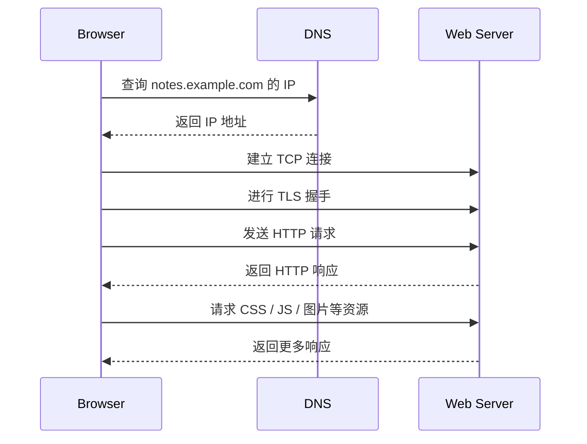

# 从建立网站理解网络基础

## 建站时到底在连接什么

一个最小的 Web 访问通常包含这些角色：

- **浏览器**：客户端，发起请求并显示页面。
- **域名**：给人看的名字，例如 `notes.example.com`。
- **DNS**：把域名解析为机器可路由的 IP 地址。
- **服务器**：运行 Web 服务的主机，可能是云服务器、容器或边缘节点。
- **Web 服务进程**：监听某个端口，接收 HTTP 请求并返回响应。

!!! note "互联网与万维网"
    互联网是底层的全球网络互联系统；万维网是建立在互联网之上的应用层生态，主要通过浏览器、URL、HTTP/HTTPS 和网页资源组织起来。建网站主要是在做万维网应用，但它依赖互联网提供的连通性。

从浏览器角度看，一个 URL 至少会给出三类信息：

```text
https://notes.example.com/articles/network.html
|     |                 |
|     |                 +-- 路径：请求服务器上的哪个资源
|     +-------------------- 主机名：需要先解析为 IP 地址
+-------------------------- 协议：使用 HTTPS
```

如果 URL 没有显式端口，浏览器会按协议使用默认端口：

| 协议 | 默认端口 | 常见用途 |
| --- | --- | --- |
| HTTP | `80/tcp` | 明文 Web 访问 |
| HTTPS | `443/tcp` | 加密 Web 访问 |
| SSH | `22/tcp` | 远程登录服务器 |

## 一次访问从 URL 到页面

用户在浏览器里输入 `https://notes.example.com/` 后，可以简化为下面的过程：



这个过程可以按问题拆开理解：

1. **这个名字是谁？** DNS 把域名变成 IP 地址。
2. **这台机器在哪里？** IP 和路由把数据送到目标主机附近。
3. **交给哪个程序？** 端口号把数据交给正确的服务进程。
4. **数据能不能可靠、有序到达？** TCP 提供可靠字节流。
5. **中间人能不能看懂或篡改？** TLS 提供加密、完整性校验和服务器身份认证。
6. **浏览器和服务器说什么格式的话？** HTTP 定义请求和响应的语义。

!!! tip "排查顺序"
    网站打不开时，不要只盯着“服务器坏了”。更有效的顺序是：域名是否解析、IP 是否可达、端口是否监听、防火墙是否放行、TLS 证书是否有效、HTTP 服务是否返回预期内容。

## 域名与 DNS

域名是给人使用的名字，IP 地址才是网络层转发分组时使用的地址。浏览器访问域名之前，通常要先做 DNS 查询。

常见 DNS 记录包括：

| 记录 | 含义 |
| --- | --- |
| `A` | 域名指向一个 IPv4 地址 |
| `AAAA` | 域名指向一个 IPv6 地址 |
| `CNAME` | 域名作为另一个域名的别名 |
| `MX` | 邮件服务器记录 |
| `TXT` | 文本记录，常用于验证和安全策略 |

例如：

```text
notes.example.com.  300  IN  A      203.0.113.10
www.example.com.    300  IN  CNAME  example.com.
```

其中 `300` 常表示 TTL，单位是秒。TTL 越长，缓存越久，解析压力越小；但迁移服务器或切换 IP 时，旧记录也可能保留更久。

!!! warning "域名不是服务器"
    一个域名可以在不同时间解析到不同 IP；多个域名也可以指向同一个 IP。域名只是入口名字，不等于某台固定机器本身。

DNS 查询通常先问本地域名服务器；如果缓存未命中，本地域名服务器再逐级查询根域名服务器、顶级域名服务器和权限域名服务器，最后把结果返回给客户端。

!!! note "DNS 常用 UDP"
    普通 DNS 查询常使用 `53/udp`，因为请求短、交互简单、开销低。需要区域传送、响应过大或特定安全扩展时，也可能使用 TCP。

## IP、路由与默认网关

DNS 解析完成后，浏览器拿到目标 IP 地址。接下来，主机要判断目标是否在同一个局域网内。

- 如果目标在同一子网，可以直接交付给目标主机。
- 如果目标不在同一子网，需要把分组先交给默认网关。

判断是否同一子网，核心是把 IP 地址和子网掩码按位与，得到网络地址。例如：

```text
本机 IP      192.168.1.23
子网掩码     255.255.255.0
网络地址     192.168.1.0
```

若目标是公网服务器 `203.0.113.10`，显然不在 `192.168.1.0/24` 这个局域网内，本机会把数据交给默认网关，再由路由器一跳一跳转发。

!!! info "IP 标识接口"
    严格说，IP 地址标识的是主机或路由器的某个网络接口。一台服务器有多块网卡或多个网络入口时，可能拥有多个 IP 地址。

路由器转发时主要看 IP 地址；交换机转发时主要看 MAC 地址。跨网络访问网站时，目的 IP 通常保持为最终服务器的 IP，但每一跳链路上的源 MAC 和目的 MAC 会变化。

## ARP 与局域网交付

在以太网中，真正发出的帧需要写入目的 MAC 地址。主机只知道下一跳的 IP 地址时，需要通过 ARP 查询对应的 MAC 地址。

访问远端网站时，ARP 查询的对象通常不是远端 Web 服务器，而是本局域网内的默认网关：

```text
浏览器目标: https://notes.example.com/
DNS 结果:   203.0.113.10
下一跳:     192.168.1.1
ARP 查询:   谁拥有 192.168.1.1？
```

拿到默认网关的 MAC 地址后，本机才能把封装着 IP 数据报的以太网帧发给网关。

!!! warning "不要把 IP 和 MAC 混成一层"
    IP 地址用于跨网络寻址；MAC 地址用于同一链路内交付。路由器每转发到下一段链路，通常会重新封装新的链路层帧。

## 端口与服务进程

同一台服务器上可以同时运行多个网络服务。IP 地址把数据送到主机，端口号再把数据交给对应进程。

常见部署可能长这样：

```text
203.0.113.10:22   -> sshd
203.0.113.10:80   -> nginx / caddy
203.0.113.10:443  -> nginx / caddy
127.0.0.1:3000    -> app server
```

其中 `127.0.0.1:3000` 只在服务器本机可见，通常由反向代理转发访问：

```text
Browser -> 203.0.113.10:443 -> Reverse Proxy -> 127.0.0.1:3000
```

!!! note "Socket"
    `IP:端口` 常称为一个 Socket 端点。一个 TCP 连接通常由四元组唯一标识：`(源 IP, 源端口, 目的 IP, 目的端口)`。

这也解释了为什么一台服务器能同时服务许多浏览器：不同客户端通常有不同的源 IP 或源端口，因此 TCP 四元组不同。

## TCP、UDP 与 HTTP

Web 页面传输通常要求数据完整、有序，因此 HTTP/1.1 和 HTTP/2 常运行在 TCP 之上。TCP 在应用层看来像一条可靠的字节流通道，但它需要连接建立、确认、重传、流量控制和拥塞控制。

UDP 则不建立连接，也不保证可靠、有序交付。它开销小，常用于 DNS、DHCP、实时音视频等场景。现代 HTTP/3 使用 QUIC，运行在 UDP 之上，但 QUIC 自己在应用可见层面补上了连接管理、可靠传输、加密和拥塞控制等机制。

| 对比项 | TCP | UDP |
| --- | --- | --- |
| 连接 | 面向连接 | 无连接 |
| 可靠性 | 提供确认、重传、按序交付 | 不保证可靠和按序 |
| 数据形式 | 字节流 | 报文 |
| 常见 Web 关系 | HTTP/1.1、HTTP/2 的常见传输基础 | DNS 常用；HTTP/3 基于 QUIC/UDP |

!!! tip "理解优先级"
    刚学习建站时，先把 HTTPS 网站理解为“HTTP 语义 + TLS 安全层 + TCP 可靠传输 + IP 路由”。等这条主线清楚后，再补 HTTP/2、HTTP/3、QUIC 和 CDN 的细节。

## HTTPS 与证书

HTTPS 不是一个全新的网页语义协议，而是在 HTTP 和 TCP 之间加入 TLS 安全层。它主要解决三件事：

- **加密**：中间人不应看懂传输内容。
- **完整性校验**：中间人不应悄悄篡改内容。
- **服务器身份认证**：浏览器要确认自己连接的是目标域名对应的服务器。

证书通常由受信任的 CA 签发。浏览器校验证书时，会检查证书链、域名是否匹配、证书是否过期或被吊销等条件。

!!! warning "证书绑定的是域名身份"
    证书能证明“这个连接对端拥有某个域名的有效证书”，但不能证明网站业务本身一定可信。HTTPS 解决传输安全，不替代应用权限、登录鉴权和内容安全。

## 发布一个网站需要哪些网络条件

以 `notes.example.com` 发布到云服务器为例，一个可访问的网站至少要满足下面几层条件：

1. 域名记录正确：`notes.example.com` 解析到服务器公网 IP。
2. 服务器有公网入口：云主机公网 IP、负载均衡或 CDN 都可以作为入口。
3. 安全组放行：云服务商安全组允许 `80/tcp` 和 `443/tcp` 入站。
4. 主机防火墙放行：服务器系统内的防火墙允许 Web 端口。
5. 服务正在监听：反向代理或 Web 服务进程监听对应端口。
6. 证书有效：HTTPS 证书覆盖该域名，并能完成 TLS 握手。
7. 应用响应正确：HTTP 请求能得到预期状态码和内容。

!!! danger "SSH 不应随手全网开放"
    Web 服务通常需要向公网开放 `80/tcp` 和 `443/tcp`；SSH 只用于运维，建议限制来源、使用密钥登录，或通过虚拟局域网访问。更完整的防火墙与 CIDR 思路可见 [网络基础、防火墙与 CIDR](/public/cs/network-firewall-cidr/)。

### `127.0.0.1`、`0.0.0.0` 与公网访问

本地开发时常见这些监听地址：

| 监听地址 | 含义 |
| --- | --- |
| `127.0.0.1` | 只接受本机访问 |
| `0.0.0.0` | 监听本机所有 IPv4 网络接口 |
| 公网 IP | 只监听指定公网接口 |

如果应用只监听 `127.0.0.1:3000`，外部用户无法直接访问它；但反向代理可以在同一台机器上访问 `127.0.0.1:3000`，再把公网请求转发过去。

!!! tip "常见部署习惯"
    让应用只监听 `127.0.0.1`，由 Nginx、Caddy 或云负载均衡统一处理公网端口、HTTPS 证书、压缩、日志和转发，通常比让应用进程直接暴露在公网更容易管理。

## 一个紧凑例子

假设你要发布一个静态笔记站点：

```text
域名: notes.example.com
服务器公网 IP: 203.0.113.10
Web 入口: 443/tcp
站点文件: /var/www/notes
```

访问链路可以理解为：

1. 浏览器查询 `notes.example.com`。
2. DNS 返回 `203.0.113.10`。
3. 浏览器向 `203.0.113.10:443` 建立 TCP 连接。
4. 浏览器和服务器完成 TLS 握手，确认域名证书。
5. 浏览器发送 `GET / HTTP/1.1` 或等价的 HTTP 请求。
6. Web 服务器读取站点文件，返回 HTML。
7. 浏览器继续请求 CSS、JavaScript、图片等资源。

如果此时打不开，可以按层排查：

| 现象 | 优先检查 |
| --- | --- |
| 域名解析不到 IP | DNS 记录、缓存、TTL |
| 能解析但连接超时 | 安全组、防火墙、路由、公网入口 |
| 连接被拒绝 | 服务是否监听对应端口 |
| HTTPS 报证书错误 | 证书域名、有效期、证书链 |
| 返回 `404` | HTTP 服务配置、站点路径、路由规则 |
| 返回 `502` | 反向代理到后端应用的连接是否正常 |

## 408 / 应试补充

### 分层职责速记

建站场景很适合串起五层模型：

| 层次 | 典型单位 | 建站场景中的职责 |
| --- | --- | --- |
| 应用层 | 报文 | DNS 查询、HTTP 请求与响应 |
| 传输层 | TCP 报文段 / UDP 数据报 | 用端口区分进程，提供 TCP 或 UDP 服务 |
| 网络层 | IP 数据报 | 用 IP 地址进行主机到主机的路由转发 |
| 数据链路层 | 帧 | 在相邻节点之间交付，使用 MAC 地址 |
| 物理层 | 比特流 | 在介质上传输 0 和 1 |

数据发送时逐层封装，接收时逐层解封装：

```text
HTTP 报文 -> TCP 报文段 -> IP 数据报 -> 以太网帧 -> 比特流
DNS 报文  -> UDP 数据报 -> IP 数据报 -> 以太网帧 -> 比特流
```

!!! tip "常考判断"
    数据链路层负责相邻节点通信，网络层负责主机到主机通信，传输层负责进程到进程通信。端口号属于传输层，IP 地址属于网络层，MAC 地址属于数据链路层。

### 协议、服务与接口

- **协议**是水平的，约束不同主机上对等层实体如何通信。
- **服务**是垂直的，下层通过接口向紧邻上层提供能力。
- **接口**是相邻层之间使用服务的入口。

例如，TCP 协议运行在两个端系统的传输层之间；应用层通过端口使用传输层服务；IP 层向传输层提供主机到主机的尽力而为交付。

!!! warning "易混点"
    “HTTP 使用 TCP”不是说 HTTP 和 TCP 在同一层。HTTP 是应用层协议，TCP 是传输层协议，HTTP 通过传输层接口使用 TCP 提供的可靠字节流服务。

### DNS 与 Web 访问常考链路

浏览器访问 `http://www.example.com/index.html`，若没有缓存，典型顺序是：

1. DNS 解析域名，得到 Web 服务器 IP。
2. 若下一跳 MAC 未知，使用 ARP 查询默认网关或同网段目标主机的 MAC。
3. 与 Web 服务器的 `80/tcp` 建立 TCP 连接。
4. 发送 HTTP 请求。
5. 接收 HTTP 响应。

常见协议搭配：

| 应用 | 应用层协议 | 传输层 |
| --- | --- | --- |
| 域名解析 | DNS | 常用 UDP |
| Web 明文访问 | HTTP | TCP |
| Web 加密访问 | HTTPS | TCP + TLS |
| 远程登录 | SSH | TCP |
| 自动获取地址 | DHCP | UDP |

### RTT 估算思路

考试中经常忽略发送时延、排队时延和服务器处理时延，只数 RTT。常见估算如下：

- 已建立 TCP 连接后，请求并收到一个很小的 HTTP 对象，约需 `1RTT`。
- 从发起 TCP 连接开始，请求并收到一个很小的 HTTP 对象，若第三次握手可捎带 HTTP 请求，约需 `2RTT`。
- 非持续 HTTP 且不并行时，每个对象通常都要重新建立 TCP 连接，RTT 开销会快速增加。
- HTTP/1.1 持续连接可以复用 TCP 连接，但仍可能受对象依赖关系、流水线方式、拥塞窗口和接收窗口影响。

!!! warning "RTT 题的关键"
    先看题目起点：是“点击超链接开始”、还是“从发出 HTTP 请求开始”、还是“从建立 TCP 连接开始”。起点不同，是否要把 DNS 查询和 TCP 握手计入答案也不同。

### 易混点速记

- DNS 解决域名到 IP 的映射，不解决 IP 到 MAC 的链路交付问题。
- ARP 解决同一链路内 IP 到 MAC 的映射；访问远端网站时通常查询默认网关的 MAC。
- 路由器根据 IP 地址转发分组；交换机根据 MAC 地址转发帧。
- IP 提供无连接、尽力而为的交付；可靠、有序通常由 TCP 或更高层机制完成。
- TCP 和 UDP 的端口号相互独立；同一台主机可以同时有 `53/udp` 和 `53/tcp`。
- NAT 可能改写 IP 地址和端口，并需要相应更新校验和。
- 目的 IP 在端到端传输中通常指向最终主机；链路层 MAC 地址会随每一跳改变。

!!! success "一句话总结"
    建站的网络主线是：域名通过 DNS 找到 IP，IP 通过路由找到主机，端口找到进程，TCP/TLS/HTTP 再分别解决可靠传输、安全通信和 Web 语义。
