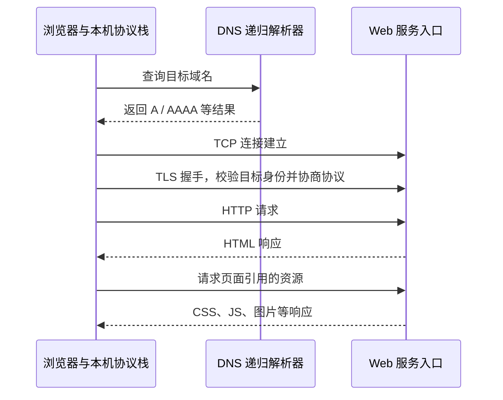

# 从建立网站理解网络基础

## URL 与访问目标

一个网站的可达性由多项条件共同决定：域名解析、网络路由、端口监听、传输安全，以及 HTTP 服务本身。浏览器显示同一个“无法访问”页面，底层原因却可能位于不同环节。

以 `https://notes.example.com:8443/articles/network.html?q=tcp#timing` 为例：

| URL 部分 | 含义 | 是否作为 HTTP 请求目标发送 |
| --- | --- | --- |
| `https` | 使用安全的 HTTP 访问方式 | 决定访问协议和安全要求 |
| `notes.example.com` | 目标主机名 | 用于 DNS、TLS 身份校验及 HTTP 目标标识 |
| `8443` | 显式端口 | 用于建立到服务入口的连接 |
| `/articles/network.html` | 资源路径 | 是 |
| `q=tcp` | 查询参数 | 是 |
| `timing` | 片段标识 | 通常由浏览器处理，不随 HTTP 请求发送 |

省略端口时，HTTP 默认使用 `80`，HTTPS 默认使用 `443`。域名大小写通常不影响解析；资源路径是否区分大小写取决于服务语义，不能把整个 URL 一概转为小写。

互联网是网络互联系统，万维网是建立在其上的应用体系。一个域名可以对应多个 IP、多个服务节点；同一个 IP 也可以承载多个域名。域名、服务器和网站之间都不必是一一对应关系。

## 一次 HTTPS 访问的协议过程

以下采用**新建连接的 HTTP/2 over TLS 1.3 over TCP**，且假定没有可复用连接。DNS、邻居缓存和 TLS 会话缓存会改变实际过程。


```mermaid
sequenceDiagram
  participant B as 浏览器与本机协议栈
  participant D as DNS 递归解析器
  participant S as Web 服务入口
  B->>D: 查询目标域名
  D-->>B: 返回 A / AAAA 等结果
  B->>S: TCP 连接建立
  B->>S: TLS 握手，校验目标身份并协商协议
  B->>S: HTTP 请求
  S-->>B: HTML 响应
  B->>S: 请求页面引用的资源
  S-->>B: CSS、JS、图片等响应
```

这个时序图省略了各次传输前的路由、ARP 或邻居发现。若 DNS 解析器在远端，本机在发出 DNS 查询之前就可能需要查询网关 MAC；因此“先 DNS，后 ARP”只适用于已经说明地址和邻居缓存条件的简化题设。

页面解析、脚本执行和资源加载还可能互相依赖。HTML 到达不等于页面所有资源已加载，TCP 建立也不等于 TLS 或 HTTP 已成功。

## DNS 解析与缓存

客户端通常向递归解析器查询。递归解析器缓存未命中时，再通过根、顶级域和权威服务器取得结果。根服务器通常给出转介信息，不直接保存所有网站的地址。

| 记录类型 | 内容 |
| --- | --- |
| A | IPv4 地址 |
| AAAA | IPv6 地址 |
| CNAME | 另一个域名的别名 |
| MX | 邮件交换主机及优先级 |
| TXT | 文本信息，常用于域名验证或协议策略 |
| HTTPS | HTTP 服务绑定信息，可携带协议与入口相关参数 |

```text
notes.example.com. 300 IN A    203.0.113.10
notes.example.com. 300 IN AAAA 2001:db8::10
```

这里 TTL 为 $300\,\mathrm{s}$，约束缓存记录的有效时间。变更记录后，既有缓存可能一直保留到原 TTL 到期；故障切换速度还受到客户端连接复用和应用缓存影响。缩短新记录的 TTL 不会追溯缩短此前已缓存记录的剩余时间。

传统 DNS 同时支持 UDP 和 TCP `53`，TCP 不仅用于区域传送，也用于截断响应重试等场景。现代解析还可使用 DoT、DoH、DoQ。DNS 加密保护查询链路，DNSSEC 验证 DNS 数据的来源与完整性，二者目的不同；都不能替代网站自身的 TLS 身份校验。

## IP 路由与链路交付

取得目标 IP 后，主机查路由表确定下一跳。常见单网卡场景中，直连子网内的目的地址直接交付，其他地址经默认网关。更具体的静态路由、多网卡或策略路由可能改变这一结果。

```text
本机地址：192.168.1.23/24
默认网关：192.168.1.1
Web 目标：203.0.113.10
```

若下一跳为默认网关，IPv4 主机使用 ARP 查询 `192.168.1.1` 的 MAC 地址。发出的以太网帧指向网关，IP 数据报仍指向 `203.0.113.10`。普通路由器逐跳重新封装链路帧，并递减 TTL；NAT、隧道和代理会引入额外的地址变化。

IPv6 使用邻居发现和 Hop Limit，流程的职责对应，但报文不同。具有 A 和 AAAA 的双栈网站需要两条地址路径分别可用。现代客户端可能采用 Happy Eyeballs 策略错开或并发尝试 IPv6 与 IPv4，以减少单一地址族故障造成的等待。

## 端口、监听地址与代理

服务器端口参与把报文交给套接字。一个 TCP 监听端口可以接收许多连接，每条已建立连接通常用四元组区分；TCP 与 UDP 的端口空间相互独立。

| 监听地址 | 对当前网络命名空间的含义 |
| --- | --- |
| `127.0.0.1:3000` | 仅本地 IPv4 环回可达 |
| `0.0.0.0:3000` | 接受发往各本地 IPv4 地址的连接 |
| 指定地址，如 `192.168.1.10:3000` | 绑定该本地地址 |
| `[::]:3000` | IPv6 通配监听；是否同时接受 IPv4 取决于系统和套接字配置 |

监听所有地址不代表已经向公网开放：路由、防火墙、NAT 与云入口仍可能阻止访问。反过来，只允许主机入站流量也未必覆盖容器发布端口的转发路径，见[网络基础、防火墙与 CIDR](network-firewall-cidr.md)。

常见部署把公网 TLS 和 HTTP 入口放在反向代理上：

```text
浏览器 → 公网反向代理:443 → 应用后端:3000
```

若代理与应用在同一网络命名空间，可用 `127.0.0.1:3000` 连接后端；分属不同容器时，应使用正确的容器网络地址或服务名。浏览器到代理与代理到后端是两段连接，协议版本和加密配置可以不同，HTTPS 终止于代理后并不自动覆盖第二段链路。

代理添加的 `Forwarded` 或 `X-Forwarded-For` 只有在可信代理链正确清理和重写时，才能作为客户端来源的依据。后端若直接信任任意请求携带的这些首部，攻击者可以伪造来源。

## HTTP 语义与传输版本

HTTP 定义资源、方法、状态码与字段语义。HTTP/1.1 常以文本开始行和首部表示，HTTP/2、HTTP/3 则使用各自的二进制帧格式；不能把“HTTP 是文本协议”推广到所有版本。

| 方法或状态 | 主要含义 | 实用边界 |
| --- | --- | --- |
| GET | 获取资源表示 | 设计上是安全、幂等方法，不应用于触发付款等操作 |
| HEAD | 获取与 GET 对应的响应元数据 | 不传送响应内容；不能只凭 HEAD 证明页面正文正确 |
| POST | 按资源定义处理提交内容 | 通常不能无条件重试，可能需要幂等键 |
| `200` | 本次请求成功 | 仍需检查响应是否为预期页面 |
| `304` | 条件请求的缓存表示仍可使用 | 客户端复用已有表示 |
| `404` | 目标资源未找到 | 已经存在能够返回 HTTP 响应的节点 |
| `502` | 网关收到无效的上游响应 | 不等同于客户端到公网入口完全不通 |

HTTP 的无状态语义不要求服务器“每次返回相同内容”，也不禁止登录会话。Cookie、令牌和后端存储可以关联请求；持久连接则复用传输通道，与用户是否登录是两个问题。

### HTTP/1.1、HTTP/2 与 HTTP/3

| 版本 | 常见传输基础 | 并发方式与限制 |
| --- | --- | --- |
| HTTP/1.1 | TCP，HTTPS 时加 TLS | 持久连接减少握手；流水线响应仍需有序 |
| HTTP/2 | 通常为 TLS over TCP | 多个流在一条连接内复用；TCP 丢包仍可能阻塞所有流的后续字节交付 |
| HTTP/3 | QUIC over UDP | 各流独立有序交付，减少跨流的传输层队头阻塞 |

HTTP/3 不会消除同一流内的等待，也不会消除共享拥塞窗口、带宽和应用依赖的限制。UDP 只是承载，可靠流、重传、拥塞控制和安全由 QUIC 提供。网络若阻断 UDP，客户端还可能回退到基于 TCP 的 HTTP，具体行为取决于实现。

## TLS 身份与安全范围

TLS 提供传输机密性、完整性与对端身份校验。在通常的 HTTPS 访问中，客户端需要验证证书链、有效期和目标身份是否匹配，并验证握手中的私钥持有证明；只看到一份证书文件并不足以完成认证。

同一 IP 可服务多个域名，TLS 的 SNI 可帮助入口选择配置，HTTP 的 Host 或 `:authority` 则标识应用目标。浏览器连接到某个 IP，不代表校验目标应从域名改为该 IP。

HTTPS 保护传输，不保证网站内容真实，也不替代登录认证和业务授权。普通 TLS 部署还可能暴露目标 IP、流量大小和时序等元数据。TLS 1.3 或 QUIC 的零往返数据能降低恢复连接的等待，但存在重放风险，应用不能把所有写操作直接放入早期数据。

## RTT 与对象获取时间

计算时延前，先明确起点、缓存、连接复用、并行数以及是否包含 TLS。设 Web 往返时延为 $R$，对象发送时间忽略，处理与排队忽略，TCP 握手的第三个 ACK 可携带请求或紧接请求：

| 模型 | 一个小对象的等待 |
| --- | --- |
| 已建立可用连接 | 约 $R$ |
| 新建 TCP、明文 HTTP | 约 $2R$ |
| 新建 TCP、完整 TLS 1.3、再请求 | 约 $3R$，假定一往返 TLS 握手且无额外验证等待 |

对象较大时还要计入发送时间、拥塞窗口增长等因素。握手时间不能简单覆盖所有对象；后续引用资源必须等 HTML 提供地址后才能请求。

!!! question "例题：连接复用与引用对象"
    已完成 DNS，页面包含一个很小的 HTML 和四个很小的图片，图片地址只能解析 HTML 后得到。Web RTT 为 $40\,\mathrm{ms}$，无 TLS，忽略发送和处理时间。比较：非持续 HTTP 串行获取、一个持续连接且不流水线、一个持续连接且四个图片请求可流水线发送。

    ??? success "参考答案"
        非持续且串行时，每个对象需要一次 TCP 握手和一次请求响应，共 $5\times2R=400\,\mathrm{ms}$。

        持续且不流水线时，先用 $2R$ 获取 HTML，再用 $4R$ 串行取图片，共 $6R=240\,\mathrm{ms}$。

        持续且理想流水线时，先用 $2R$ 获取 HTML，再用 $R$ 获取四个图片，共 $3R=120\,\mathrm{ms}$。此处忽略对象传输，且假定服务器能及时生成全部响应；真实 HTTP/1.1 流水线并非现代浏览器普遍采用的并发方案。

若另给 DNS 的多次查询时延，应先列明串行依赖再求和。主机到递归解析器与解析器到各级服务器的时延不能混为同一个 RTT。对现代 HTTP/2、HTTP/3，优先按连接建立与资源依赖画时序，不机械套用 HTTP/1.0 的每对象两次 RTT。

## 站点发布与故障定位

发布入口可以是源站、负载均衡或 CDN。使用 CDN 时，客户端 TCP/TLS 通常终止在边缘节点，再由边缘访问源站；这缩短了部分访问路径，同时把原来的一条链路拆成多段，日志和证书也要按段排查。

Linux 上可以用以下只读命令分别观察解析、路由和监听。示例域名与地址须替换成实际测试目标。

```bash
# 查看解析结果，分别检查地址族
dig notes.example.com A
dig notes.example.com AAAA

# 查看到一个 IPv4 目标的实际路由选择
ip route get 203.0.113.10

# 查看本机 TCP / UDP 监听
ss -lntup

# 观察连接、TLS、HTTP 首部，并实际取得正文
curl -v --max-time 15 https://notes.example.com/
```

需要绕开 DNS 检查指定入口，同时保留域名的 SNI、Host 与证书校验目标时：

```bash
curl -v --resolve notes.example.com:443:203.0.113.10 https://notes.example.com/
```

| 现象 | 优先检查 | 不能直接推出的结论 |
| --- | --- | --- |
| 域名无结果或返回错误地址 | 权威记录、缓存、TTL、解析链 | 服务进程一定故障 |
| 连接超时 | 路由、过滤、丢包、入口和返回路径 | 一定是防火墙 |
| 连接拒绝 | 监听地址、进程、显式拒绝策略 | DNS 一定有问题 |
| 证书错误 | 名称、有效期、信任链、系统时间 | TCP 未建立 |
| 页面 `404` 或正文错误 | 主机名路由、路径、站点配置、应用 | 仅凭 `200` 就说明页面正常 |
| `502` | 代理至上游的连接和响应 | 客户端到代理的链路不通 |

排查的目标是缩小故障所在的协议阶段。每次检查都要记录访问的地址族、入口节点和实际响应正文，避免把某一条路径的成功推广到整个网站。

## 参考资料

- [RFC 1034：DNS 概念](https://www.rfc-editor.org/rfc/rfc1034)、[RFC 7766：DNS over TCP](https://www.rfc-editor.org/rfc/rfc7766)、[RFC 9460：SVCB 与 HTTPS 记录](https://www.rfc-editor.org/rfc/rfc9460)。
- [RFC 9110：HTTP 语义](https://www.rfc-editor.org/rfc/rfc9110)、[RFC 9113：HTTP/2](https://www.rfc-editor.org/rfc/rfc9113)、[RFC 9114：HTTP/3](https://www.rfc-editor.org/rfc/rfc9114)。
- [RFC 8446：TLS 1.3](https://www.rfc-editor.org/rfc/rfc8446)、[RFC 9001：QUIC 使用 TLS](https://www.rfc-editor.org/rfc/rfc9001)、[RFC 8305：Happy Eyeballs v2](https://www.rfc-editor.org/rfc/rfc8305)。
- [curl：`--resolve`](https://curl.se/docs/manpage.html#--resolve)。
