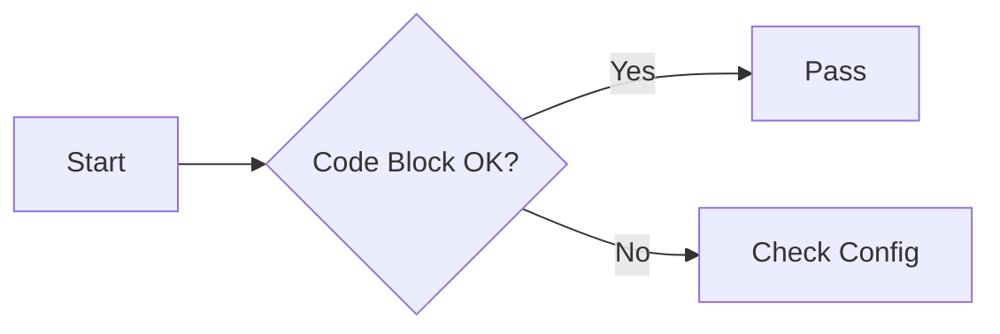

# 功能检查

## Callout

普通 callout 使用 `!!! type "标题"` 语法。callout 正文需要缩进 4 个空格。

### note

!!! note "定义"
    适合放定义、说明或背景信息。

### danger

!!! danger "危险"
    适合放高风险操作或严重后果提示。

### tip

!!! tip "技巧"
    适合放解题技巧、使用建议或捷径。

### warning

!!! warning "警告"
    适合放明显的注意事项和易错点。

### info

!!! info "信息"
    这是一个 info callout。

### success

!!! success "成功"
    这是一个 success callout。

### example

!!! example "示例"
    这是一个 example callout。

### question

!!! question "问题"
    这是一个 question callout。

### abstract

!!! abstract "摘要"
    这是一个 abstract callout。

### bug

!!! bug "Bug"
    这是一个 bug callout。

### quote

!!! quote "引用"
    这是一个 quote callout。

### failure

!!! failure "失败"
    这是一个 failure callout。

### 折叠式 Callout

折叠式 callout 使用 `??? type "标题"` 和 `???+ type "标题"` 语法。

`???` 表示默认折叠，`???+` 表示默认展开。

??? note "默认折叠"
    这是一个默认折叠的 callout。当前仓库约定不要使用 `???-` 写法。

???+ warning "默认展开"
    这是一个默认展开的 callout。
    
## Code Block

### 基础代码块

```python
def hello(name: str) -> str:
    return f"Hello, {name}"
```

### 标题与高亮行

```python hl_lines="2 3" title="highlight-demo.py"
def add(a: int, b: int) -> int:
    result = a + b
    return result
```

### 行号

```python linenums="1" title="linenums-demo.py"
for i in range(3):
    print(i)
```

### 代码注释

```python title="annotation-demo.py"
def square(x: int) -> int:
    return x * x  # (1)!
```

1.  这里测试代码注释是否正常显示。

### 内容标签页

=== "Python"

    ```python
    print("Hello from Python")
    ```

=== "JavaScript"

    ```javascript
    console.log("Hello from JavaScript");
    ```

### Mermaid




## Math

行内公式：$E = mc^2$

块级公式：

$$
\int_0^1 x^2 \, dx = \frac{1}{3}
$$
